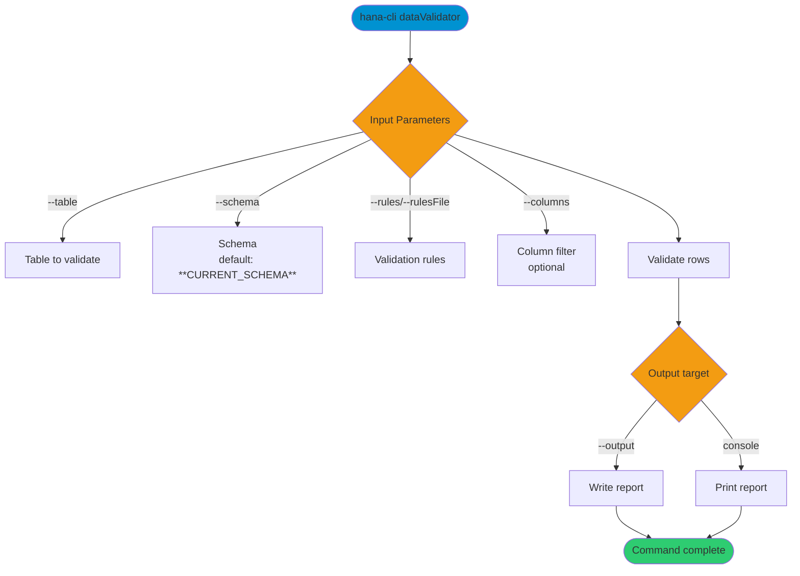

# dataValidator

> Command: `dataValidator`  
> Category: **Data Tools**  
> Status: Production Ready

## Description

Validate table data against business rules and constraints. You can supply rules inline or via a rules file and optionally limit validation to specific columns.

## Syntax

```bash
hana-cli dataValidator [options]
```

## Aliases

- `dval`
- `validateData`
- `dataValidation`

## Command Diagram



## Parameters

### Positional Arguments

None.

### Options

| Option | Alias | Type | Default | Description |
| --- | --- | --- | --- | --- |
| `--table` | `-t` | string | - | Name of the table to validate. |
| `--schema` | `-s` | string | `**CURRENT_SCHEMA**` | Schema name (uses current schema if omitted). |
| `--rules` | `-r` | string | - | Validation rules string in `column:rule1,rule2;column2:rule3` format. |
| `--rulesFile` | `--rf` | string | - | Path to a rules file containing the rules string. |
| `--columns` | `-c` | string | - | Comma-separated list of columns to validate. |
| `--output` | `-o` | string | - | Output file path for the report. |
| `--format` | `-f` | string | `json` | Report format. Choices: `json`, `csv`, `summary`, `detailed`. |
| `--limit` | `-l` | number | `10000` | Maximum number of rows to validate. |
| `--stopOnFirstError` | `--sfe` | boolean | `false` | Stop validation after the first error. |
| `--timeout` | `--to` | number | `3600` | Operation timeout in seconds. |
| `--profile` | `-p` | string | - | Connection profile to use. |

### Connection Parameters

| Option | Alias | Type | Default | Description |
| --- | --- | --- | --- | --- |
| `--admin` | `-a` | boolean | `false` | Connect via admin (default-env-admin.json). |
| `--conn` | - | string | - | Connection filename to override default-env.json. |

### Troubleshooting

| Option | Alias | Type | Default | Description |
| --- | --- | --- | --- | --- |
| `--disableVerbose` | `--quiet` | boolean | `false` | Disable verbose output for scripting. |
| `--debug` | `-d` | boolean | `false` | Debug hana-cli with detailed intermediate output. |

### Special Default Values

| Token | Resolves To | Description |
| --- | --- | --- |
| `**CURRENT_SCHEMA**` | Current user's schema | Used as default for `--schema`. |

## Validation Rules

Rules are specified in the format: `column:rule1,rule2;column2:rule3`.

Supported rules:

- `required` - Column must not be null or empty
- `numeric` - Column must contain numeric values
- `email` - Column must contain valid email addresses
- `date` - Column must contain valid dates
- `length:min:max` - Column value length must be between min and max
- `pattern:regex` - Column must match the specified regex pattern
- `range:min:max` - Numeric column must be between min and max

### Default Rules Preset

If you omit both `--rules` and `--rulesFile`, the command generates a default rules preset based on column names:

- Columns ending with `ID` or `_ID` → `required`
- Columns containing `EMAIL` → `email`
- Columns ending with `DATE`, `_AT`, or `_ON` → `date`
- Columns ending with `AMOUNT`, `PRICE`, `TOTAL`, `COUNT`, `QTY`, or `QUANTITY` → `numeric`

If no columns match these patterns, the first column is validated as `required`.

### Rules File Format

The rules file must contain the same rules string format as `--rules` (semicolon-separated pairs).

```text
email:required,email;firstName:required,length:1:50;lastName:required,length:1:50;age:numeric,range:18:120;zipcode:pattern:^\d{5}(-\d{4})?$
```

## Output Formats

- **json**: Full JSON results object.
- **csv**: CSV error rows (`Row,Column,Value,Rule,Error`).
- **summary**: Text summary report.
- **detailed**: JSON printed to console (file output uses the summary report format).

## Interactive Mode

In interactive mode, you are prompted for:

| Parameter | Required | Prompted | Notes |
| --- | --- | --- | --- |
| `table` | Yes | Always | Table to validate. |
| `schema` | No | Always | Defaults to current schema if omitted. |
| `rules` | No | Skipped | Use `--rules` or `--rulesFile`. |
| `columns` | No | Skipped | Use `--columns` to limit validation. |
| `output` | No | Skipped | Use `--output` to write a file. |
| `format` | No | Skipped | Use `--format` to select output. |
| `limit` | No | Skipped | Use `--limit` to cap rows. |
| `timeout` | No | Skipped | Use `--timeout` to cap runtime. |
| `profile` | No | Always | Optional CDS profile. |

## Examples

```bash
hana-cli dataValidator --table myTable --rules validation.json
```

## Return Codes

- `0` - Validation completed successfully
- `1` - Validation error or database connection issue

## Performance Tips

1. Use `--limit` to validate a subset of rows first.
2. Use `--stopOnFirstError` to quickly identify issues.
3. Specify only required columns with `--columns` to reduce processing.
4. Use `--timeout` to prevent long-running validations.

## Related Commands

See the [Commands Reference](../all-commands.md) for other commands in this category.

## See Also

- [Category: Data Tools](..)
- [All Commands A-Z](../all-commands.md)
