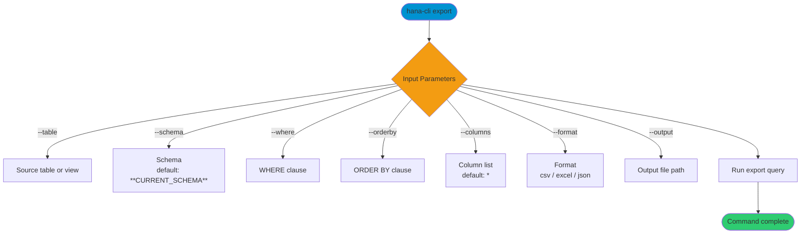

# export

> Command: `export`  
> Category: **Data Tools**  
> Status: Production Ready

## Description

Export table or view data to CSV, Excel, or JSON files. This is the complementary command to `import`, which loads data into tables.

## Syntax

```bash
hana-cli export [options]
```

## Aliases

- `exp`
- `downloadData`
- `downloaddata`

## Command Diagram



## Parameters

### Positional Arguments

None.

### Options

| Option | Alias | Type | Default | Description |
| --- | --- | --- | --- | --- |
| `--table` | `-t` | string | - | Source table or view name. |
| `--schema` | `-s` | string | `**CURRENT_SCHEMA**` | Source schema name. |
| `--output` | `-o` | string | - | Output file path. If omitted, a timestamped filename is generated. |
| `--format` | `-f` | string | `csv` | Export format. Choices: `csv`, `excel`, `json`. |
| `--where` | `-w` | string | - | WHERE clause for filtering rows (without the `WHERE` keyword). |
| `--limit` | `-l` | number | - | Maximum number of rows to export. Defaults to `--maxRows` when unset. |
| `--orderby` | `--ob` | string | - | ORDER BY clause for sorting (without the `ORDER BY` keyword). |
| `--columns` | `-c` | string | `*` | Comma-separated list of columns to export. |
| `--delimiter` | `-d` | string | `,` | CSV delimiter character. |
| `--includeHeaders` | `--ih` | boolean | `true` | Include header row in CSV export. |
| `--nullValue` | `--nv` | string | `''` | Value to use for NULL/empty cells in CSV/Excel output. |
| `--maxRows` | `--mr` | number | `1000000` | Maximum rows allowed (used when `--limit` is not set). |
| `--timeout` | `--to` | number | `3600` | Operation timeout in seconds. |
| `--profile` | `-p` | string | - | CDS profile for connections. |

### Connection Parameters

| Option | Alias | Type | Default | Description |
| --- | --- | --- | --- | --- |
| `--admin` | `-a` | boolean | `false` | Connect via admin (default-env-admin.json). |
| `--conn` | - | string | - | Connection filename to override default-env.json. |

### Troubleshooting

| Option | Alias | Type | Default | Description |
| --- | --- | --- | --- | --- |
| `--disableVerbose` | `--quiet` | boolean | `false` | Disable verbose output for scripting. |
| `--debug` | `-d` | boolean | `false` | Debug hana-cli with detailed intermediate output. |

### Special Default Values

| Token | Resolves To | Description |
| --- | --- | --- |
| `**CURRENT_SCHEMA**` | Current user's schema | Used as default for `--schema`. |
| `*` | All columns | Used when `--columns` is not provided. |

## Output Formats

### CSV Export

- Standard comma-separated values format
- First row contains column headers (configurable with `--includeHeaders`)
- NULL values appear as empty cells or a custom value (with `--nullValue`)

### Excel Export

- Modern .xlsx format (Office Open XML)
- Automatic column width adjustment
- Data types preserved (numbers, dates, text)

### JSON Export

- JSON array of objects
- Best for complex data structures and programmatic processing

## Interactive Mode

In interactive mode, you are prompted for:

| Parameter | Required | Prompted | Notes |
| --- | --- | --- | --- |
| `table` | Yes | Always | Source table or view. |
| `schema` | No | Always | Defaults to current schema if omitted. |
| `output` | Yes | Always | File path to write. |
| `format` | Yes | Always | Select csv/excel/json. |
| `where` | No | Skipped | Use `--where` to filter rows. |
| `limit` | No | Skipped | Use `--limit` to cap rows. |
| `orderby` | No | Skipped | Use `--orderby` to sort results. |
| `columns` | No | Skipped | Use `--columns` to select columns. |
| `delimiter` | No | Skipped | Use `--delimiter` for CSV. |
| `includeHeaders` | No | Skipped | Use `--includeHeaders` to toggle headers. |
| `nullValue` | No | Skipped | Use `--nullValue` for NULL replacement. |
| `maxRows` | No | Skipped | Use `--maxRows` to cap rows. |
| `timeout` | No | Skipped | Use `--timeout` to cap runtime. |
| `profile` | No | Always | Optional CDS profile. |

## Examples

```bash
hana-cli export --table myTable --format csv
```

### Additional Examples

```bash
# Excel export with column selection
hana-cli export -t EMPLOYEES -o ./output/staff.xlsx -f excel -c EMPLOYEE_ID,NAME,EMAIL,HIRE_DATE

# Export with WHERE clause
hana-cli export -t SALES -o ./output/2024_sales.csv -w "YEAR = 2024 AND STATUS = 'COMPLETED'"

# JSON export with ordering
hana-cli export -t PRODUCTS -o ./output/products.json -f json --orderby "PRICE DESC"

# Export with row limit
hana-cli export -t LARGE_TABLE -o ./output/sample.csv -l 1000

# CSV with custom delimiter
hana-cli export -t DATA -o ./output/data.tsv -d '\t'

# Export from a specific schema
hana-cli export -t CUSTOMERS -s SALES_DB -o ./output/customers.csv
```

## Workflow Examples

### Backup and Restore Workflow

```bash
# Export current production data
hana-cli export -t CRITICAL_TABLE -s PRODUCTION -o ./backup/critical_$(date +%Y%m%d).csv -f excel

# Import into a target environment
hana-cli import -n ./backup/critical_20260215.csv -t CRITICAL_TABLE -s STAGING -m name
```

### Large Dataset Export Strategy

```bash
# First batch
hana-cli export -t BIG_TABLE -o ./batch1.csv -l 100000

# Subsequent batches with filtering
hana-cli export -t BIG_TABLE -o ./batch2.csv -l 100000 -w "ID > 100000"
```

## Frequently Asked Questions

### Can I export views?

Yes, the export command works with both tables and views.

```bash
hana-cli export -t SCHEMA.VIEW_NAME -o output.csv
```

### What is the maximum export size?

The export is limited by available disk space and the `--maxRows` setting (default: 1,000,000 rows). Use batching for larger exports.

### What happens to NULL values?

- By default, NULL appears as empty cells in CSV/Excel.
- Use `--nullValue` to customize the replacement.
- JSON preserves NULL as JSON `null`.

## Performance Considerations

| Factor | Recommendation |
| --- | --- |
| Large datasets | Use `--limit` to test, then export in batches. |
| Specific columns | Use `--columns` to reduce file size and export time. |
| Long-running exports | Increase `--timeout` for millions of rows. |
| File format choice | JSON is larger; use CSV for bulk data. |
| Filtering efficiency | Apply WHERE clause at database level. |

## Error Handling

| Error | Cause | Solution |
| --- | --- | --- |
| `Table not found` | Table doesn't exist or wrong schema | Verify table name and schema via `hana-cli inspectTable -t TABLE`. |
| `Column not found` | Column doesn't exist | Check column names with `hana-cli inspectTable -t SCHEMA.TABLE`. |
| `File write failed` | Permission denied or invalid path | Ensure output directory exists and is writable. |
| `Timeout exceeded` | Query took too long | Use WHERE clause to filter, increase `--timeout`. |
| `Invalid format` | Unsupported format choice | Use csv, excel, or json. |

## Tips and Best Practices

1. **Always test first**: Use `-l 100` to preview data before full export.
2. **Include timestamps**: Add timestamps to filenames for version tracking.
3. **Choose format wisely**:
   - CSV for data analysis tools
   - Excel for business users
   - JSON for APIs and web applications
4. **Validate before import**: Check file integrity after export.
5. **Use schemas explicitly**: Specify schema to avoid ambiguity.

## Related Commands

See the [Commands Reference](../all-commands.md) for other commands in this category.

## See Also

- [Category: Data Tools](..)
- [All Commands A-Z](../all-commands.md)
