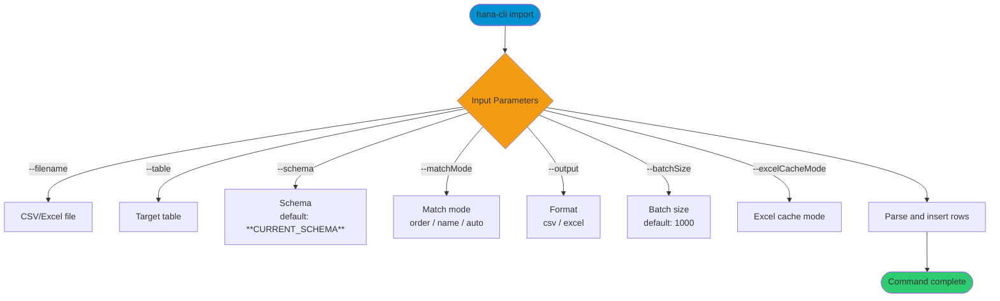

# import

> Command: `import`  
> Category: **Data Tools**  
> Status: Production Ready

## Description

Import data from CSV or Excel files into a database table. This is the complementary command to `export`.

## Syntax

```bash
hana-cli import [options]
```

## Aliases

- `imp`
- `uploadData`
- `uploaddata`

## Command Diagram



## Parameters

### Positional Arguments

None.

### Options

| Option | Alias | Type | Default | Description |
| --- | --- | --- | --- | --- |
| `--filename` | `-n` | string | - | Path to the CSV or Excel file to import. |
| `--table` | `-t` | string | - | Target database table (format: `SCHEMA.TABLE` or `TABLE`). |
| `--schema` | `-s` | string | `**CURRENT_SCHEMA**` | Import schema. |
| `--output` | `-o` | string | `csv` | File format. Choices: `csv`, `excel`. |
| `--matchMode` | `-m` | string | `auto` | Column matching strategy. Choices: `order`, `name`, `auto`. |
| `--truncate` | `--tr` | boolean | `false` | Truncate target table before import. |
| `--batchSize` | `-b` | number | `1000` | Rows per batch insert (1-10000). |
| `--worksheet` | `-w` | number | `1` | Excel worksheet number (1-based). |
| `--startRow` | `--sr` | number | `1` | Starting row number in Excel (1-based). |
| `--skipEmptyRows` | `--se` | boolean | `true` | Skip empty rows in Excel files. |
| `--excelCacheMode` | `--ec` | string | `cache` | Excel shared strings cache mode. Choices: `cache`, `emit`, `ignore`. |
| `--dryRun` | `--dr` | boolean | `false` | Preview import results without committing to the database. |
| `--maxFileSizeMB` | `--mfs` | number | `500` | Maximum file size in MB. |
| `--timeoutSeconds` | `--ts` | number | `3600` | Import operation timeout in seconds (0 = no timeout). |
| `--nullValues` | `--nv` | string | `null,NULL,#N/A,` | Comma-separated list of values to treat as NULL. |
| `--skipWithErrors` | `--swe` | boolean | `false` | Continue import even if errors exceed threshold. |
| `--maxErrorsAllowed` | `--mea` | number | `-1` | Maximum errors allowed before stopping (-1 = unlimited). |
| `--profile` | `-p` | string | - | CDS profile for connection. |

### Connection Parameters

| Option | Alias | Type | Default | Description |
| --- | --- | --- | --- | --- |
| `--admin` | `-a` | boolean | `false` | Connect via admin (default-env-admin.json). |
| `--conn` | - | string | - | Connection filename to override default-env.json. |

### Troubleshooting

| Option | Alias | Type | Default | Description |
| --- | --- | --- | --- | --- |
| `--disableVerbose` | `--quiet` | boolean | `false` | Disable verbose output (scripting mode). |
| `--debug` | `-d` | boolean | `false` | Debug hana-cli with detailed output. |

### Special Default Values

| Token | Resolves To | Description |
| --- | --- | --- |
| `**CURRENT_SCHEMA**` | Current user's schema | Used as default for `--schema`. |

## Interactive Mode

In interactive mode, you are prompted for:

| Parameter | Required | Prompted | Notes |
| --- | --- | --- | --- |
| `filename` | Yes | Always | Path to CSV/Excel file. |
| `table` | Yes | Always | Target table. |
| `schema` | No | Always | Defaults to current schema if omitted. |
| `output` | Yes | Always | File format (csv/excel). |
| `matchMode` | Yes | Always | Column matching strategy. |
| `truncate` | No | Skipped | Use `--truncate` when needed. |
| `batchSize` | No | Skipped | Use `--batchSize` to tune performance. |
| `worksheet` | No | Skipped | Use `--worksheet` for Excel. |
| `startRow` | No | Skipped | Use `--startRow` for Excel. |
| `skipEmptyRows` | No | Skipped | Use `--skipEmptyRows` for Excel. |
| `excelCacheMode` | No | Skipped | Use `--excelCacheMode` for Excel. |
| `dryRun` | No | Skipped | Use `--dryRun` for preview. |
| `maxFileSizeMB` | No | Skipped | Use `--maxFileSizeMB` to cap file size. |
| `timeoutSeconds` | No | Skipped | Use `--timeoutSeconds` to cap runtime. |
| `nullValues` | No | Skipped | Use `--nullValues` for custom NULLs. |
| `skipWithErrors` | No | Skipped | Use `--skipWithErrors` to continue. |
| `maxErrorsAllowed` | No | Skipped | Use `--maxErrorsAllowed` to cap errors. |
| `profile` | No | Always | Optional CDS profile. |

## Examples

```bash
hana-cli import --filename data.csv --table myTable
```

## Column Matching Strategies

### Match Mode: "order"

Columns are matched by their position, regardless of column names:

```text
File columns:  [ID, Name, Price]
Table columns: [PRODUCT_ID, PRODUCT_NAME, COST]
Mapping:       ID → PRODUCT_ID, Name → PRODUCT_NAME, Price → COST
```

### Match Mode: "name"

Columns are matched strictly by name (case-insensitive):

```text
File columns:  [ID, ProductName, Cost]
Table columns: [ID, PRODUCT_NAME, COST]
Mapping:       ID → ID, ProductName → PRODUCT_NAME, Cost → COST
```

### Match Mode: "auto" (Default)

Attempts name-based matching first, then falls back to position matching for unmatched columns:

```text
File columns:  [ID, ProductName, UnknownCol]
Table columns: [ID, PRODUCT_NAME, COST]
Mapping:       ID → ID, ProductName → PRODUCT_NAME, UnknownCol → COST
```

## File Format Support

### CSV Format Requirements

- Standard comma-separated values
- First row contains column headers
- Values can be quoted (supports embedded commas and quotes)

### Excel Format Requirements

- .xlsx format (modern Excel)
- First worksheet is used by default (specify others with `--worksheet`)
- First row contains column headers (configurable with `--startRow`)

## Data Type Handling

The import command converts data types based on the target table's column definitions:

- **Integer columns**: Parsed from string/number to integer
- **Decimal/Numeric columns**: Parsed from string/number to decimal
- **Date/Timestamp columns**: Converted from string to date/time
- **Boolean columns**: "true", "1", "yes" → true; "false", "0", "no" → false
- **Text columns**: Stored as string
- **Null values**: Empty cells or "NULL" strings become NULL

## Output and Results

After import, the command displays a summary and (if present) a list of errors.

## Limits and Constraints

- File paths must resolve within the current working directory (path traversal is blocked).
- Batch size must be between 1 and 10000.
- Files larger than `--maxFileSizeMB` are rejected.

## Additional Examples

```bash
# Excel file import with name matching
hana-cli import -n ./data/sales.xlsx -o excel -t SALES_DATA -m name

# Truncate before import
hana-cli import -n ./data/refresh.csv -t MASTER_DATA --truncate

# Excel worksheet selection
hana-cli import -n report.xlsx -o excel -t MONTHLY_SALES --worksheet 2

# Large CSV file with higher batch size
hana-cli import -n transactions.csv -t TRANSACTIONS --batchSize 5000
```

## Performance Considerations

### Batch Size Selection

| Scenario | Recommended Batch Size | Rationale |
| --- | --- | --- |
| Row size > 1KB | 500-1000 | Reduce memory pressure |
| Row size < 100 bytes | 5000-10000 | Maximize throughput |
| File size > 100MB | 500-1000 | Balance memory and performance |
| Memory-constrained (< 4GB) | 500 | Conservative approach |

### Excel Cache Mode Selection

| Mode | Performance | Memory | Best For |
| --- | --- | --- | --- |
| `cache` (default) | Fastest | Higher | Most files, < 100MB |
| `emit` | Slower | Lower | Large files > 100MB |
| `ignore` | Variable | Lowest | Extreme memory constraints |

## Error Handling

The command handles common error scenarios:

- File not found or invalid file format
- Column mismatch or missing required columns
- Data type conversion errors
- Database constraint violations

## Permission Requirements

- Read access to the source file
- Write/Insert privileges on target table
- If using `--truncate`: Delete privileges on target table

## Tips & Best Practices

1. **Always backup** before a truncate/import operation.
2. **Test first** on a development table before production.
3. **Use auto matching** for most files.
4. **Tune batch size** for your environment.
5. **Use emit mode** for very large Excel files.

## Related Commands

See the [Commands Reference](../all-commands.md) for other commands in this category.

## See Also

- [Category: Data Tools](..)
- [All Commands A-Z](../all-commands.md)
