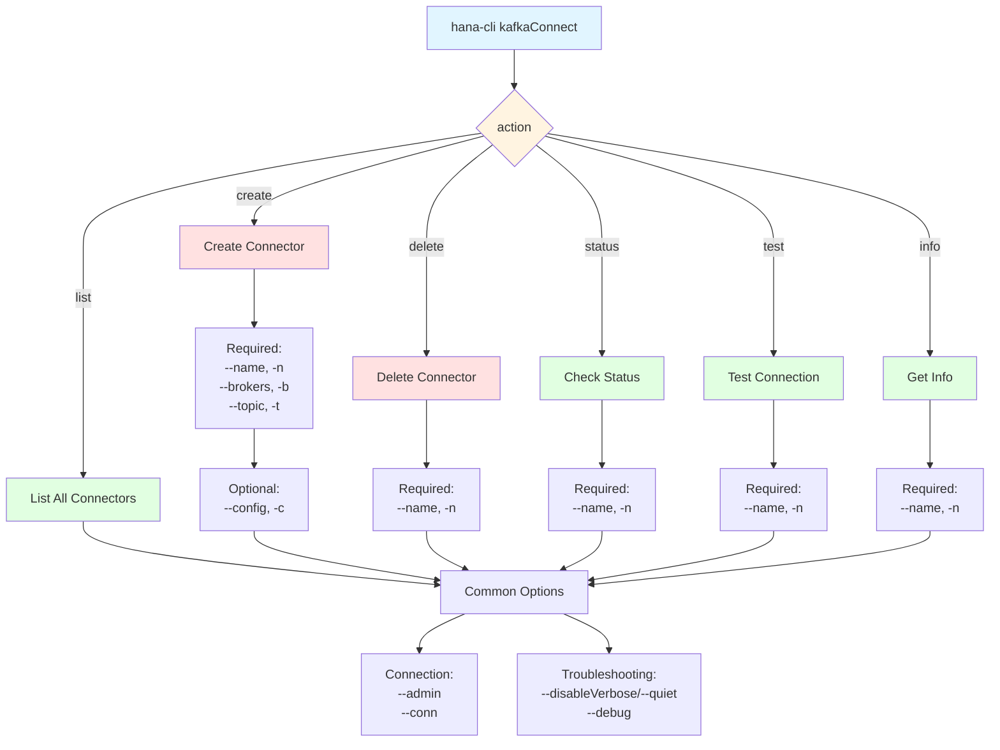

# kafkaConnect

> Command: `kafkaConnect`  
> Category: **Data Tools**  
> Status: Production Ready

## Description

Manages Kafka connector configurations for integrating real-time streaming data from Apache Kafka into SAP HANA. It allows you to create, configure, monitor, and test Kafka connectors seamlessly.

## Syntax

```bash
hana-cli kafkaConnect [action] [options]
```

## Aliases

- `kafka`
- `kafkaAdapter`
- `kafkasub`

## Command Diagram



## Parameters

| Parameter   | Aliases           | Type   | Default | Required For                                 | Description                                                                                                                                              |
|-------------|-------------------|--------|---------|----------------------------------------------|----------------------------------------------------------------------------------------------------------------------------------------------------------|
| `action`   | `-a`, `--action`  | string | `list`  | All actions                                  | Action to perform on Kafka connectors. **Choices:** `list`, `create`, `delete`, `status`, `test`, `info`                                               |
| `--name`   | `-n`, `--Name`    | string | -       | `create`, `delete`, `status`, `test`, `info` | Kafka Connector Name. Unique identifier for the connector.                                                                                               |
| `--brokers` | `-b`, `--Brokers` | string | -       | `create`                                     | Kafka Brokers (comma-separated). Format: `hostname:port,hostname:port`. Example: `kafka1.example.com:9092,kafka2.example.com:9092`                     |
| `--topic`  | `-t`, `--Topic`   | string | -       | `create`                                     | Kafka Topic Name. Must exist in the Kafka cluster before connector creation.                                                                             |
| `--config` | `-c`, `--Config`  | string | -       | Optional                                     | Path to configuration file containing connector settings.                                                                                                |

### Connection Parameters

| Parameter | Aliases | Type   | Default | Description                                                                       |
| --------- | ------- | ------ | ------- | --------------------------------------------------------------------------------- |
| `--admin` | -       | string | `false` | Connect via admin using `default-env-admin.json` instead of standard connection.  |
| `--conn`  | -       | string | -       | Connection filename to override the default `default-env.json`.                   |

### Troubleshooting Parameters

| Parameter          | Aliases   | Type    | Default | Description                                                                                                                      |
|------------------- | --------- | ------- | ------- | -------------------------------------------------------------------------------------------------------------------------------- |
| `--disableVerbose` | `--quiet` | boolean | `false` | Disable verbose output. Removes all extra output that is only helpful to human-readable interface. Useful for scripting commands. |
| `--debug`          | `-d`      | boolean | `false` | Debug hana-cli itself by adding output of LOTS of intermediate details. Use for troubleshooting command issues.                   |
| `--help`           | `-h`      | boolean | -       | Show help information for the command.                                                                                            |

### Parameter Notes

- **Action Parameter**: Can be specified as positional argument or using `-a`/`--action` flag
- **Required Parameters**: Vary by action:
  - `list`: No additional parameters required
  - `create`: Requires `--name`, `--brokers`, and `--topic`
  - `delete`, `status`, `test`, `info`: Require `--name`
- **Comma-separated Values**: When specifying multiple brokers, use commas without spaces
- **Configuration File**: JSON file containing advanced connector settings (schema mappings, batch sizes, etc.)

For a complete list of parameters and real-time help, use:

```bash
hana-cli kafkaConnect --help
```

## Actions

- **list** (default): Display all Kafka connectors
- **create**: Create a new Kafka connector
- **delete**: Remove a Kafka connector
- **status**: Check connector status and health
- **test**: Test a Kafka connector connection
- **info**: Get detailed connector information

## Output

### List Action

Returns all connectors with:

- Connector ID
- Connector name
- Status
- Brokers
- Topic
- Creation and modification timestamps

### Status Action

Returns:

- Connector name
- Current status
- Last error (if any)
- Message count
- Error count
- Last activity timestamp

### Test Action

Returns test results and connection validation status.

### Info Action

Returns comprehensive connector details:

- Configuration parameters
- Schema and table mappings
- Column mappings
- Comments and descriptions

## Configuration

### Broker Format

```bash
hostname:port,hostname:port
Example: kafka-broker1.example.com:9092,kafka-broker2.example.com:9092
```

### Topic Naming

Use standard Kafka topic naming conventions (alphanumeric, dots, hyphens, underscores).

## Examples

### 1. List All Kafka Connectors

```bash
hana-cli kafkaConnect list
```

### 2. Create a New Kafka Connector

```bash
hana-cli kafkaConnect create \
  --name my_connector \
  --brokers kafka1:9092,kafka2:9092 \
  --topic orders
```

### 3. Check Connector Status

```bash
hana-cli kafka status --name my_connector
```

### 4. Test Connector Connection

```bash
hana-cli kafkaConnect test -n my_connector
```

### 5. Get Detailed Connector Information

```bash
hana-cli kafkaConnect info --name my_connector
```

### 6. Delete a Connector

```bash
hana-cli kafka delete --name old_connector
```

## Use Cases

- **Real-time Data Integration**: Stream Kafka messages into HANA tables
- **Event Processing**: Capture and analyze streaming events
- **Data Pipeline**: Build ETL pipelines with Kafka sources
- **IoT Data**: Ingest sensor and IoT data streams

## Troubleshooting

### Connection Failed

- Verify broker addresses are correct and accessible
- Ensure network connectivity to Kafka brokers
- Check authentication credentials

### Missing Messages

- Verify topic name exists in Kafka cluster
- Check message retention policies
- Confirm consumer group configuration

### High Latency

- Monitor Kafka broker performance
- Check HANA database capacity
- Review batch size and timeout settings

## Notes

- Kafka brokers must be accessible from HANA System
- Topic must exist in Kafka cluster before connector creation
- Large message volumes may require performance tuning
- Connector status updates periodically (typically every 30 seconds)

## Related Commands

- `import` - Bulk data import from files
- `export` - Export data to various formats
- `containers` - Manage HDI containers for data storage

See the [Commands Reference](../all-commands.md) for other commands in this category.

## See Also

- [Category: Data Tools](..)
- [All Commands A-Z](../all-commands.md)
