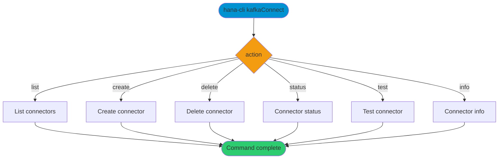

# kafkaConnect

> Command: `kafkaConnect`  
> Category: **Data Tools**  
> Status: Production Ready

## Description

Manage Kafka connector configurations for integrating streaming data from Apache Kafka into SAP HANA. Actions include listing, creating, deleting, testing, and inspecting connectors.

## Syntax

```bash
hana-cli kafkaConnect [action] [options]
```

## Aliases

- `kafka`
- `kafkaAdapter`
- `kafkasub`

## Command Diagram



## Parameters

### Positional Arguments

| Parameter | Type | Description |
| --- | --- | --- |
| `action` | string | Action to perform. Choices: `list`, `create`, `delete`, `status`, `test`, `info`. Defaults to `list`. |

### Options

| Option | Alias | Type | Default | Description |
| --- | --- | --- | --- | --- |
| `--action` | `-a` | string | `list` | Action to perform. Choices: `list`, `create`, `delete`, `status`, `test`, `info`. |
| `--name` | `-n` | string | - | Kafka connector name. Required for `create`, `delete`, `status`, `test`, `info`. |
| `--brokers` | `-b` | string | - | Kafka brokers (comma-separated). Required for `create`. |
| `--topic` | `-t` | string | - | Kafka topic name. Required for `create`. |
| `--config` | `-c` | string | - | Configuration file path (accepted but not currently used by the command). |

### Connection Parameters

| Option | Alias | Type | Default | Description |
| --- | --- | --- | --- | --- |
| `--admin` | `-a` | boolean | `false` | Connect via admin (default-env-admin.json). |
| `--conn` | - | string | - | Connection filename to override default-env.json. |

### Troubleshooting

| Option | Alias | Type | Default | Description |
| --- | --- | --- | --- | --- |
| `--disableVerbose` | `--quiet` | boolean | `false` | Disable verbose output for scripting. |
| `--debug` | `-d` | boolean | `false` | Debug hana-cli with detailed intermediate output. |

## Actions

| Action | Required Parameters | Description |
| --- | --- | --- |
| `list` | - | List all Kafka connectors. |
| `create` | `--name`, `--brokers`, `--topic` | Create a new connector. |
| `delete` | `--name` | Delete a connector. |
| `status` | `--name` (optional) | Show status for a connector or all connectors. |
| `test` | `--name` | Test connector connectivity. |
| `info` | `--name` | Show detailed connector information. |

## Output

The command prints tables with connector metadata (list/info) or status metrics (status/test) using the standard CLI output formatting.

## Interactive Mode

In interactive mode, you are prompted for:

| Parameter | Required | Prompted | Notes |
| --- | --- | --- | --- |
| `action` | Yes | Always | Defaults to `list` if omitted. |
| `name` | No | Always | Required for most actions except `list`. |
| `brokers` | No | Always | Required for `create`. |
| `topic` | No | Always | Required for `create`. |

## Examples

```bash
hana-cli kafkaConnect --action list
```

## Notes

- Kafka brokers must be accessible from the HANA system.
- The `--config` option is accepted but not currently used by the handler.
- Both `--action` and `--admin` use the `-a` short alias; prefer the long form to avoid ambiguity.

## Related Commands

See the [Commands Reference](../all-commands.md) for other commands in this category.

## See Also

- [Category: Data Tools](..)
- [All Commands A-Z](../all-commands.md)
