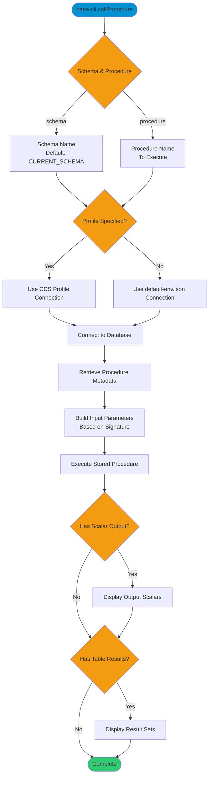

# callProcedure

> Command: `callProcedure`  
> Category: **Developer Tools**  
> Status: Production Ready

## Description

Call a stored procedure and display the results. The command retrieves procedure metadata from the database, builds the appropriate input parameters based on the procedure signature, executes the stored procedure, and displays any output scalars and result sets returned by the procedure.

## Syntax

```bash
hana-cli callProcedure [schema] [procedure] [options]
```

## Aliases

- `cp`
- `callprocedure`
- `callProc`
- `callproc`
- `callSP`
- `callsp`

## Command Diagram



## Parameters

### Positional Arguments

| Parameter | Type | Description |
|-----------|------|-------------|
| `schema` | string | Schema containing the stored procedure (optional, defaults to `**CURRENT_SCHEMA**`) |
| `procedure` | string | Name of the stored procedure to call (optional if using `--procedure`) |

### Options

| Option | Alias | Type | Default | Description |
|--------|-------|------|---------|-------------|
| `--procedure` | `--sp`, `-p` | string | - | Stored procedure to call |
| `--schema` | `-s` | string | `**CURRENT_SCHEMA**` | Schema containing the stored procedure |
| `--profile` | - | string | - | CDS Profile for connection |

### Connection Parameters

| Option | Alias | Type | Default | Description |
|--------|-------|------|---------|-------------|
| `--admin` | `-a` | boolean | `false` | Connect via admin (default-env-admin.json) |
| `--conn` | - | string | - | Connection filename to override default-env.json |

### Troubleshooting

| Option | Alias | Type | Default | Description |
|--------|-------|------|---------|-------------|
| `--disableVerbose` | `--quiet` | boolean | `false` | Disable verbose output - removes all extra output that is only helpful to human readable interface |
| `--debug` | `-d` | boolean | `false` | Debug hana-cli itself by adding output of LOTS of intermediate details |

## Examples

### Basic Usage

```bash
hana-cli callProcedure --procedure myProc --schema MYSCHEMA
```

Executes the stored procedure `myProc` in the `MYSCHEMA` schema and displays the results.

## Related Commands

See the [Commands Reference](../all-commands.md) for other commands in this category.

## See Also

- [Category: Developer Tools](..)
- [All Commands A-Z](../all-commands.md)
