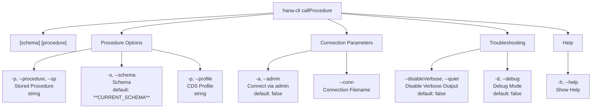

# callProcedure

> Command: `callProcedure`  
> Category: **Developer Tools**  
> Status: Production Ready

## Description

Call a stored procedure and display the results

## Syntax

```bash
hana-cli callProcedure [schema] [procedure] [options]
```

## Aliases

- `cp`
- `callprocedure`
- `callProc`
- `callproc`
- `callSP`
- `callsp`

## Command Diagram



## Parameters

| Option | Alias | Type | Default | Description |
| --- | --- | --- | --- | --- |
| `--procedure` | `--sp`, `-p` | string | - | Stored Procedure to call |
| `--schema` | `-s` | string | `**CURRENT_SCHEMA**` | Schema containing the stored procedure |
| `--profile` | `-p` | string | - | CDS Profile |
| `--admin` | `-a` | boolean | `false` | Connect via admin (default-env-admin.json) |
| `--conn` | - | string | - | Connection filename to override default-env.json |
| `--disableVerbose` | `--quiet` | boolean | `false` | Disable verbose output - useful for scripting commands |
| `--debug` | `-d` | boolean | `false` | Debug hana-cli itself by adding output of LOTS of intermediate details |
| `--help` | `-h` | boolean | - | Show help information |

For a complete list of parameters and options, use:

```bash
hana-cli callProcedure --help
```

## Examples

### Basic Usage

```bash
hana-cli hana-cli callProcedure --procedure myProc --schema MYSCHEMA
```

Execute the command

## Related Commands

See the [Commands Reference](../all-commands.md) for other commands in this category.

## See Also

- [Category: Developer Tools](..)
- [All Commands A-Z](../all-commands.md)
