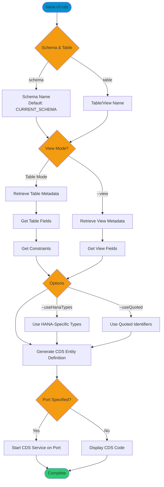

# cds

> Command: `cds`  
> Category: **Developer Tools**  
> Status: Production Ready

## Description

Display a database object via CDS (Core Data Services). This command generates CDS entity definitions from database tables or views and can preview them using a CDS service. It retrieves the object schema, fields, and constraints to generate properly formatted CDS code.

## Syntax

```bash
hana-cli cds [schema] [table] [options]
```

## Aliases

- `cdsPreview`

## Command Diagram



## Parameters

### Positional Arguments

| Parameter | Type | Description |
|-----------|------|-------------|
| `schema` | string | Schema containing the table or view (optional, defaults to `**CURRENT_SCHEMA**`) |
| `table` | string | Database table or view name (optional if using `--table`) |

### Options

| Option | Alias | Type | Default | Description |
|--------|-------|------|---------|-------------|
| `--table` | `-t` | string | - | Database table name |
| `--schema` | `-s` | string | `**CURRENT_SCHEMA**` | Schema containing the table or view |
| `--view` | `-v` | boolean | `false` | CDS processing for View instead of Table |
| `--useHanaTypes` | `--hana` | boolean | `false` | Use SAP HANA-Specific Data Types (see [predefined types](https://cap.cloud.sap/docs/cds/cdl#predefined-types)) |
| `--useQuoted` | `-q`, `--quoted` | boolean | `false` | Use Quoted Identifiers for non-standard identifiers |
| `--port` | `-p` | number | - | Port to run HTTP server for CDS preview |
| `--profile` | `--pr` | string | - | CDS Profile for connection |

### Connection Parameters

| Option | Alias | Type | Default | Description |
|--------|-------|------|---------|-------------|
| `--admin` | `-a` | boolean | `false` | Connect via admin (default-env-admin.json) |
| `--conn` | - | string | - | Connection filename to override default-env.json |

### Troubleshooting

| Option | Alias | Type | Default | Description |
|--------|-------|------|---------|-------------|
| `--disableVerbose` | `--quiet` | boolean | `false` | Disable verbose output - removes all extra output that is only helpful to human readable interface |
| `--debug` | `-d` | boolean | `false` | Debug hana-cli itself by adding output of LOTS of intermediate details |

## Examples

### Basic Usage

```bash
hana-cli cds --table myTable --schema MYSCHEMA
```

Generates CDS entity definition for table `myTable` in schema `MYSCHEMA` and displays the CDS code.

### Generate CDS for a View

```bash
hana-cli cds --table myView --schema MYSCHEMA --view
```

Generates CDS entity definition for view `myView`.

### Use HANA-Specific Types

```bash
hana-cli cds --table myTable --useHanaTypes
```

Generates CDS code using HANA-specific data types instead of generic CDS types.

### Preview with CDS Service

```bash
hana-cli cds --table myTable --port 4004
```

Starts a CDS service on port 4004 to preview the generated entity.

## Related Commands

See the [Commands Reference](../all-commands.md) for other commands in this category.

## See Also

- [Category: Developer Tools](..)
- [All Commands A-Z](../all-commands.md)
