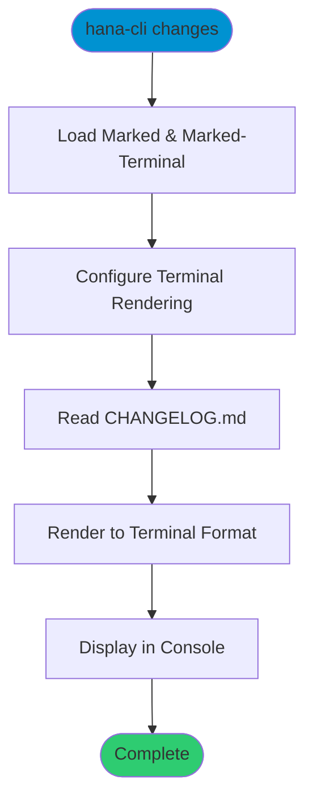

# changes

> Command: `changes`  
> Category: **Developer Tools**  
> Status: Production Ready

## Description

Display the CHANGELOG.md file in the CLI with formatted markdown rendering. This command uses the `marked` and `marked-terminal` packages to render the changelog with proper terminal formatting, making it easy to view version history and recent changes directly from the command line.

## Syntax

```bash
hana-cli changes [options]
```

## Aliases

- `chg`
- `changeLog`
- `changelog`

## Command Diagram



## Parameters

This command does not accept any parameters or options beyond the standard connection and troubleshooting options.

### Connection Parameters

| Option | Alias | Type | Default | Description |
|--------|-------|------|---------|-------------|
| `--admin` | `-a` | boolean | `false` | Connect via admin (default-env-admin.json) |
| `--conn` | - | string | - | Connection filename to override default-env.json |

### Troubleshooting

| Option | Alias | Type | Default | Description |
|--------|-------|------|---------|-------------|
| `--disableVerbose` | `--quiet` | boolean | `false` | Disable verbose output - removes all extra output that is only helpful to human readable interface |
| `--debug` | `-d` | boolean | `false` | Debug hana-cli itself by adding output of LOTS of intermediate details |

## Examples

### Basic Usage

```bash
hana-cli changes
```

Displays the CHANGELOG.md file with terminal-formatted markdown, showing all version history and changes.

### Using Alias

```bash
hana-cli chg
```

Same as above, using the short alias.

## Related Commands

See the [Commands Reference](../all-commands.md) for other commands in this category.

## See Also

- [Category: Developer Tools](..)
- [All Commands A-Z](../all-commands.md)
- [openChangeLog](./open-change-log.md) - Opens CHANGELOG.md in browser
