# codeTemplate

> Command: `codeTemplate`  
> Category: **Developer Tools**  
> Status: Production Ready

## Description

Generate boilerplate code for common patterns

## Syntax

```bash
hana-cli codeTemplate [options]
```

## Aliases

- `template`
- `codegen`
- `scaffold`
- `boilerplate`

## Command Diagram

```mermaid
graph TD
    A["hana-cli codeTemplate [options]"]
    
    A --> B["Connection Parameters"]
    A --> C["Pattern & Object Selection"]
    A --> D["Code Generation Options"]
    A --> E["Additional Options"]
    A --> F["Troubleshooting"]
    
    B --> B1["-a, --admin<br/>Connect via admin"]
    B --> B2["--conn &lt;filename&gt;<br/>Connection Filename"]
    
    C --> C1["-p, --pattern &lt;pattern&gt;<br/>crud|service|repository|mapper<br/>dto|entity|query|test|migration"]
    C --> C2["-o, --object &lt;name&gt;<br/>Object or table name"]
    C --> C3["-s, --schema &lt;name&gt;<br/>Schema name"]
    C --> C4["-f, --output &lt;path&gt;<br/>Output file path"]
    
    D --> D1["-l, --language &lt;lang&gt;<br/>javascript|typescript|java|cds|sql|python<br/>default: typescript"]
    D --> D2["--framework, --fw &lt;fw&gt;<br/>express|spring|nestjs|cds|none<br/>default: none"]
    D --> D3["-c, --comments<br/>Include code comments<br/>default: true"]
    
    E --> E1["--profile, --pr &lt;name&gt;<br/>CDS Profile"]
    E --> E2["-h, --help<br/>Show help"]
    
    F --> F1["--disableVerbose, --quiet<br/>Disable Verbose output"]
    F --> F2["-d, --debug<br/>Debug output"]
```



## Parameters

| Parameter | Short | Type | Choices/Values | Default | Description |
| --- | --- | --- | --- | --- | --- |
| `--admin` | `-a` | boolean | - | false | Connect via admin (default-env-admin.json) |
| `--conn` | - | string | - | - | Connection Filename to override default-env.json |
| `--pattern` | `-p` | string | crud, service, repository, mapper, dto, entity, query, test, migration | - | Code pattern to generate |
| `--object` | `-o` | string | - | - | Object or table name |
| `--schema` | `-s` | string | - | - | Schema name |
| `--language` | `-l` | string | javascript, typescript, java, cds, sql, python | typescript | Programming language |
| `--output` | `-f` | string | - | - | Output file path |
| `--framework` | `--fw` | string | express, spring, nestjs, cds, none | none | Target framework |
| `--comments` | `-c` | boolean | - | true | Include code comments |
| `--profile` | `--pr` | string | - | - | CDS Profile |
| `--disableVerbose` | `--quiet` | boolean | - | false | Disable Verbose output (for scripting) |
| `--debug` | `-d` | boolean | - | false | Debug hana-cli with detailed output |
| `--help` | `-h` | boolean | - | - | Show help |

## Examples

### Basic Usage

```bash
hana-cli codeTemplate --pattern crud --object myTable
```

Execute the command

## Related Commands

See the [Commands Reference](../all-commands.md) for other commands in this category.

## See Also

- [Category: Developer Tools](..)
- [All Commands A-Z](../all-commands.md)
