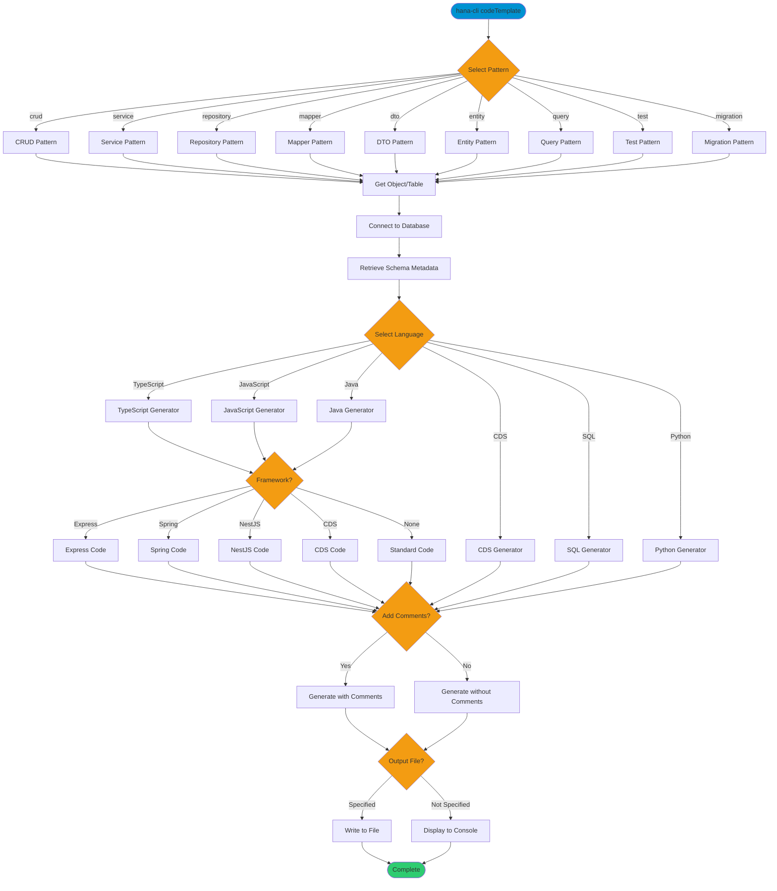

# codeTemplate

> Command: `codeTemplate`  
> Category: **Developer Tools**  
> Status: Production Ready

## Description

Generate boilerplate code for common design patterns. This command creates code templates for CRUD operations, services, repositories, DTOs, entities, and more based on database table schemas. It supports multiple programming languages and frameworks, automatically generating properly structured code from database metadata.

## Syntax

```bash
hana-cli codeTemplate [options]
```

## Aliases

- `template`
- `codegen`
- `scaffold`
- `boilerplate`

## Command Diagram



## Parameters

### Options

| Option | Alias | Type | Default | Description |
|--------|-------|------|---------|-------------|
| `--pattern` | `-p` | string | - | Code pattern to generate. Choices: `crud`, `service`, `repository`, `mapper`, `dto`, `entity`, `query`, `test`, `migration` |
| `--object` | `-o` | string | - | Object or table name to generate code for |
| `--schema` | `-s` | string | - | Schema name containing the object |
| `--language` | `-l` | string | `typescript` | Programming language. Choices: `javascript`, `typescript`, `java`, `cds`, `sql`, `python` |
| `--output` | `-f` | string | - | Output file path (displays to console if not specified) |
| `--framework` | `--fw` | string | `none` | Target framework. Choices: `express`, `spring`, `nestjs`, `cds`, `none` |
| `--comments` | `-c` | boolean | `true` | Include code comments in generated code |
| `--profile` | `--pr` | string | - | CDS Profile for connection |

### Connection Parameters

| Option | Alias | Type | Default | Description |
|--------|-------|------|---------|-------------|
| `--admin` | `-a` | boolean | `false` | Connect via admin (default-env-admin.json) |
| `--conn` | - | string | - | Connection filename to override default-env.json |

### Troubleshooting

| Option | Alias | Type | Default | Description |
|--------|-------|------|---------|-------------|
| `--disableVerbose` | `--quiet` | boolean | `false` | Disable verbose output - removes all extra output that is only helpful to human readable interface |
| `--debug` | `-d` | boolean | `false` | Debug hana-cli itself by adding output of LOTS of intermediate details |

## Examples

### Basic Usage

```bash
hana-cli codeTemplate --pattern crud --object myTable
```

Generates CRUD code template for `myTable` using TypeScript (default language).

### Generate Service in JavaScript

```bash
hana-cli codeTemplate --pattern service --object CUSTOMERS --language javascript
```

Generates a service layer for the CUSTOMERS table using JavaScript.

### Generate with Express Framework

```bash
hana-cli codeTemplate --pattern crud --object ORDERS --framework express --output ./src/orders.controller.ts
```

Generates Express-based CRUD controller for ORDERS table and saves to specified file.

### Generate Java Spring Repository

```bash
hana-cli codeTemplate --pattern repository --object PRODUCTS --language java --framework spring
```

Generates a Spring Data repository for the PRODUCTS table in Java.

### Generate without Comments

```bash
hana-cli codeTemplate --pattern entity --object USERS --comments false
```

Generates entity code for USERS table without inline comments.

## Related Commands

See the [Commands Reference](../all-commands.md) for other commands in this category.

## See Also

- [Category: Developer Tools](..)
- [All Commands A-Z](../all-commands.md)
- [createModule](./create-module.md) - Create a new database module
- [generateDocs](./generate-docs.md) - Generate documentation from database objects
