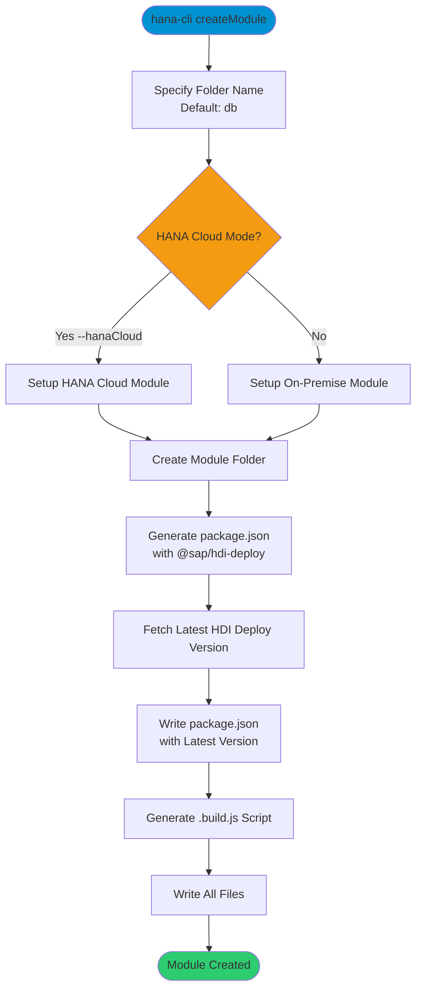

# createModule

> Command: `createModule`  
> Category: **Developer Tools**  
> Status: Production Ready

## Description

Create a new database module with proper structure for SAP HANA development. This command scaffolds a database module folder with the necessary configuration files including package.json with @sap/hdi-deploy dependency, build scripts, and proper settings for SAP HANA Cloud or on-premise deployments.

## Syntax

```bash
hana-cli createModule [options]
```

## Aliases

- `createDB`
- `createDBModule`

## Command Diagram



## Parameters

### Options

| Option | Alias | Type | Default | Description |
|--------|-------|------|---------|-------------|
| `--folder` | `-f` | string | `db` | Folder name for the database module |
| `--hanaCloud` | `--hc`, `--hana-cloud`, `--hanacloud` | boolean | `true` | Build module for SAP HANA Cloud (vs on-premise) |

### Troubleshooting

| Option | Alias | Type | Default | Description |
|--------|-------|------|---------|-------------|
| `--disableVerbose` | `--quiet` | boolean | `false` | Disable verbose output - removes all extra output that is only helpful to human readable interface |
| `--debug` | `-d` | boolean | `false` | Debug hana-cli itself by adding output of LOTS of intermediate details |

## Examples

### Basic Usage

```bash
hana-cli createModule --folder db
```

Creates a new database module in the `db` folder configured for SAP HANA Cloud.

### Create On-Premise Module

```bash
hana-cli createModule --folder database --hanaCloud false
```

Creates a database module configured for SAP HANA on-premise instead of Cloud.

### Create with Custom Folder Name

```bash
hana-cli createModule --folder db-artifacts
```

Creates the database module in a custom folder named `db-artifacts`.

## What Gets Created

The command creates the following structure:

- **package.json**: Contains @sap/hdi-deploy dependency with latest version
  - Node.js engine requirements: ^12.18.0 || ^14.0.0 || ^16.0.0 || ^18.0.0
  - Start script: Executes HDI deployment with auto-undeploy option
- **.build.js**: Build script for CDS compilation
  - Checks for parent package.json existence
  - Runs `npm install && npm run build` from parent directory
  - Handles both build-time and CF staging scenarios

## Related Commands

See the [Commands Reference](../all-commands.md) for other commands in this category.

## See Also

- [Category: Developer Tools](..)
- [All Commands A-Z](../all-commands.md)
