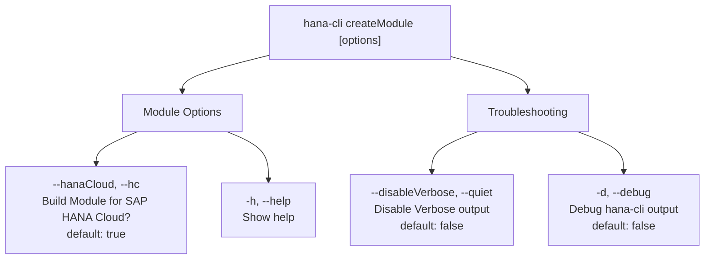

# createModule

> Command: `createModule`  
> Category: **Developer Tools**  
> Status: Production Ready

## Description

Create DB Module

## Syntax

```bash
hana-cli createModule [options]
```

## Aliases

- `createDB`
- `createDBModule`

## Command Diagram



## Parameters

| Parameter | Short/Aliases | Type | Default | Description |
| --- | --- | --- | --- | --- |
| `--hanaCloud` | `--hc`, `--hana-cloud`, `--hanacloud` | boolean | true | Build Module for SAP HANA Cloud? |
| `--disableVerbose` | `--quiet` | boolean | false | Disable Verbose output (removes extra output helpful for human readable interface, useful for scripting) |
| `--debug` | `-d` | boolean | false | Debug hana-cli itself by adding output of LOTS of intermediate details |
| `--help` | `-h` | boolean | - | Show help |

## Examples

### Basic Usage

```bash
hana-cli createModule --folder db
```

Execute the command

## Related Commands

See the [Commands Reference](../all-commands.md) for other commands in this category.

## See Also

- [Category: Developer Tools](..)
- [All Commands A-Z](../all-commands.md)
