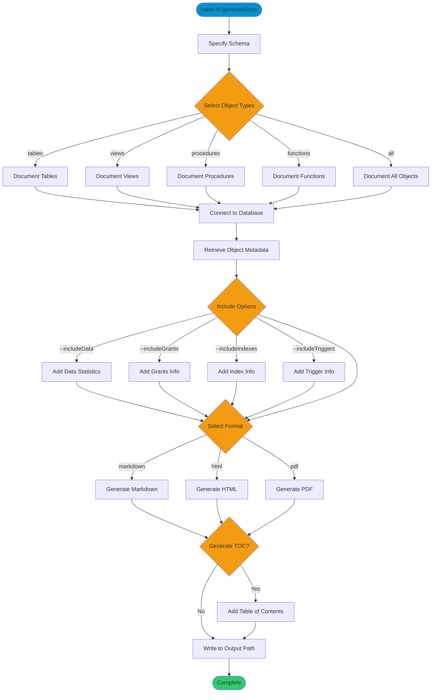

# generateDocs

> Command: `generateDocs`  
> Category: **Developer Tools**  
> Status: Production Ready

## Description

Auto-generate comprehensive database documentation from schema objects. This command creates documentation for tables, views, procedures, and functions with optional data statistics, grants, indexes, and triggers. Output can be generated in markdown, HTML, or PDF format with an automatically generated table of contents.

## Syntax

```bash
hana-cli generateDocs [options]
```

## Aliases

- `gendocs`
- `generateDocumentation`

## Command Diagram



## Parameters

### Options

| Option | Alias | Type | Default | Description |
|--------|-------|------|---------|-------------|
| `--schema` | `-s` | string | - | Schema to document |
| `--objects` | `-o` | string | `all` | Object types to document. Choices: `tables`, `views`, `procedures`, `functions`, `all` |
| `--output` | `-f` | string | - | Documentation output file path |
| `--format` | `--fmt` | string | `markdown` | Output format. Choices: `markdown`, `html`, `pdf` |
| `--includeData` | `--id` | boolean | `false` | Include data statistics in documentation |
| `--includeGrants` | `--ig` | boolean | `true` | Include grants information |
| `--includeIndexes` | `--ii` | boolean | `true` | Include index information |
| `--includeTriggers` | `--it` | boolean | `true` | Include trigger information |
| `--generateTOC` | `--toc` | boolean | `true` | Generate table of contents |
| `--profile` | `-p` | string | - | CDS Profile for connection |

### Connection Parameters

| Option | Alias | Type | Default | Description |
|--------|-------|------|---------|-------------|
| `--admin` | `-a` | boolean | `false` | Connect via admin (default-env-admin.json) |
| `--conn` | - | string | - | Connection filename to override default-env.json |

### Troubleshooting

| Option | Alias | Type | Default | Description |
|--------|-------|------|---------|-------------|
| `--disableVerbose` | `--quiet` | boolean | `false` | Disable verbose output - removes all extra output that is only helpful to human readable interface |
| `--debug` | `-d` | boolean | `false` | Debug hana-cli itself by adding output of LOTS of intermediate details |

## Examples

### Basic Usage

```bash
hana-cli generateDocs --schema MYSCHEMA --format markdown --output docs/
```

Generates markdown documentation for all objects in MYSCHEMA schema and saves to the docs/ folder.

### Document Only Tables and Views

```bash
hana-cli generateDocs --schema MYSCHEMA --objects tables,views
```

Generates documentation for only tables and views, excluding procedures and functions.

### Generate HTML with Data Statistics

```bash
hana-cli generateDocs --schema MYSCHEMA --format html --includeData --output schema-docs.html
```

Creates HTML documentation including data statistics for the schema.

### Generate PDF without TOC

```bash
hana-cli generateDocs --schema MYSCHEMA --format pdf --generateTOC false --output schema.pdf
```

Generates PDF documentation without a table of contents.

### Minimal Documentation

```bash
hana-cli generateDocs --schema MYSCHEMA --includeGrants false --includeIndexes false --includeTriggers false
```

Generates minimal documentation with only basic object information, excluding grants, indexes, and triggers.

## Related Commands

See the [Commands Reference](../all-commands.md) for other commands in this category.

## See Also

- [Category: Developer Tools](..)
- [All Commands A-Z](../all-commands.md)
- [helpDocu](./help-docu.md) - Open online documentation
- [readMe](./read-me.md) - Display README in terminal
