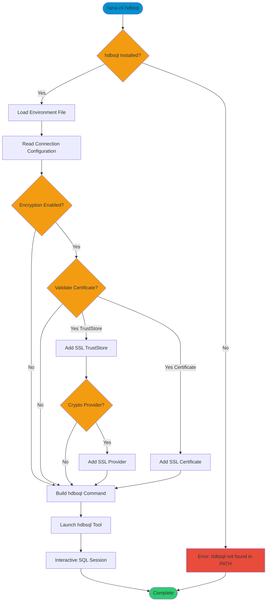

# hdbsql

> Command: `hdbsql`  
> Category: **Developer Tools**  
> Status: Production Ready

## Description

Launch the hdbsql tool (if installed separately) using the locally persisted credentials from default-env*.json. This command automatically configures the connection parameters including encryption settings from your environment configuration files. You can install hdbsql as part of the SAP HANA Client from [https://tools.hana.ondemand.com/#hanatools](https://tools.hana.ondemand.com/#hanatools).

## Syntax

```bash
hana-cli hdbsql [options]
```

## Aliases

No aliases

## Command Diagram



## Parameters

### Connection Parameters

| Option | Alias | Type | Default | Description |
|--------|-------|------|---------|-------------|
| `--admin` | `-a` | boolean | `false` | Connect via admin (default-env-admin.json) |
| `--conn` | - | string | - | Connection filename to override default-env.json |

### Troubleshooting

| Option | Alias | Type | Default | Description |
|--------|-------|------|---------|-------------|
| `--disableVerbose` | `--quiet` | boolean | `false` | Disable verbose output - removes all extra output that is only helpful to human readable interface |
| `--debug` | `-d` | boolean | `false` | Debug hana-cli itself by adding output of LOTS of intermediate details |

## Examples

### Basic Usage

```bash
hana-cli hdbsql
```

Launches hdbsql with connection parameters from default-env.json.

### Use Admin Connection

```bash
hana-cli hdbsql --admin
```

Launches hdbsql using administrator credentials from default-env-admin.json.

### Use Alternative Connection File

```bash
hana-cli hdbsql --conn my-connection.json
```

Launches hdbsql with connection parameters from a custom connection file.

## Prerequisites

The hdbsql client must be installed on your system and available in your PATH. Install it from:

- **SAP HANA Client Download**: [https://tools.hana.ondemand.com/#hanatools](https://tools.hana.ondemand.com/#hanatools)

The command will display an error if hdbsql is not found in your system PATH.

## Connection Configuration

The command automatically handles:

- **User and password** from environment configuration
- **Host and port** from environment configuration
- **SSL encryption** if enabled in configuration
- **Certificate validation** including trust stores and crypto providers
- **Additional hdbsql flags**: `-A` (auto-commit off), `-m` (multiline mode), `-j` (JDBC mode)

## Related Commands

See the [Commands Reference](../all-commands.md) for other commands in this category.

## See Also

- [Category: Developer Tools](..)
- [All Commands A-Z](../all-commands.md)
- [querySimple](./query-simple.md) - Execute SQL queries without hdbsql
- [callProcedure](./call-procedure.md) - Call stored procedures
