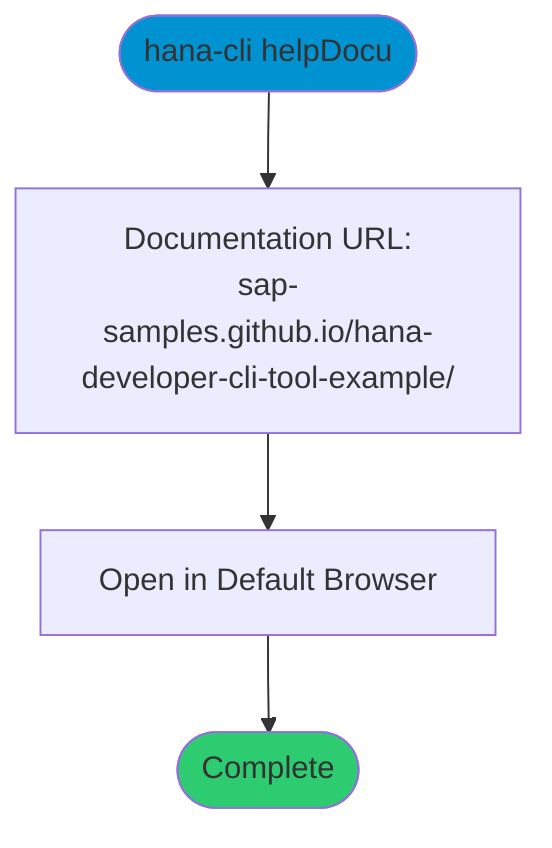

# helpDocu

> Command: `helpDocu`  
> Category: **Developer Tools**  
> Status: Production Ready

## Description

Open the hana-cli documentation website in your default browser. This command launches the online documentation at [https://sap-samples.github.io/hana-developer-cli-tool-example/](https://sap-samples.github.io/hana-developer-cli-tool-example/) where you can browse comprehensive guides, command references, and examples.

## Syntax

```bash
hana-cli helpDocu [options]
```

## Aliases

- `openDocu`
- `openDocumentation`
- `documentation`
- `docu`

## Command Diagram



## Parameters

This command does not accept any command-specific parameters beyond the standard troubleshooting options.

### Troubleshooting

| Option | Alias | Type | Default | Description |
|--------|-------|------|---------|-------------|
| `--disableVerbose` | `--quiet` | boolean | `false` | Disable verbose output - removes all extra output that is only helpful to human readable interface |
| `--debug` | `-d` | boolean | `false` | Debug hana-cli itself by adding output of LOTS of intermediate details |

## Examples

### Basic Usage

```bash
hana-cli helpDocu
```

Opens the hana-cli documentation website in your default browser.

### Using Alias

```bash
hana-cli docu
```

Same as above, using the short alias.

## What Opens

The command opens: [https://sap-samples.github.io/hana-developer-cli-tool-example/](https://sap-samples.github.io/hana-developer-cli-tool-example/)

This documentation site includes:

- Getting started guides
- Complete command reference
- Feature documentation
- API reference
- Development guides
- Troubleshooting information

## Related Commands

See the [Commands Reference](../all-commands.md) for other commands in this category.

## See Also

- [Category: Developer Tools](..)
- [All Commands A-Z](../all-commands.md)
- [readMe](./read-me.md) - Display README in terminal
- [generateDocs](./generate-docs.md) - Generate database documentation
- [issue](./issue.md) - Report an issue on GitHub
