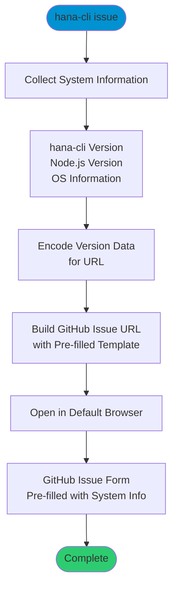

# issue

> Command: `issue`  
> Category: **Developer Tools**  
> Status: Production Ready

## Description

Open a pre-filled GitHub issue form to report problems or suggest improvements. This command automatically includes your system information (hana-cli version, Node.js version, etc.) in the issue template and opens the GitHub issue creation page in your default browser.

## Syntax

```bash
hana-cli issue [options]
```

## Aliases

- `Issue`
- `openIssue`
- `openissue`
- `reportIssue`
- `reportissue`

## Command Diagram



## Parameters

This command does not accept any command-specific parameters beyond the standard troubleshooting options.

### Troubleshooting

| Option | Alias | Type | Default | Description |
|--------|-------|------|---------|-------------|
| `--disableVerbose` | `--quiet` | boolean | `false` | Disable verbose output - removes all extra output that is only helpful to human readable interface |
| `--debug` | `-d` | boolean | `false` | Debug hana-cli itself by adding output of LOTS of intermediate details |

## Examples

### Basic Usage

```bash
hana-cli issue
```

Opens GitHub issue creation form with pre-filled system information.

### Using Alias

```bash
hana-cli reportIssue
```

Same as above, using an alias.

## What Information is Included

The command automatically includes:

- **hana-cli version**: Current installed version
- **Node.js version**: Runtime version
- **Operating system**: Platform and version
- **Additional diagnostics**: Any relevant environment details

This information helps maintainers diagnose and resolve issues more quickly.

## GitHub Repository

Issues are created at:
[https://github.com/SAP-samples/hana-developer-cli-tool-example/issues](https://github.com/SAP-samples/hana-developer-cli-tool-example/issues)

## Related Commands

See the [Commands Reference](../all-commands.md) for other commands in this category.

## See Also

- [Category: Developer Tools](..)
- [All Commands A-Z](../all-commands.md)
- [helpDocu](./help-docu.md) - Open online documentation
- [diagnose](../troubleshooting/diagnose.md) - Run diagnostic checks
