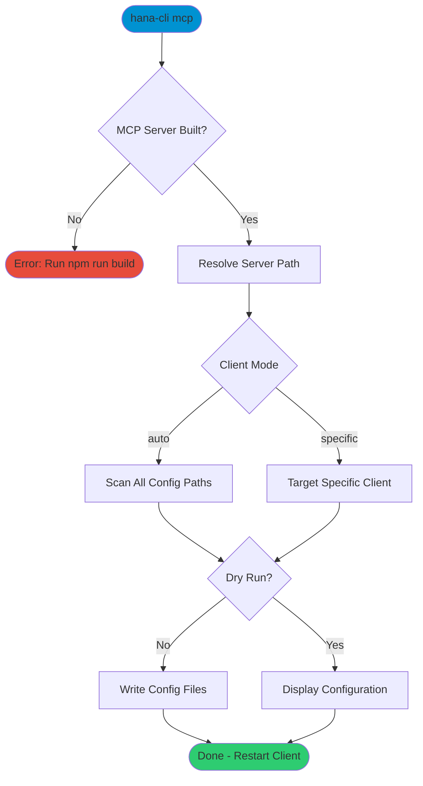

# mcpServerInstall

> Command: `mcpServerInstall`  
> Category: **Developer Tools**  
> Status: Production Ready

## Description

Install the hana-cli MCP server configuration into AI assistant clients. This command writes the necessary JSON configuration so that Claude Desktop, Claude Code, Cursor, Windsurf, Cline, VS Code, Continue, Zed, or other MCP-compatible tools can discover and use all hana-cli commands as MCP tools.

The command resolves the absolute path to the MCP server entry point and your Node.js executable, then merges the configuration into the target client's settings file.

## Syntax

```bash
hana-cli mcpServerInstall [options]
```

## Aliases

- `mcp`
- `mcpInstall`
- `mcp-install`

## Command Diagram



## Parameters

| Option | Alias | Type | Default | Description |
|--------|-------|------|---------|-------------|
| `--client` | `-c` | string | `auto` | Target client: `claude-desktop`, `claude-code`, `cursor`, `windsurf`, `cline`, `vscode`, `continue`, `zed`, or `auto` |
| `--name` | `-n` | string | `hana-cli` | Server name in the MCP configuration |
| `--dryRun` | `--dr` | boolean | `false` | Show what would be written without making changes |
| `--global` | `-g` | boolean | `false` | Install globally (user-level) instead of project-level |

### Client Configuration Paths

| Client | Config Key | Windows | macOS | Linux |
| ------ | ---------- | ------- | ----- | ----- |
| Claude Desktop | `mcpServers` | `%APPDATA%/Claude/claude_desktop_config.json` | `~/Library/Application Support/Claude/claude_desktop_config.json` | `~/.config/Claude/claude_desktop_config.json` |
| Claude Code (project) | `mcpServers` | `.mcp.json` | `.mcp.json` | `.mcp.json` |
| Claude Code (user) | `mcpServers` | `~/.claude.json` | `~/.claude.json` | `~/.claude.json` |
| Cursor | `mcpServers` | `%APPDATA%/Cursor/User/globalStorage/cursor.mcp/settings.json` | `~/Library/Application Support/Cursor/User/globalStorage/cursor.mcp/settings.json` | `~/.config/Cursor/User/globalStorage/cursor.mcp/settings.json` |
| Windsurf | `mcpServers` | `~/.codeium/windsurf/mcp_config.json` | `~/.codeium/windsurf/mcp_config.json` | `~/.codeium/windsurf/mcp_config.json` |
| Cline (VS Code) | `mcpServers` | `%APPDATA%/Code/User/globalStorage/saoudrizwan.claude-dev/settings/cline_mcp_settings.json` | `~/Library/Application Support/Code/User/globalStorage/saoudrizwan.claude-dev/settings/cline_mcp_settings.json` | `~/.config/Code/User/globalStorage/saoudrizwan.claude-dev/settings/cline_mcp_settings.json` |
| VS Code (workspace) | `servers` | `.vscode/mcp.json` | `.vscode/mcp.json` | `.vscode/mcp.json` |
| VS Code (user) | `servers` | `%APPDATA%/Code/User/mcp.json` | `~/Library/Application Support/Code/User/mcp.json` | `~/.config/Code/User/mcp.json` |
| Continue | `mcpServers` | `~/.continue/config.json` | `~/.continue/config.json` | `~/.continue/config.json` |
| Zed | `context_servers` | `%APPDATA%/Zed/settings.json` | `~/.config/zed/settings.json` | `~/.config/zed/settings.json` |

::: tip Config Key Differences
Most clients use the `mcpServers` key. VS Code uses `servers` in a dedicated `mcp.json` file. Zed uses `context_servers` in its `settings.json`. The install command handles these differences automatically.
:::

### Auto Mode Behavior

When `--client` is `auto` (the default), the command scans all known config paths but only writes to files that already exist. This prevents creating config files for tools the user hasn't installed. Use `--client` to explicitly target a specific client.

## Examples

### Preview Configuration

```bash
hana-cli mcp --dry-run
```

Shows the JSON configuration that would be written and which client config files exist on your system.

### Install for Claude Desktop

```bash
hana-cli mcp --client claude-desktop
```

Writes the MCP server entry into the Claude Desktop configuration file.

### Install Globally for Claude Code

```bash
hana-cli mcp --client claude-code --global
```

Writes to `~/.claude/settings.json` so the MCP server is available in all projects.

### Install with Custom Server Name

```bash
hana-cli mcp --client claude-code --name my-hana-server
```

Uses `my-hana-server` as the key in the `mcpServers` configuration instead of the default `hana-cli`.

### Install for Windsurf

```bash
hana-cli mcp --client windsurf
```

Writes the MCP server entry into Windsurf's configuration file.

### Install for VS Code

```bash
hana-cli mcp --client vscode
```

Writes the MCP server entry into the workspace-level `.vscode/mcp.json`. Use `--global` to write to the user-level VS Code config instead.

### Install for Zed

```bash
hana-cli mcp --client zed
```

Writes using Zed's `context_servers` key in its settings file.

## Prerequisites

The MCP server must be built before installation:

```bash
cd mcp-server
npm install
npm run build
```

## What Gets Written

The command adds/updates a single entry in the client's MCP configuration. All entries include `"type": "stdio"` for broad client compatibility. Most clients use the `mcpServers` key:

```json
{
  "mcpServers": {
    "hana-cli": {
      "type": "stdio",
      "command": "/path/to/node",
      "args": ["/path/to/mcp-server/build/index.js"]
    }
  }
}
```

VS Code uses the `servers` key in a dedicated `mcp.json`:

```json
{
  "servers": {
    "hana-cli": {
      "type": "stdio",
      "command": "/path/to/node",
      "args": ["/path/to/mcp-server/build/index.js"]
    }
  }
}
```

Zed uses `context_servers` in its `settings.json`:

```json
{
  "context_servers": {
    "hana-cli": {
      "type": "stdio",
      "command": "/path/to/node",
      "args": ["/path/to/mcp-server/build/index.js"]
    }
  }
}
```

::: info Claude Code File Locations
Claude Code reads MCP servers from `.mcp.json` (project root, team-shared) or `~/.claude.json` (user scope), **not** from `.claude/settings.json`. The install command writes to the correct location automatically.
:::

Existing entries in the configuration are preserved — only the `hana-cli` key is added or updated.

## Related Commands

See the [Commands Reference](../all-commands.md) for other commands in this category.

## See Also

- [Category: Developer Tools](..)
- [All Commands A-Z](../all-commands.md)
- [mcpServerStatus](./mcp-server-status.md) - Check MCP server installation status
- [MCP Integration Guide](../../03-features/mcp-integration.md) - Full MCP feature documentation
- [helpDocu](./help-docu.md) - Open documentation in browser
