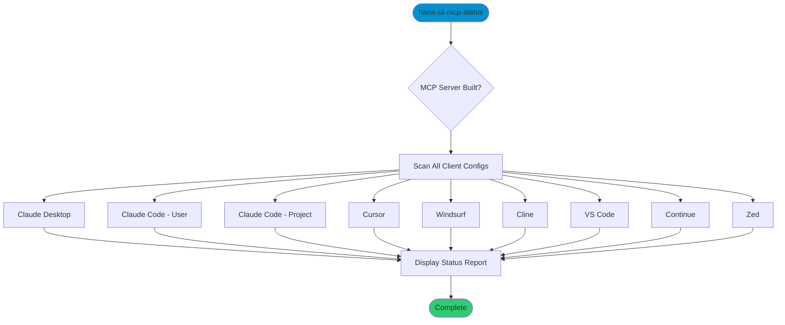

# mcpServerStatus

> Command: `mcpServerStatus`  
> Category: **Developer Tools**  
> Status: Production Ready

## Description

Check the MCP server installation status across all supported AI assistant clients. This command scans known configuration paths for Claude Desktop, Claude Code, Cursor, Windsurf, Cline, VS Code, Continue, and Zed to report whether the hana-cli MCP server is configured in each.

## Syntax

```bash
hana-cli mcpServerStatus
```

## Aliases

- `mcp-status`
- `mcpStatus`

## Command Diagram



## Parameters

This command does not accept any command-specific parameters beyond the standard troubleshooting options.

### Troubleshooting

| Option | Alias | Type | Default | Description |
|--------|-------|------|---------|-------------|
| `--disableVerbose` | `--quiet` | boolean | `false` | Disable verbose output |
| `--debug` | `-d` | boolean | `false` | Debug hana-cli itself |

## Examples

### Basic Usage

```bash
hana-cli mcp-status
```

Outputs a status report like:

```
SAP HANA CLI - MCP Server Status

  Server path: /path/to/mcp-server/build/index.js
  Built: yes

Client Configuration Status:

  ● Claude Code (project)
    configured (hana-cli)
    /project/.mcp.json

  ○ Claude Code (user)
    config exists, not configured
    ~/.claude.json

  – Claude Desktop
    config not found
    ~/.config/Claude/claude_desktop_config.json

  – Cursor
    config not found
    ~/.config/Cursor/User/globalStorage/cursor.mcp/settings.json

  – Windsurf
    config not found
    ~/.codeium/windsurf/mcp_config.json

  – Cline (VS Code)
    config not found
    ~/.config/Code/User/globalStorage/saoudrizwan.claude-dev/settings/cline_mcp_settings.json

  ● VS Code (workspace)
    configured (hana-cli)
    /project/.vscode/mcp.json

  – VS Code (user)
    config not found
    ~/.config/Code/User/mcp.json

  – Continue
    config not found
    ~/.continue/config.json

  – Zed
    config not found
    ~/.config/zed/settings.json
```

### Status Icons

| Icon | Meaning |
|------|---------|
| `●` (green) | Configured — MCP server entry found |
| `○` (dim) | Config file exists but MCP server not configured |
| `–` (dim) | Config file not found (client likely not installed) |

## Related Commands

See the [Commands Reference](../all-commands.md) for other commands in this category.

## See Also

- [Category: Developer Tools](..)
- [All Commands A-Z](../all-commands.md)
- [mcpServerInstall](./mcp-server-install.md) - Install MCP server configuration
- [MCP Integration Guide](../../03-features/mcp-integration.md) - Full MCP feature documentation
