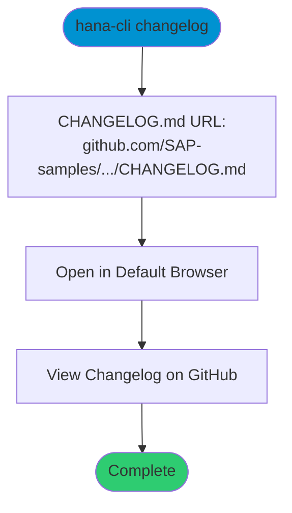

# openChangeLog

> Command: `changelog`  
> Category: **Developer Tools**  
> Status: Production Ready

## Description

Open the CHANGELOG.md file in your default browser on GitHub. This command launches the GitHub web view of the changelog where you can view the complete version history, release notes, and changes in a formatted interface.

Note: The command name is `changelog`, not `openChangeLog` (which is the filename convention for documentation).

## Syntax

```bash
hana-cli changelog [options]
```

## Aliases

- `openrchangelog`
- `openChangeLog`
- `openChangelog`
- `ChangeLog`
- `Changelog`
- `changes`
- `Changes`

## Command Diagram



## Parameters

This command does not accept any command-specific parameters beyond the standard troubleshooting options.

### Troubleshooting

| Option | Alias | Type | Default | Description |
|--------|-------|------|---------|-------------|
| `--disableVerbose` | `--quiet` | boolean | `false` | Disable verbose output - removes all extra output that is only helpful to human readable interface |
| `--debug` | `-d` | boolean | `false` | Debug hana-cli itself by adding output of LOTS of intermediate details |

## Examples

### Basic Usage

```bash
hana-cli changelog
```

Opens the CHANGELOG.md file on GitHub in your default browser.

### Using Alias

```bash
hana-cli changes
```

Same as above, using an alias.

## What Opens

The command opens:
[https://github.com/SAP-samples/hana-developer-cli-tool-example/blob/main/CHANGELOG.md](https://github.com/SAP-samples/hana-developer-cli-tool-example/blob/main/CHANGELOG.md)

This provides:

- Complete version history
- Release notes for each version
- Formatted markdown rendering
- Links to related issues and pull requests

## Related Commands

See the [Commands Reference](../all-commands.md) for other commands in this category.

## See Also

- [Category: Developer Tools](..)
- [All Commands A-Z](../all-commands.md)
- [changes](./change-log.md) - Display changelog in terminal
- [version](../system-tools/version.md) - Show current hana-cli version
