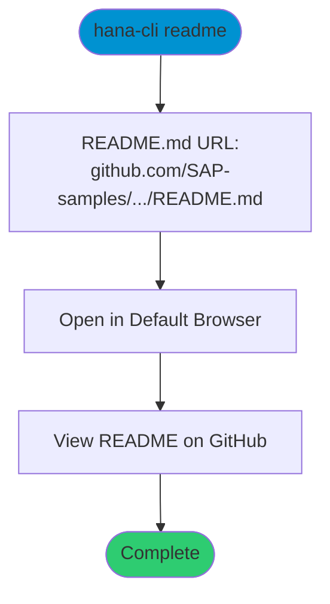

# openReadMe

> Command: `readme`  
> Category: **Developer Tools**  
> Status: Production Ready

## Description

Open the README.md file in your default browser on GitHub. This command launches the GitHub web view of the project README where you can view installation instructions, quick start guide, and project overview in a formatted interface.

Note: The command name is `readme`, not `openReadMe` (which is the filename convention for documentation).

## Syntax

```bash
hana-cli readme [options]
```

## Aliases

- `openreadme`
- `openReadme`
- `openReadMe`
- `openHelp`
- `openhelp`

## Command Diagram



## Parameters

This command does not accept any command-specific parameters beyond the standard troubleshooting options.

### Troubleshooting

| Option | Alias | Type | Default | Description |
|--------|-------|------|---------|-------------|
| `--disableVerbose` | `--quiet` | boolean | `false` | Disable verbose output - removes all extra output that is only helpful to human readable interface |
| `--debug` | `-d` | boolean | `false` | Debug hana-cli itself by adding output of LOTS of intermediate details |

## Examples

### Basic Usage

```bash
hana-cli readme
```

Opens the README.md file on GitHub in your default browser.

### Using Alias

```bash
hana-cli openReadMe
```

Same as above, using an alias.

## What Opens

The command opens:
[https://github.com/SAP-samples/hana-developer-cli-tool-example/blob/main/README.md](https://github.com/SAP-samples/hana-developer-cli-tool-example/blob/main/README.md)

This provides:

- Project overview and description
- Installation instructions
- Quick start guide
- Feature highlights
- Getting started information
- Links to documentation

## Related Commands

See the [Commands Reference](../all-commands.md) for other commands in this category.

## See Also

- [Category: Developer Tools](..)
- [All Commands A-Z](../all-commands.md)
- [readMe](./read-me.md) - Display README in terminal
- [helpDocu](./help-docu.md) - Open online documentation
