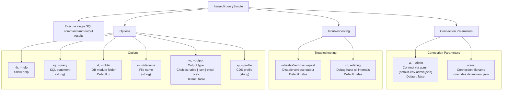

# querySimple

> Command: `querySimple`  
> Category: **Developer Tools**  
> Status: Production Ready

## Description

Execute single SQL command and output results

## Syntax

```bash
hana-cli querySimple [options]
```

## Aliases

- `qs`
- `querysimple`

## Command Diagram



## Parameters

| Group | Flags | Description | Type | Default | Choices |
| --- | --- | --- | --- | --- | --- |
| Connection | `-a, --admin` | Connect via admin (`default-env-admin.json`) | `boolean` | `false` | — |
| Connection | `--conn` | Connection filename to override `default-env.json` | `string` | — | — |
| Troubleshooting | `--disableVerbose`, `--quiet` | Disable verbose output (useful for scripting) | `boolean` | `false` | — |
| Troubleshooting | `-d, --debug` | Debug `hana-cli` with detailed intermediate output | `boolean` | `false` | — |
| Options | `-h, --help` | Show help | `boolean` | — | — |
| Options | `-q, --query` | SQL statement | `string` | — | — |
| Options | `-f, --folder` | DB module folder name | `string` | `./` | — |
| Options | `-n, --filename` | File name | `string` | — | — |
| Options | `-o, --output` | Output type for query results | `string` | `table` | `table`, `json`, `excel`, `csv` |
| Options | `-p, --profile` | CDS profile | `string` | — | — |

For the complete generated help output, use:

```bash
hana-cli querySimple --help
```

## Examples

### Basic Usage

```bash
hana-cli querySimple --query "SELECT * FROM CUSTOMERS" --output csv
```

Execute the command

---

## querySimpleUI (UI Variant)

> Command: `querySimpleUI`  
> Status: Production Ready

**Description:** Execute querySimpleUI command - UI version for executing SQL queries

**Syntax:**

```bash
hana-cli querySimpleUI [options]
```

**Aliases:**

- `qsui`
- `querysimpleui`
- `queryUI`
- `sqlUI`

**Parameters:**

For a complete list of parameters and options, use:

```bash
hana-cli querySimpleUI --help
```

**Example Usage:**

```bash
hana-cli querySimpleUI
```

Execute the command

## Related Commands

See the [Commands Reference](../all-commands.md) for other commands in this category.

## See Also

- [Category: Developer Tools](..)
- [All Commands A-Z](../all-commands.md)
