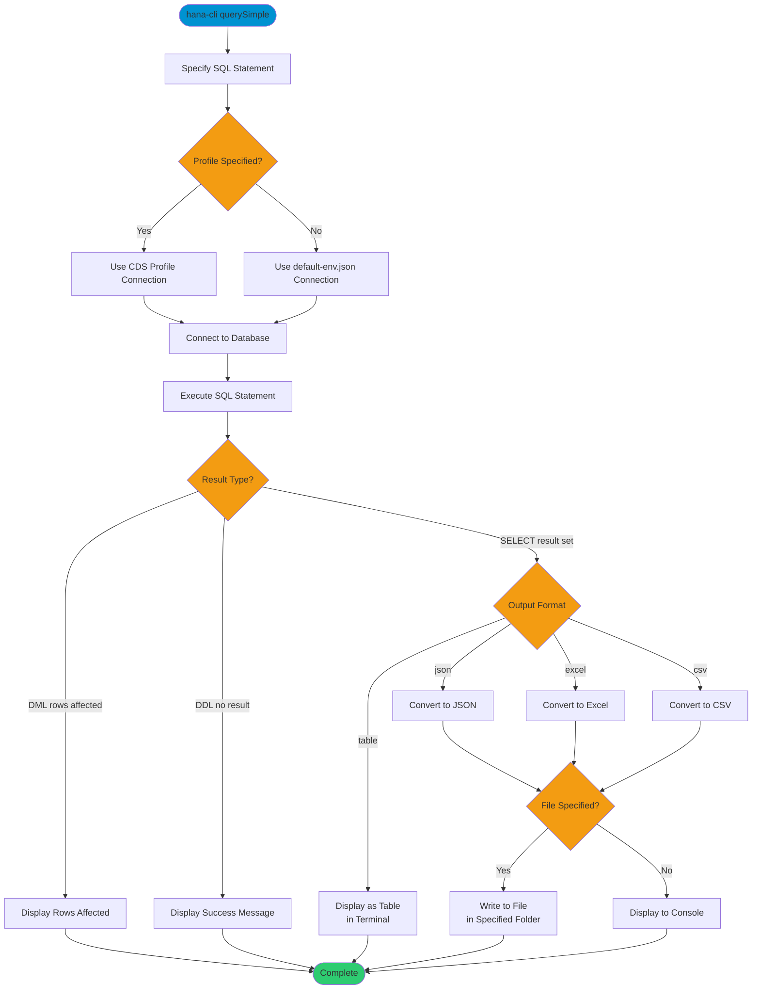

# querySimple

> Command: `querySimple`  
> Category: **Developer Tools**  
> Status: Production Ready

## Description

Execute any single SQL statement and display or export the results. This command supports SELECT queries (returning result sets), DML statements (INSERT, UPDATE, DELETE — returning rows-affected counts), and DDL statements (CREATE, DROP, ALTER — returning success confirmation). Results can be saved to a file or displayed in the terminal.

## Syntax

```bash
hana-cli querySimple [options]
```

## Aliases

- `qs`
- `querysimple`

## Command Diagram



## Parameters

### Options

| Option | Alias | Type | Default | Description |
|--------|-------|------|---------|-------------|
| `--query` | `-q` | string | - | SQL statement to execute |
| `--folder` | `-f` | string | `./` | Folder path for output file (when saving to file) |
| `--filename` | `-n` | string | - | Output filename (when saving to file) |
| `--output` | `-o` | string | `table` | Output format. Choices: `table`, `json`, `excel`, `csv` |
| `--profile` | `-p` | string | - | CDS Profile for connection |

### Connection Parameters

| Option | Alias | Type | Default | Description |
|--------|-------|------|---------|-------------|
| `--admin` | `-a` | boolean | `false` | Connect via admin (default-env-admin.json) |
| `--conn` | - | string | - | Connection filename to override default-env.json |

### Troubleshooting

| Option | Alias | Type | Default | Description |
|--------|-------|------|---------|-------------|
| `--disableVerbose` | `--quiet` | boolean | `false` | Disable verbose output - removes all extra output that is only helpful to human readable interface |
| `--debug` | `-d` | boolean | `false` | Debug hana-cli itself by adding output of LOTS of intermediate details |

## Output Behavior by Statement Type

| Statement Type | Default Output | JSON Output (`--output json`) |
|---------------|----------------|-------------------------------|
| SELECT | Formatted table | `[{...}, {...}]` (array of row objects) |
| INSERT/UPDATE/DELETE | `Rows affected: N` | `{"rowsAffected": N}` |
| CREATE/DROP/ALTER | `Statement executed successfully` | `{"success": true, "message": "..."}` |

All statement types exit with code 0 on success, making this command safe for scripting and automation.

## Examples

### SELECT Queries

```bash
# Display results as a formatted table (default)
hana-cli querySimple --query "SELECT TOP 10 * FROM ORDERS"

# Output as JSON for programmatic use
hana-cli querySimple --query "SELECT * FROM CUSTOMERS" --output json --quiet

# Export to CSV file
hana-cli querySimple --query "SELECT * FROM SALES" --output csv --folder ./exports --filename sales

# Export to Excel file
hana-cli querySimple --query "SELECT * FROM PRODUCTS" --output excel --folder ./exports --filename products
```

### DML Statements (INSERT, UPDATE, DELETE)

```bash
# Insert a row
hana-cli querySimple --query "INSERT INTO CONFIG (KEY, VALUE) VALUES ('timeout', '30')"
# Output: Rows affected: 1

# Update rows
hana-cli querySimple --query "UPDATE CONFIG SET VALUE = '60' WHERE KEY = 'timeout'" --output json --quiet
# Output: {"rowsAffected": 1}

# Delete rows
hana-cli querySimple --query "DELETE FROM LOGS WHERE CREATED_AT < ADD_DAYS(CURRENT_DATE, -90)"
# Output: Rows affected: 1542
```

### DDL Statements (CREATE, DROP, ALTER)

```bash
# Create a table
hana-cli querySimple --query "CREATE TABLE T1 (ID INT PRIMARY KEY, NAME NVARCHAR(100))" --output json --quiet
# Output: {"success": true, "message": "Statement executed successfully (no result set)."}

# Drop a table
hana-cli querySimple --query "DROP TABLE T1"
# Output: Statement executed successfully (no result set).
```

### Use Alias

```bash
hana-cli qs --query "SELECT COUNT(*) as TOTAL FROM ORDERS"
```

Same functionality using the short alias `qs`.

## Related Commands

See the [Commands Reference](../all-commands.md) for other commands in this category.

## See Also

- [Category: Developer Tools](..)
- [All Commands A-Z](../all-commands.md)
- [hdbsql](./hdbsql.md) - Launch interactive SQL client
- [callProcedure](./call-procedure.md) - Execute stored procedures
