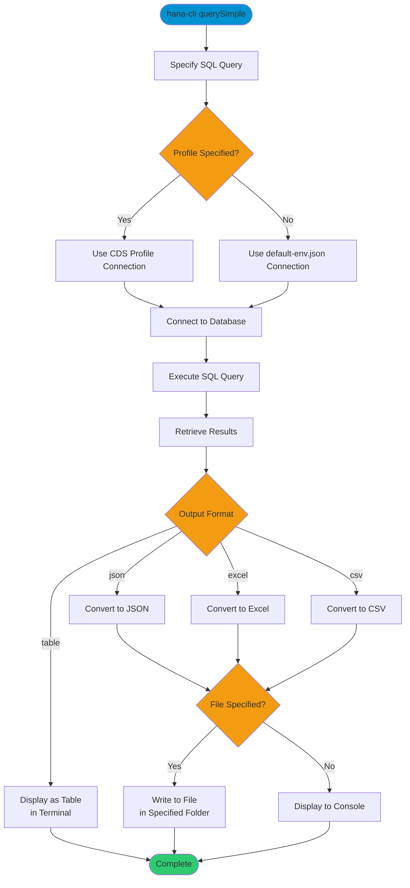

# querySimple

> Command: `querySimple`  
> Category: **Developer Tools**  
> Status: Production Ready

## Description

Execute a simple SQL query and display or export the results. This command provides a quick way to run SQL queries against the database with output options including table display, JSON, Excel, or CSV formats. Results can be saved to a file or displayed in the terminal.

## Syntax

```bash
hana-cli querySimple [options]
```

## Aliases

- `qs`
- `querysimple`

## Command Diagram



## Parameters

### Options

| Option | Alias | Type | Default | Description |
|--------|-------|------|---------|-------------|
| `--query` | `-q` | string | - | SQL query to execute |
| `--folder` | `-f` | string | `./` | Folder path for output file (when saving to file) |
| `--filename` | `-n` | string | - | Output filename (when saving to file) |
| `--output` | `-o` | string | `table` | Output format. Choices: `table`, `json`, `excel`, `csv` |
| `--profile` | `-p` | string | - | CDS Profile for connection |

### Connection Parameters

| Option | Alias | Type | Default | Description |
|--------|-------|------|---------|-------------|
| `--admin` | `-a` | boolean | `false` | Connect via admin (default-env-admin.json) |
| `--conn` | - | string | - | Connection filename to override default-env.json |

### Troubleshooting

| Option | Alias | Type | Default | Description |
|--------|-------|------|---------|-------------|
| `--disableVerbose` | `--quiet` | boolean | `false` | Disable verbose output - removes all extra output that is only helpful to human readable interface |
| `--debug` | `-d` | boolean | `false` | Debug hana-cli itself by adding output of LOTS of intermediate details |

## Examples

### Basic Usage

```bash
hana-cli querySimple --query "SELECT * FROM CUSTOMERS" --output csv
```

Executes the query and displays results in CSV format.

### Display as Table

```bash
hana-cli querySimple --query "SELECT TOP 10 * FROM ORDERS"
```

Executes the query and displays the first 10 results as a formatted table in the terminal (default output).

### Export to Excel

```bash
hana-cli querySimple --query "SELECT * FROM PRODUCTS" --output excel --filename products.xlsx
```

Executes the query and exports results to an Excel file.

### Export to CSV with Custom Folder

```bash
hana-cli querySimple --query "SELECT * FROM SALES" --output csv --folder ./exports --filename sales.csv
```

Exports query results to a CSV file in the specified folder.

### Export to JSON

```bash
hana-cli querySimple --query "SELECT * FROM USERS" --output json --filename users.json
```

Exports query results to a JSON file.

### Use Alias

```bash
hana-cli qs --query "SELECT COUNT(*) as TOTAL FROM ORDERS"
```

Same functionality using the short alias `qs`.

## Related Commands

See the [Commands Reference](../all-commands.md) for other commands in this category.

## See Also

- [Category: Developer Tools](..)
- [All Commands A-Z](../all-commands.md)
- [hdbsql](./hdbsql.md) - Launch interactive SQL client
- [callProcedure](./call-procedure.md) - Execute stored procedures
