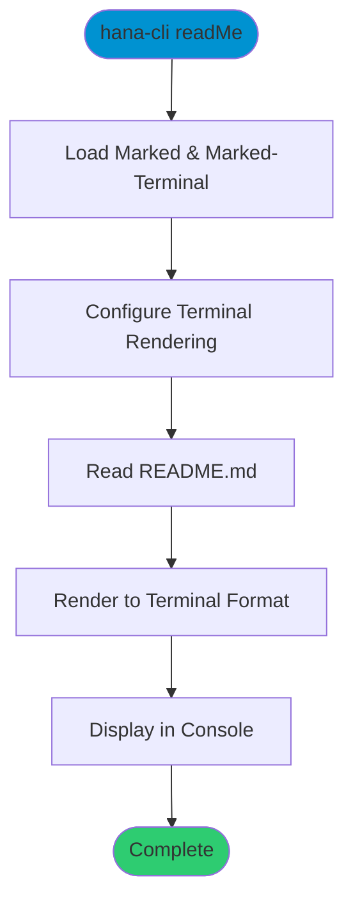

# readMe

> Command: `readMe`  
> Category: **Developer Tools**  
> Status: Production Ready

## Description

Display the project README.md file in the terminal with formatted markdown rendering. This command uses the `marked` and `marked-terminal` packages to render the README with proper terminal formatting, making it easy to view project information, installation instructions, and quick start guide directly from the command line without leaving the terminal.

## Syntax

```bash
hana-cli readMe [options]
```

## Aliases

- `readme`

## Command Diagram



## Parameters

This command does not accept any command-specific parameters.

## Examples

### Basic Usage

```bash
hana-cli readMe
```

Displays the README.md file with terminal-formatted markdown.

### Using Alias

```bash
hana-cli readme
```

Same as above, using the alias.

## What is Displayed

The command displays the README.md content including:

- **Project title and description**
- **Installation instructions**
- **Quick start guide**
- **Feature highlights**
- **Usage examples**
- **Requirements and prerequisites**
- **Links to documentation**
- **License information**

All markdown formatting is rendered appropriately for terminal display:

- Headings are styled and highlighted
- Code blocks are formatted
- Lists are properly indented
- Links are preserved
- Bold and italic text is rendered

## Related Commands

See the [Commands Reference](../all-commands.md) for other commands in this category.

## See Also

- [Category: Developer Tools](..)
- [All Commands A-Z](../all-commands.md)
- [openReadMe](./open-read-me.md) - Open README on GitHub
- [helpDocu](./help-docu.md) - Open online documentation
- [changes](./change-log.md) - Display changelog in terminal
