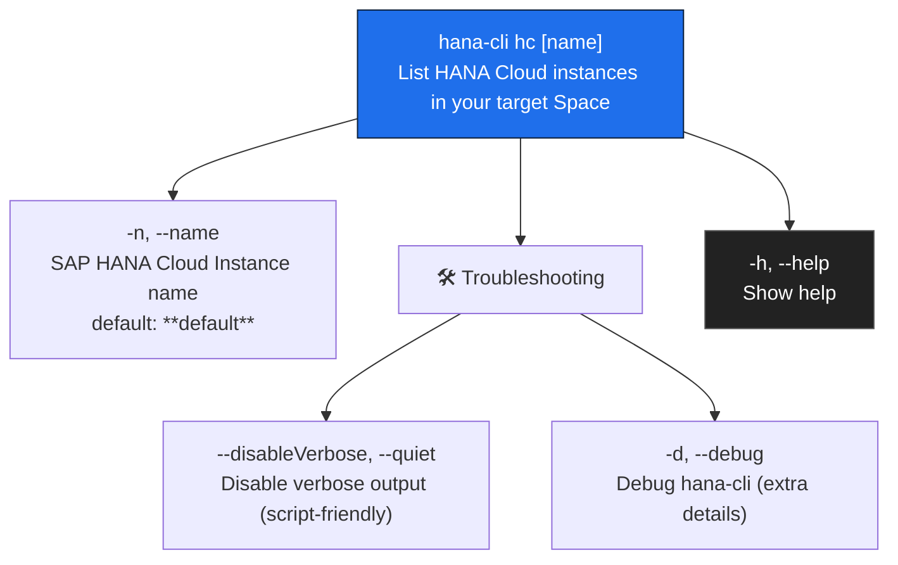

# hanaCloudInstances

> Command: `hanaCloudInstances`  
> Category: **HANA Cloud**  
> Status: Production Ready

## Description

List all SAP HANA Cloud instances in your target Space

## Syntax

```bash
hana-cli hc [name] [options]
```

## Aliases

- `hcInstances`
- `instances`
- `listHC`
- `listhc`
- `hcinstances`

## Command Diagram



## Parameters

For a complete list of parameters and options, use:

```bash
hana-cli hanaCloudInstances --help
```

| Option | Alias | Type | Default | Description |
| --- | --- | --- | --- | --- |
| `--disableVerbose` | `--quiet` | boolean | `false` | Disable verbose output (removes extra human-readable output; useful for scripting). |
| `--debug` | `-d` | boolean | `false` | Debug hana-cli by adding lots of intermediate details. |
| `--help` | `-h` | boolean | `—` | Show help. |
| `--name` | `-n` | string | `**default**` | SAP HANA Cloud instance name. |

## Examples

### Basic Usage

```bash
hana-cli hc --name myInstance
```

Execute the command

## Related Commands

See the [Commands Reference](../all-commands.md) for other commands in this category.

## See Also

- [Category: HANA Cloud](..)
- [All Commands A-Z](../all-commands.md)
