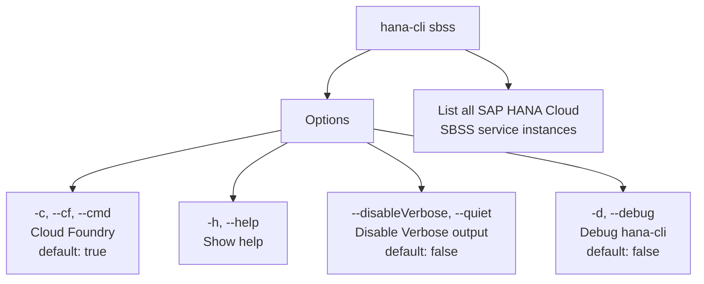

# hanaCloudSBSSInstances

> Command: `hanaCloudSBSSInstances`  
> Category: **HANA Cloud**  
> Status: Production Ready

## Description

List all SAP HANA Cloud SBSS service instances in your target Space

## Syntax

```bash
hana-cli sbss [options]
```

## Aliases

- `sbssInstances`
- `sbssinstances`
- `sbssServices`
- `listsbss`
- `sbssservices`
- `sbsss`

## Command Diagram



## Parameters

| Option | Description | Type | Default |
| --- | --- | --- | --- |
| `-c, --cf, --cmd` | Cloud Foundry | boolean | true |
| `-h, --help` | Show help | boolean | - |
| `-d, --debug` | Debug hana-cli itself by adding output of LOTS of intermediate details | boolean | false |
| `--disableVerbose, --quiet` | Disable Verbose output - removes all extra output that is only helpful to human readable interface. Useful for scripting commands. | boolean | false |

For a complete list of parameters and options, use:

```bash
hana-cli hanaCloudSBSSInstances --help
```

## Examples

### Basic Usage

```bash
hana-cli sbss --cf
```

Execute the command

---

## hanaCloudSBSSInstancesUI (UI Variant)

> Command: `hanaCloudSBSSInstancesUI`  
> Status: Production Ready

**Description:** Execute hanaCloudSBSSInstancesUI command - UI version for listing SAP HANA Cloud SBSS instances

**Syntax:**

```bash
hana-cli sbssUI [options]
```

**Aliases:**

- `sbssInstancesUI`
- `sbssinstancesui`
- `sbssServicesUI`
- `listsbssui`
- `sbssservicesui`
- `sbsssui`

**Parameters:**

For a complete list of parameters and options, use:

```bash
hana-cli sbssUI --help
```

**Example Usage:**

```bash
hana-cli sbssUI
```

Execute the command

## Related Commands

See the [Commands Reference](../all-commands.md) for other commands in this category.

## See Also

- [Category: HANA Cloud](..)
- [All Commands A-Z](../all-commands.md)
