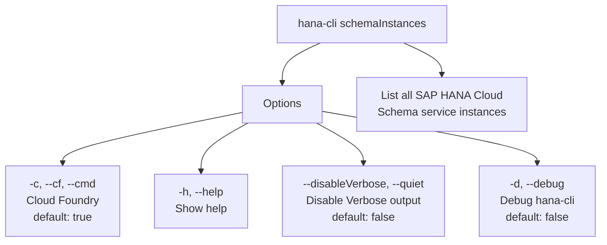

# hanaCloudSchemaInstances

> Command: `hanaCloudSchemaInstances`  
> Category: **HANA Cloud**  
> Status: Production Ready

## Description

List all SAP HANA Cloud Schema service instances in your target Space

## Syntax

```bash
hana-cli schemaInstances [options]
```

## Aliases

- `schemainstances`
- `schemaServices`
- `listschemas`
- `schemaservices`

## Command Diagram



## Parameters

| Flag | Description | Type | Default |
| --- | --- | --- | --- |
| `-h, --help` | Show help | boolean | - |
| `-c, --cf, --cmd` | Cloud Foundry? | boolean | `true` |
| `--disableVerbose, --quiet` | Disable Verbose output - removes all extra output that is only helpful to human readable interface. Useful for scripting commands. | boolean | `false` |
| `-d, --debug` | Debug hana-cli itself by adding output of LOTS of intermediate details | boolean | `false` |

For a complete list of parameters and options, use:

```bash
hana-cli schemaInstances --help
```

## Examples

### Basic Usage

```bash
hana-cli schemaInstances --cf
```

Execute the command

---

## hanaCloudSchemaInstancesUI (UI Variant)

> Command: `hanaCloudSchemaInstancesUI`  
> Status: Production Ready

**Description:** Execute hanaCloudSchemaInstancesUI command - UI version for listing SAP HANA Cloud Schema instances

**Syntax:**

```bash
hana-cli schemaInstancesUI [options]
```

**Aliases:**

- `schemainstancesui`
- `schemaServicesUI`
- `listschemasui`
- `schemaservicesui`

**Parameters:**

For a complete list of parameters and options, use:

```bash
hana-cli hanaCloudSchemaInstancesUI --help
```

**Example Usage:**

```bash
hana-cli schemaInstancesUI
```

Execute the command

## Related Commands

See the [Commands Reference](../all-commands.md) for other commands in this category.

## See Also

- [Category: HANA Cloud](..)
- [All Commands A-Z](../all-commands.md)
