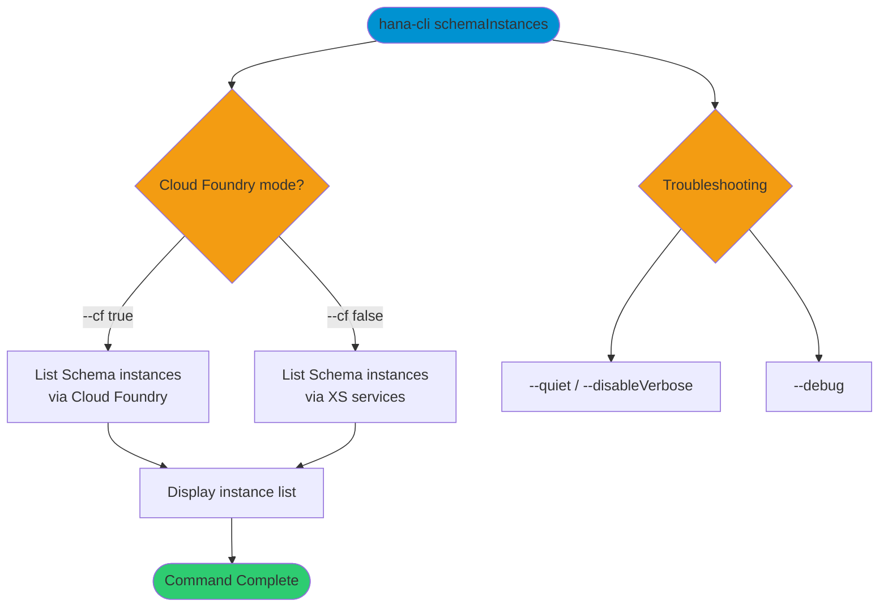
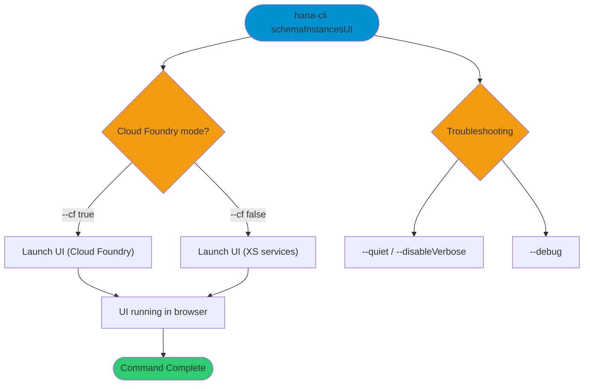

# hanaCloudSchemaInstances

> Command: `hanaCloudSchemaInstances`  
> Category: **HANA Cloud**  
> Status: Production Ready

## Description

List SAP HANA Cloud Schema service instances in the current target space. By default, the command uses the Cloud Foundry API; set the flag to false to use XS-based service APIs.

## Syntax

```bash
hana-cli schemaInstances [options]
```

## Aliases

- `schemainstances`
- `schemaServices`
- `listschemas`
- `schemaservices`

## Command Diagram



## Parameters

### Options

| Option  | Alias         | Type    | Default | Description                                                     |
|---------|---------------|---------|---------|-----------------------------------------------------------------|
| `--cf`  | `-c`, `--cmd` | boolean | `true`  | Cloud Foundry mode (set to `false` for XS-based service APIs).   |

### Troubleshooting

| Option             | Alias     | Type    | Default | Description                                         |
|--------------------|-----------|---------|---------|-----------------------------------------------------|
| `--disableVerbose` | `--quiet` | boolean | `false` | Disable verbose output for script-friendly results. |
| `--debug`          | `-d`      | boolean | `false` | Enable debug output with intermediate details.      |
| `--help`           | `-h`      | boolean | -       | Show help.                                          |

For a complete list of parameters and options, use:

```bash
hana-cli schemaInstances --help
```

## Examples

### Basic Usage

```bash
hana-cli schemaInstances --cf
```

List Schema instances using Cloud Foundry mode.

## Interactive Mode

This command can be run in interactive mode, which prompts for optional inputs.

| Parameter | Required | Prompted | Notes                                           |
|-----------|----------|----------|-------------------------------------------------|
| `cf`      | No       | Always   | Cloud Foundry mode (default: `true`).          |

---

## hanaCloudSchemaInstancesUI (UI Variant)

> Command: `hanaCloudSchemaInstancesUI`  
> Category: **HANA Cloud**  
> Status: Production Ready

### UI Description

Launch the Schema instances UI for the current target space.

### UI Syntax

```bash
hana-cli schemaInstancesUI [options]
```

### UI Aliases

- `schemainstancesui`
- `schemaServicesUI`
- `listschemasui`
- `schemaservicesui`

### UI Command Diagram



### UI Parameters

#### UI Options

| Option  | Alias         | Type    | Default | Description                                                     |
|---------|---------------|---------|---------|-----------------------------------------------------------------|
| `--cf`  | `-c`, `--cmd` | boolean | `true`  | Cloud Foundry mode (set to `false` for XS-based service APIs).   |

#### UI Troubleshooting

| Option             | Alias     | Type    | Default | Description                                         |
|--------------------|-----------|---------|---------|-----------------------------------------------------|
| `--disableVerbose` | `--quiet` | boolean | `false` | Disable verbose output for script-friendly results. |
| `--debug`          | `-d`      | boolean | `false` | Enable debug output with intermediate details.      |
| `--help`           | `-h`      | boolean | -       | Show help.                                          |

For a complete list of parameters and options, use:

```bash
hana-cli hanaCloudSchemaInstancesUI --help
```

### UI Examples

```bash
hana-cli schemaInstancesUI
```

Open the Schema instances UI.

## Related Commands

Related commands from HANA Cloud:

- `hanaCloudInstances` - List HANA Cloud instances
- `schemas` - List schemas in the database

See the [Commands Reference](../all-commands.md) for all available commands.

## See Also

- [Category: HANA Cloud](..)
- [All Commands A-Z](../all-commands.md)
