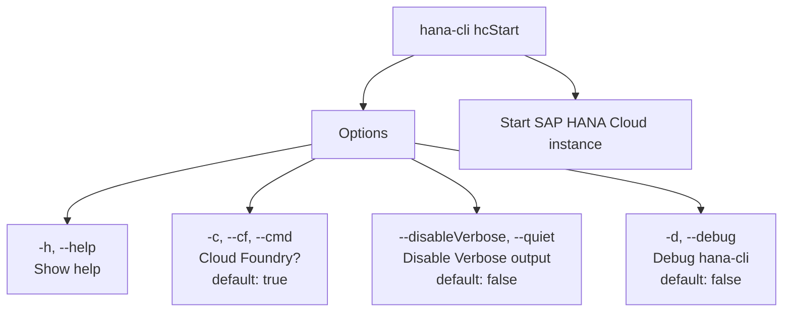

# hanaCloudStart

> Command: `hanaCloudStart`  
> Category: **HANA Cloud**  
> Status: Production Ready

## Description

Start SAP HANA Cloud instance

## Syntax

```bash
hana-cli hcStart [name] [options]
```

## Aliases

- `hcstart`
- `hc_start`
- `start`

## Command Diagram



## Parameters

| Flag | Description | Type | Default |
| --- | --- | --- | --- |
| `-h, --help` | Show help | boolean | - |
| `-n, --name` | SAP HANA Cloud Instance name | string | `**default**` |
| `--disableVerbose, --quiet` | Disable Verbose output - removes all extra output that is only helpful to human readable interface. Useful for scripting commands. | boolean | `false` |
| `-d, --debug` | Debug hana-cli itself by adding output of LOTS of intermediate details | boolean | `false` |

For a complete list of parameters and options, use:

```bash
hana-cli hanaCloudStart --help
```

## Examples

### Basic Usage

```bash
hana-cli hcStart --name myInstance
```

Execute the command

## Related Commands

See the [Commands Reference](../all-commands.md) for other commands in this category.

## See Also

- [Category: HANA Cloud](..)
- [All Commands A-Z](../all-commands.md)
