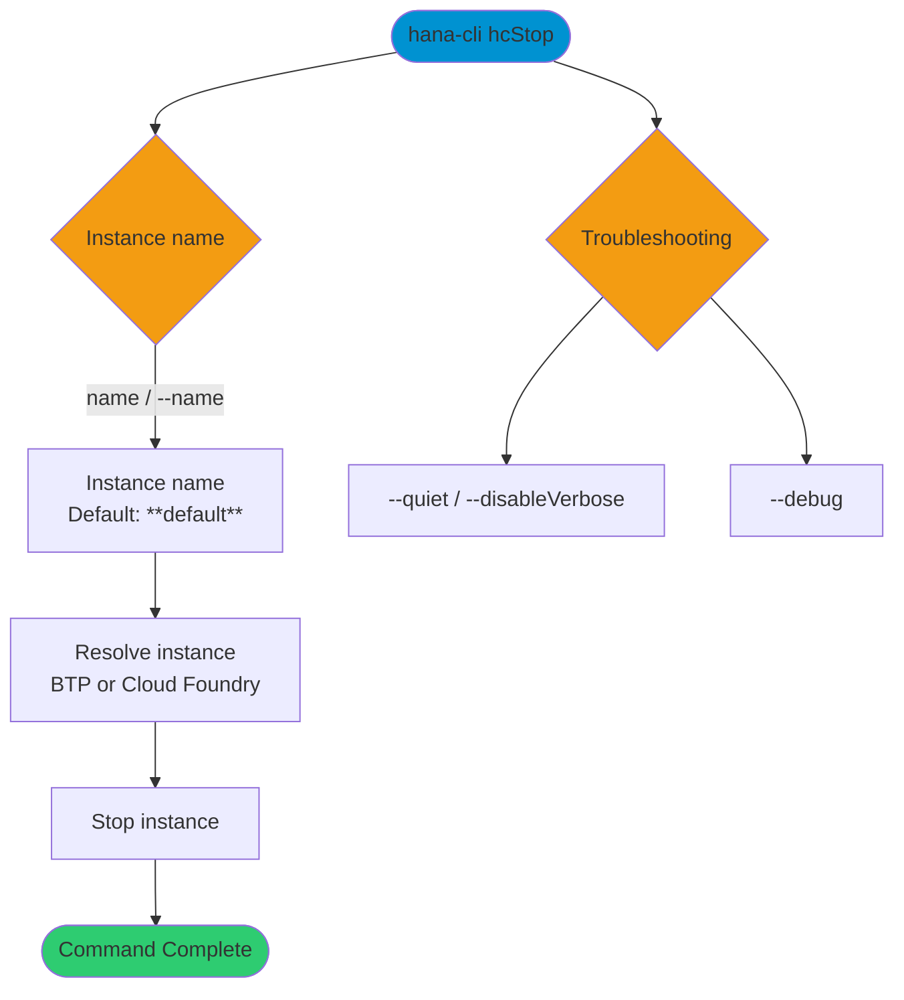

# hanaCloudStop

> Command: `hanaCloudStop`  
> Category: **HANA Cloud**  
> Status: Production Ready

## Description

Stop a SAP HANA Cloud instance by name. The command targets SAP BTP multi-environment instances when available and falls back to Cloud Foundry instances otherwise.

## Syntax

```bash
hana-cli hcStop [name] [options]
```

## Aliases

- `hcstop`
- `hc_stop`
- `stop`

## Command Diagram



## Parameters

### Positional Arguments

| Parameter | Type   | Description                                      |
|-----------|--------|--------------------------------------------------|
| `name`    | string | Instance name filter (default: `**default**`).   |

### Options

| Option   | Alias | Type   | Default        | Description                      |
|----------|-------|--------|----------------|----------------------------------|
| `--name` | `-n`  | string | `**default**`  | SAP HANA Cloud instance name.    |

### Troubleshooting

| Option             | Alias     | Type    | Default | Description                                         |
|--------------------|-----------|---------|---------|-----------------------------------------------------|
| `--disableVerbose` | `--quiet` | boolean | `false` | Disable verbose output for script-friendly results. |
| `--debug`          | `-d`      | boolean | `false` | Enable debug output with intermediate details.      |
| `--help`           | `-h`      | boolean | -       | Show help.                                          |

For a complete list of parameters and options, use:

```bash
hana-cli hanaCloudStop --help
```

## Examples

### Basic Usage

```bash
hana-cli hcStop --name myInstance
```

Stop a specific SAP HANA Cloud instance.

## Interactive Mode

This command can be run in interactive mode, which prompts for required inputs.

| Parameter | Required | Prompted | Notes                                         |
|-----------|----------|----------|-----------------------------------------------|
| `name`    | Yes      | Always   | Instance name filter (default: `**default**`). |

## Related Commands

Related commands from HANA Cloud:

- `hanaCloudStart` - Start a HANA Cloud instance
- `hanaCloudInstances` - List HANA Cloud instances

See the [Commands Reference](../all-commands.md) for all available commands.

## See Also

- [Category: HANA Cloud](..)
- [All Commands A-Z](../all-commands.md)
