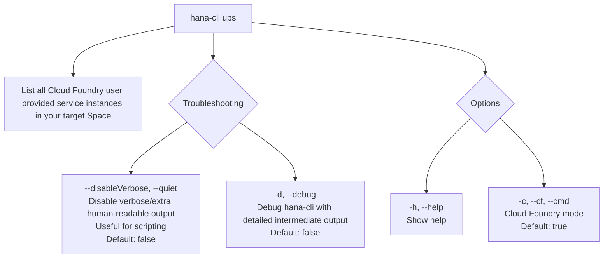

# hanaCloudUPSInstances

> Command: `hanaCloudUPSInstances`  
> Category: **HANA Cloud**  
> Status: Production Ready

## Description

List all Cloud Foundry user provided service instances in your target Space

## Syntax

```bash
hana-cli ups [options]
```

## Aliases

- `upsInstances`
- `upsinstances`
- `upServices`
- `listups`
- `upsservices`

## Command Diagram



## Parameters

| Option | Type | Default | Description |
| --- | --- | --- | --- |
| `--disableVerbose`, `--quiet` | `boolean` | `false` | Disable verbose output by removing extra human-readable output. Useful for scripting commands. |
| `-d`, `--debug` | `boolean` | `false` | Debug `hana-cli` itself by adding lots of intermediate detail output. |
| `-h`, `--help` | `boolean` | _(none)_ | Show help. |
| `-c`, `--cf`, `--cmd` | `boolean` | `true` | Cloud Foundry mode. |

For a complete list of parameters and options, use:

```bash
hana-cli ups --help
```

## Examples

### Basic Usage

```bash
hana-cli ups --cf
```

Execute the command

---

## hanaCloudUPSInstancesUI (UI Variant)

> Command: `hanaCloudUPSInstancesUI`  
> Status: Production Ready

**Description:** Execute hanaCloudUPSInstancesUI command - UI version for listing user-provided service instances

**Syntax:**

```bash
hana-cli upsUI [options]
```

**Aliases:**

- `upsInstancesUI`
- `upsinstancesui`
- `upServicesUI`
- `listupsui`
- `upsservicesui`

**Parameters:**

For a complete list of parameters and options, use:

```bash
hana-cli upsUI --help
```

**Example Usage:**

```bash
hana-cli upsUI
```

Execute the command

## Related Commands

See the [Commands Reference](../all-commands.md) for other commands in this category.

## See Also

- [Category: HANA Cloud](..)
- [All Commands A-Z](../all-commands.md)
