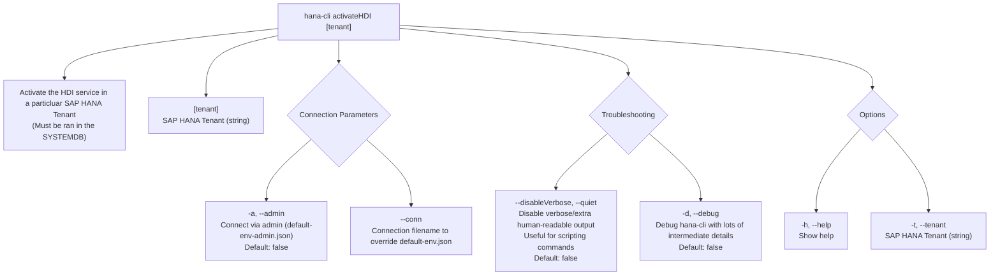

# activateHDI

> Command: `activateHDI`  
> Category: **HDI Management**  
> Status: Production Ready

## Description

Activate the HDI service in a particular SAP HANA Tenant (Must be ran in the SYSTEMDB)

## Syntax

```bash
hana-cli activateHDI [tenant] [options]
```

## Aliases

- `ahdi`
- `ah`

## Command Diagram



## Parameters

| Option | Type | Default | Group | Description |
| --- | --- | --- | --- | --- |
| `[tenant]` | `string` | _(none)_ | Positional Argument | SAP HANA Tenant. |
| `-a`, `--admin` | `boolean` | `false` | Connection Parameters | Connect via admin (`default-env-admin.json`). |
| `--conn` | `string` | _(none)_ | Connection Parameters | Connection filename to override `default-env.json`. |
| `--disableVerbose`, `--quiet` | `boolean` | `false` | Troubleshooting | Disable verbose output by removing extra human-readable output. Useful for scripting commands. |
| `-d`, `--debug` | `boolean` | `false` | Troubleshooting | Debug `hana-cli` itself by adding lots of intermediate details. |
| `-h`, `--help` | `boolean` | _(none)_ | Options | Show help. |
| `-t`, `--tenant` | `string` | _(none)_ | Options | SAP HANA Tenant. |

For a complete list of parameters and options, use:

```bash
hana-cli activateHDI --help
```

## Examples

### Basic Usage

```bash
hana-cli activateHDI TenantDB
```

Activates the HDI service in the specified tenant database.

### Using Option Flag

```bash
hana-cli activateHDI --tenant TenantDB
```

Activate HDI service using the named option parameter.

### With Admin Connection

```bash
hana-cli activateHDI TenantDB --admin
```

Activate HDI service using admin credentials from `default-env-admin.json`.

## Related Commands

See the [Commands Reference](../all-commands.md) for other commands in this category.

## See Also

- [Category: HDI Management](..)
- [All Commands A-Z](../all-commands.md)
