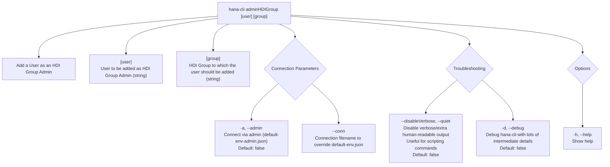

# adminHDIGroup

> Command: `adminHDIGroup`  
> Category: **HDI Management**  
> Status: Production Ready

## Description

Add a User as an HDI Group Admin

## Syntax

```bash
hana-cli adminHDIGroup [user] [group] [options]
```

## Aliases

- `adHDIG`
- `adhdig`

## Command Diagram



## Parameters

| Option | Type | Default | Group | Description |
| --- | --- | --- | --- | --- |
| `[user]` | `string` | _(none)_ | Positional Argument | User to be added as HDI Group Admin. |
| `[group]` | `string` | _(none)_ | Positional Argument | HDI Group to which the user should be added. |
| `-a`, `--admin` | `boolean` | `false` | Connection Parameters | Connect via admin (`default-env-admin.json`). |
| `--conn` | `string` | _(none)_ | Connection Parameters | Connection filename to override `default-env.json`. |
| `--disableVerbose`, `--quiet` | `boolean` | `false` | Troubleshooting | Disable verbose output by removing extra human-readable output. Useful for scripting commands. |
| `-d`, `--debug` | `boolean` | `false` | Troubleshooting | Debug `hana-cli` itself by adding lots of intermediate details. |
| `-h`, `--help` | `boolean` | _(none)_ | Options | Show help. |

For a complete list of parameters and options, use:

```bash
hana-cli adminHDIGroup --help
```

## Examples

### Basic Usage

```bash
hana-cli adminHDIGroup HDI_USER myGroup
```

Adds `HDI_USER` as an administrator of the HDI group `myGroup`.

### Using Named Parameters

```bash
hana-cli adminHDIGroup --user HDI_USER --group myGroup
```

Add user as HDI group admin using named option parameters.

### With Admin Connection

```bash
hana-cli adminHDIGroup HDI_USER myGroup --admin
```

Add user as HDI group admin using admin credentials from `default-env-admin.json`.

## Related Commands

See the [Commands Reference](../all-commands.md) for other commands in this category.

## See Also

- [Category: HDI Management](..)
- [All Commands A-Z](../all-commands.md)
