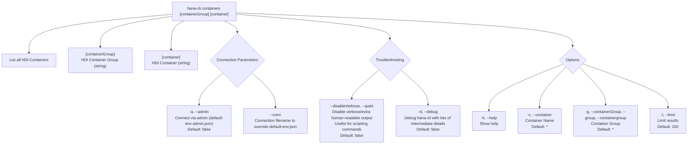

# containers

> Command: `containers`  
> Category: **HDI Management**  
> Status: Production Ready

## Description

List all HDI Containers

## Syntax

```bash
hana-cli containers [containerGroup] [container] [options]
```

## Aliases

- `cont`
- `listContainers`
- `listcontainers`

## Command Diagram



## Parameters

| Option | Type | Default | Group | Description |
| --- | --- | --- | --- | --- |
| `[containerGroup]` | `string` | _(none)_ | Positional Argument | HDI Container Group. |
| `[container]` | `string` | _(none)_ | Positional Argument | HDI Container. |
| `-a`, `--admin` | `boolean` | `false` | Connection Parameters | Connect via admin (`default-env-admin.json`). |
| `--conn` | `string` | _(none)_ | Connection Parameters | Connection filename to override `default-env.json`. |
| `--disableVerbose`, `--quiet` | `boolean` | `false` | Troubleshooting | Disable verbose output by removing extra human-readable output. Useful for scripting commands. |
| `-d`, `--debug` | `boolean` | `false` | Troubleshooting | Debug `hana-cli` itself by adding lots of intermediate details. |
| `-h`, `--help` | `boolean` | _(none)_ | Options | Show help. |
| `-c`, `--container` | `string` | `*` | Options | Container Name. |
| `-g`, `--containerGroup`, `--group`, `--containergroup` | `string` | `*` | Options | Container Group. |
| `-l`, `--limit` | `number` | `200` | Options | Limit results. |

For a complete list of parameters and options, use:

```bash
hana-cli containers --help
```

## Examples

### Basic Usage

```bash
hana-cli hana-cli containers --container myContainer
```

Execute the command

---

## containersUI (UI Variant)

> Command: `containersUI`  
> Status: Production Ready

**Description:** Execute containersUI command - UI version for listing HDI containers

**Syntax:**

```bash
hana-cli containersUI [containerGroup] [container] [options]
```

**Aliases:**

- `containersui`
- `contUI`
- `listContainersUI`
- `listcontainersui`

**Parameters:**

For a complete list of parameters and options, use:

```bash
hana-cli containersUI --help
```

**Example Usage:**

```bash
hana-cli containersUI
```

Execute the command

## Related Commands

See the [Commands Reference](../all-commands.md) for other commands in this category.

## See Also

- [Category: HDI Management](..)
- [All Commands A-Z](../all-commands.md)
