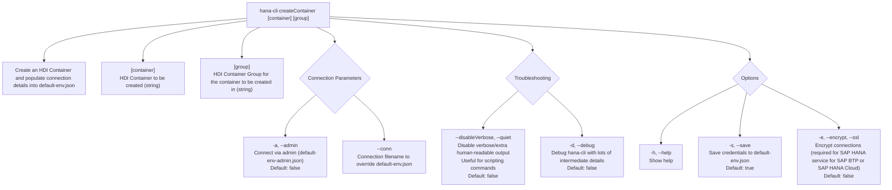

# createContainer

> Command: `createContainer`  
> Category: **HDI Management**  
> Status: Production Ready

## Description

Create an HDI Container and populate connection details into default-env.json

## Syntax

```bash
hana-cli createContainer [container] [group] [options]
```

## Aliases

- `cc`
- `cCont`

## Command Diagram



## Parameters

| Option | Type | Default | Group | Description |
| --- | --- | --- | --- | --- |
| `[container]` | `string` | _(none)_ | Positional Argument | HDI Container to be created. |
| `[group]` | `string` | _(none)_ | Positional Argument | HDI Container Group for the container to be created in. |
| `-a`, `--admin` | `boolean` | `false` | Connection Parameters | Connect via admin (`default-env-admin.json`). |
| `--conn` | `string` | _(none)_ | Connection Parameters | Connection filename to override `default-env.json`. |
| `--disableVerbose`, `--quiet` | `boolean` | `false` | Troubleshooting | Disable verbose output by removing extra human-readable output. Useful for scripting commands. |
| `-d`, `--debug` | `boolean` | `false` | Troubleshooting | Debug `hana-cli` itself by adding lots of intermediate details. |
| `-h`, `--help` | `boolean` | _(none)_ | Options | Show help. |
| `-c`, `--container` | `string` | _(none)_ | Options | Container Name. |
| `-g`, `--group` | `string` | `""` | Options | HDI Group. |
| `-s`, `--save` | `boolean` | `true` | Options | Save credentials to `default-env.json`. |
| `-e`, `--encrypt`, `--ssl` | `boolean` | `false` | Options | Encrypt connections (required for SAP HANA service for SAP BTP or SAP HANA Cloud). |

For a complete list of parameters and options, use:

```bash
hana-cli createContainer --help
```

## Examples

### Basic Usage

```bash
hana-cli createContainer --container myContainer
```

Execute the command

## Related Commands

See the [Commands Reference](../all-commands.md) for other commands in this category.

## See Also

- [Category: HDI Management](..)
- [All Commands A-Z](../all-commands.md)
