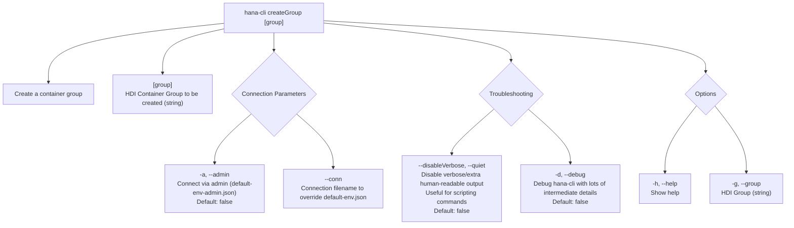

# createGroup

> Command: `createGroup`  
> Category: **System Tools**  
> Status: Production Ready

## Description

Create a container group

## Syntax

```bash
hana-cli createGroup [group] [options]
```

## Aliases

- `cg`
- `cGrp`

## Command Diagram



## Parameters

| Option | Type | Default | Group | Description |
| --- | --- | --- | --- | --- |
| `[group]` | `string` | _(none)_ | Positional Argument | HDI Container Group to be created. |
| `-a`, `--admin` | `boolean` | `false` | Connection Parameters | Connect via admin (`default-env-admin.json`). |
| `--conn` | `string` | _(none)_ | Connection Parameters | Connection filename to override `default-env.json`. |
| `--disableVerbose`, `--quiet` | `boolean` | `false` | Troubleshooting | Disable verbose output by removing extra human-readable output. Useful for scripting commands. |
| `-d`, `--debug` | `boolean` | `false` | Troubleshooting | Debug `hana-cli` itself by adding lots of intermediate details. |
| `-h`, `--help` | `boolean` | _(none)_ | Options | Show help. |
| `-g`, `--group` | `string` | _(none)_ | Options | HDI Group. |

For a complete list of parameters and options, use:

```bash
hana-cli createGroup --help
```

## Examples

### Basic Usage

```bash
hana-cli createGroup --group myGroup
```

Execute the command

## Related Commands

See the [Commands Reference](../all-commands.md) for other commands in this category.

## See Also

- [Category: HDI Management](..)
- [All Commands A-Z](../all-commands.md)
