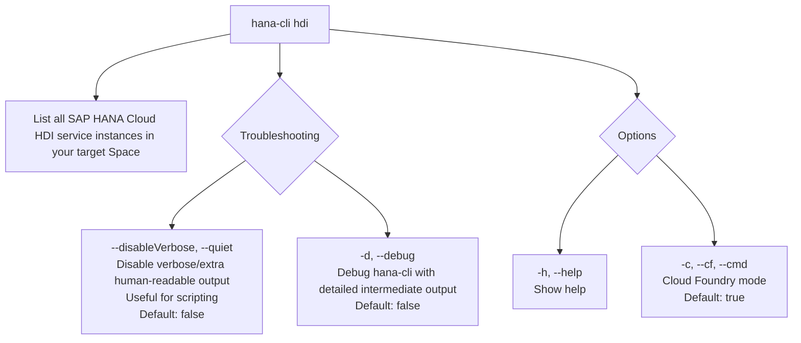

# hanaCloudHDIInstances

> Command: `hanaCloudHDIInstances`  
> Category: **HDI Management**  
> Status: Production Ready

## Description

List all SAP HANA Cloud HDI service instances in your target Space

## Syntax

```bash
hana-cli hdi [options]
```

## Aliases

- `hdiInstances`
- `hdiinstances`
- `hdiServices`
- `listhdi`
- `hdiservices`
- `hdis`

## Command Diagram



## Parameters

| Option | Type | Default | Group | Description |
| --- | --- | --- | --- | --- |
| `--disableVerbose`, `--quiet` | `boolean` | `false` | Troubleshooting | Disable verbose output by removing extra human-readable output. Useful for scripting commands. |
| `-d`, `--debug` | `boolean` | `false` | Troubleshooting | Debug `hana-cli` itself by adding lots of intermediate details. |
| `-h`, `--help` | `boolean` | _(none)_ | Options | Show help. |
| `-c`, `--cf`, `--cmd` | `boolean` | `true` | Options | Cloud Foundry mode. |

For a complete list of parameters and options, use:

```bash
hana-cli hanaCloudHDIInstances --help
```

## Examples

### List HDI Instances in Cloud Foundry

```bash
hana-cli hdi --cf
```

Lists all SAP HANA Cloud HDI service instances in your targeted Cloud Foundry space.

### List HDI Instances (Short Command)

```bash
hana-cli hdi
```

Lists HDI instances using the default Cloud Foundry mode.

### Using Alias

```bash
hana-cli hdis
```

Lists HDI instances using a shorter alias command.

---

## hanaCloudHDIInstancesUI (UI Variant)

> Command: `hanaCloudHDIInstancesUI`  
> Status: Production Ready

**Description:** Execute hanaCloudHDIInstancesUI command - UI version for listing SAP HANA Cloud HDI instances

**Syntax:**

```bash
hana-cli hdiUI [options]
```

**Aliases:**

- `hdiInstancesUI`
- `hdiinstancesui`
- `hdiServicesUI`
- `listhdiui`
- `hdiservicesui`
- `hdisui`

**Parameters:**

For a complete list of parameters and options, use:

```bash
hana-cli hanaCloudHDIInstancesUI --help
```

**Example Usage:**

```bash
hana-cli hanaCloudHDIInstancesUI
```

Execute the command

## Related Commands

See the [Commands Reference](../all-commands.md) for other commands in this category.

## See Also

- [Category: HDI Management](..)
- [All Commands A-Z](../all-commands.md)
