# massConvert

> Command: `massConvert`  
> Category: **Mass Operations**  
> Status: Production Ready

## Description

Convert a group of tables and views to CDS or HDBTable format. This command generates CAP CDS definitions or native HANA HDI artifacts from existing database tables and views, enabling migration from classic database schemas to modern HDI-based development.

### Use Cases

- **Schema Migration**: Convert existing tables to HDI artifacts for cloud-native deployment
- **CAP Development**: Generate CDS models from legacy database structures
- **Documentation**: Create declarative definitions of existing schemas
- **Multi-Target**: Export to both CDS and HDI formats for different deployment targets
- **Bulk Conversion**: Process entire schemas or filtered object sets at once

### Output Formats

| Format               | Description                                          | Best For                    |
|----------------------|------------------------------------------------------|-----------------------------|
| `cds`                | CAP CDS format with type definitions                 | CAP/Node.js projects        |
| `hdbtable`           | Native HANA HDI table definitions                    | Pure HDI projects           |
| `hdbmigrationtable`  | HDI migration table format (preserves data)          | Migrating existing data     |

### Key Features

- **Wildcard Support**: Use patterns to select multiple tables/views
- **Type Mapping**: Automatic conversion between database and CDS types
- **Namespace Support**: Generate CDS with proper namespace structure
- **Path Handling**: Flexible options for handling dotted paths and colons
- **Synonym Generation**: Optional creation of synonym definitions
- **Progress Logging**: Continuous logging for large conversion operations

## Syntax

```bash
hana-cli massConvert [schema] [table] [view] [options]
```

## Aliases

- `mc`
- `massconvert`
- `massConv`
- `massconv`

## Command Diagram

```mermaid
graph TD
    Start([hana-cli massConvert]) --> Input{Input Selection}
    Input -->|schema| Schema[Schema Name<br/>Default: CURRENT_SCHEMA]
    Input -->|table| Table[Table Pattern<br/>Default: * all tables]
    Input -->|view| View[View Pattern<br/>Optional]
    
    Schema --> Limit[Apply Limit<br/>Default: 200 objects]
    Table --> Limit
    View --> Limit
    
    Limit --> Format{Output Format}
    Format -->|output=cds| CDS[📄 CAP CDS Format<br/>Default]
    Format -->|output=hdbtable| HDBTable[📄 HDI Table Format]
    Format -->|output=hdbmigrationtable| Migration[📄 HDI Migration Format<br/>Preserves data]
    
    CDS --> TypeOptions{Type Configuration}
    HDBTable --> TypeOptions
    Migration --> TypeOptions
    
    TypeOptions -->|useHanaTypes=false| StdTypes[Standard CDS Types<br/>Default]
    TypeOptions -->|useHanaTypes=true| HanaTypes[HANA-Specific Types<br/>e.g., ST_POINT, ST_GEOMETRY]
    
    StdTypes --> Catalog{Catalog Mode}
    HanaTypes --> Catalog
    
    Catalog -->|useCatalogPure=false| Standard[Standard Definitions<br/>Default]
    Catalog -->|useCatalogPure=true| Pure[Pure Catalog<br/>With associations & merge]
    
    Standard --> Naming{Naming Options}
    Pure --> Naming
    
    Naming -->|useQuoted=false| Unquoted[Unquoted Identifiers<br/>Default]
    Naming -->|useQuoted=true| Quoted[Quoted Identifiers<br/>For special chars]
    
    Unquoted --> PathHandling{Path Handling}
    Quoted --> PathHandling
    
    PathHandling -->|keepPath=false| NormalPath[Standard Path<br/>Default]
    PathHandling -->|keepPath=true| KeepDots[Keep Dots in Path]
    PathHandling -->|noColons=true| ReplaceColons[Replace :: with .]
    
    NormalPath --> Namespace{Namespace}
    KeepDots --> Namespace
    ReplaceColons --> Namespace
    
    Namespace -->|namespace specified| WithNS[Apply CDS Namespace]
    Namespace -->|no namespace| NoNS[No Namespace]
    
    WithNS --> Output{Output Options}
    NoNS --> Output
    
    Output -->|folder| TargetFolder[Output Folder<br/>Default: ./]
    Output -->|filename| SingleFile[Single Output File]
    Output -->|synonyms| SynFile[Generate Synonyms File]
    
    TargetFolder --> Logging{Error Handling}
    SingleFile --> Logging
    SynFile --> Logging
    
    Logging -->|log=false| StopError[Stop on First Error<br/>Default]
    Logging -->|log=true| ContinueLog[Continue & Log<br/>Write to file]
    
    StopError --> Generate[Generate Files]
    ContinueLog --> Generate
    
    Generate --> Complete([✅ Conversion Complete<br/>Files Created])
    
    style Start fill:#0092d1
    style Complete fill:#2ecc71
    style Format fill:#f39c12
    style TypeOptions fill:#f39c12
    style Output fill:#9b59b6
```



## Parameters

### Positional Arguments

| Parameter | Type   | Description                                                 |
|-----------|--------|-------------------------------------------------------------|
| `schema`  | string | Schema name to process (default: current schema)            |
| `table`   | string | Database table pattern (supports wildcards, default: `*`)   |
| `view`    | string | Database view pattern (supports wildcards, optional)        |

### Options

#### Source Selection

| Option      | Alias | Type   | Default              | Description                                          |
|-------------|-------|--------|----------------------|------------------------------------------------------|
| `--schema`  | `-s`  | string | `**CURRENT_SCHEMA**` | Schema name containing tables/views to convert       |
| `--table`   | `-t`  | string | `*`                  | Table name pattern (supports SQL wildcards)          |
| `--view`    | `-v`  | string | -                    | View name pattern (supports SQL wildcards)           |
| `--limit`   | `-l`  | number | `200`                | Maximum number of objects to convert                 |

#### Output Configuration

| Option       | Alias | Type    | Default | Description                                                                     |
|--------------|-------|---------|---------|---------------------------------------------------------------------------------|
| `--output`   | `-o`  | string  | `cds`   | Output format. Choices: `cds`, `hdbtable`, `hdbmigrationtable`                  |
| `--folder`   | `-f`  | string  | `./`    | Output folder for generated files                                               |
| `--filename` | `-n`  | string  | -       | Output file name (single file). If not specified, creates one file per object   |
| `--namespace`| `-ns` | string  | `""`    | CDS namespace for generated definitions                                         |
| `--synonyms` | -     | string  | `""`    | Synonyms output file name (generates synonym definitions)                       |
| `--log`      | -     | boolean | `false` | Write progress log to file instead of stopping on first error                   |

#### Type & Format Options

| Option             | Alias                       | Type    | Default | Description                                                                            |
|--------------------|-----------------------------|---------|---------|----------------------------------------------------------------------------------------|
| `--useHanaTypes`   | `--hana`                    | boolean | `false` | Use HANA-specific data types (ST_POINT, ST_GEOMETRY, etc.)                             |
| `--useCatalogPure` | `--catalog`, `--pure`       | boolean | `false` | Use pure catalog definitions with associations and merge settings                      |
| `--useExists`      | `--exists`, `--persistence` | boolean | `true`  | Use persistence exists annotation in CDS                                               |
| `--useQuoted`      | `-q`, `--quoted`            | boolean | `false` | Use quoted identifiers for non-standard names                                          |

#### Path & Naming Options

| Option       | Alias | Type    | Default | Description                                          |
|--------------|-------|---------|---------|------------------------------------------------------|
| `--keepPath` | -     | boolean | `false` | Keep table/view path with dots                       |
| `--noColons` | -     | boolean | `false` | Replace `::` in table/view path with `.`             |

### Connection Parameters

| Option    | Alias | Type    | Default | Description                                          |
|-----------|-------|---------|---------|------------------------------------------------------|
| `--admin` | `-a`  | boolean | `false` | Connect via admin (default-env-admin.json)           |
| `--conn`  | -     | string  | -       | Connection filename to override default-env.json     |

### Troubleshooting

| Option              | Alias     | Type    | Default | Description                                                                                              |
|---------------------|-----------|---------|---------|----------------------------------------------------------------------------------------------------------|
| `--disableVerbose`  | `--quiet` | boolean | `false` | Disable verbose output - removes all extra output that is only helpful to human readable interface       |
| `--debug`           | `-d`      | boolean | `false` | Debug hana-cli itself by adding output of LOTS of intermediate details                                   |

For a complete list of parameters and options, use:

```bash
hana-cli massConvert --help
```

## Examples

### Convert All Tables to CDS

```bash
hana-cli massConvert --schema MYSCHEMA --output cds
```

Convert all tables in MYSCHEMA to CAP CDS format in the current directory.

### Convert Specific Tables to HDI Format

```bash
hana-cli massConvert --schema MYSCHEMA --table "SALES_%" --output hdbtable
```

Convert all tables starting with `SALES_` to HDI table definitions.

### Convert with Namespace

```bash
hana-cli massConvert --schema MYSCHEMA --namespace "com.company.sales" --output cds
```

Generate CDS definitions with a proper namespace structure.

### Convert to Single File

```bash
hana-cli massConvert --schema MYSCHEMA --filename schema.cds
```

Output all table definitions to a single `schema.cds` file.

### Convert with HANA-Specific Types

```bash
hana-cli massConvert --schema GIS_DATA --useHanaTypes --output cds
```

Convert spatial/geometric tables preserving HANA-specific types like ST_POINT.

### Migration Table Format (Preserve Data)

```bash
hana-cli massConvert --schema LEGACY --output hdbmigrationtable --folder ./migration
```

Generate HDI migration tables that preserve existing data during deployment.

### Convert with Quoted Identifiers

```bash
hana-cli massConvert --schema MYSCHEMA --table "Special-Name%" --useQuoted
```

Convert tables with special characters in names using quoted identifiers.

### Generate with Synonyms

```bash
hana-cli massConvert --schema MYSCHEMA --synonyms synonyms.hdbsynonym
```

Convert tables and generate corresponding synonym definitions.

### Large Schema with Logging

```bash
hana-cli massConvert --schema BIGSCHEMA --limit 500 --log --folder ./converted
```

Convert up to 500 objects, continuing on errors and logging progress to file.

### Pure Catalog Mode

```bash
hana-cli massConvert --schema MYSCHEMA --useCatalogPure --output cds
```

Generate pure catalog definitions including associations and merge settings.

## Advanced Usage

### Pattern Matching

Use SQL wildcards for selective conversion:

```bash
# Convert all tables starting with TEMP_
hana-cli massConvert --table "TEMP_%"

# Convert both tables and views matching pattern
hana-cli massConvert --table "DATA_%" --view "V_DATA_%"

# Convert tables ending with _LOG
hana-cli massConvert --table "%_LOG"
```

### Handling Special Paths

```bash
# Keep original dotted paths
hana-cli massConvert --keepPath

# Replace :: with . in paths
hana-cli massConvert --noColons

# Use quoted identifiers for compatibility
hana-cli massConvert --useQuoted
```

### Custom Output Organization

```bash
# Output to specific folder structure
hana-cli massConvert --folder ./db/src/tables --output hdbtable

# Single file with namespace
hana-cli massConvert --filename all-entities.cds --namespace app.entities
```

## Output Examples

### CDS Output Format

```cds
namespace com.example.sales;

entity CUSTOMERS {
  key CUSTOMER_ID : Integer;
  NAME            : String(100);
  EMAIL           : String(255);
  CREATED_AT      : Timestamp;
}

entity ORDERS {
  key ORDER_ID    : Integer;
  CUSTOMER_ID     : Integer;
  ORDER_DATE      : Date;
  TOTAL_AMOUNT    : Decimal(15,2);
}
```

### HDI Table Output Format

```sql
COLUMN TABLE "CUSTOMERS" (
  "CUSTOMER_ID" INTEGER NOT NULL,
  "NAME" NVARCHAR(100),
  "EMAIL" NVARCHAR(255),
  "CREATED_AT" TIMESTAMP,
  PRIMARY KEY ("CUSTOMER_ID")
)
```

### Progress Output

```text
Converting Tables to cds:
  ✓ CUSTOMERS
  ✓ ORDERS
  ✓ PRODUCTS
  ✓ INVOICES

Successfully converted 4 tables to ./db/src/
```

## Best Practices

### 1. Start with a Test Schema

```bash
# Test conversion on a small subset first
hana-cli massConvert --schema TEST_SCHEMA --limit 10
```

### 2. Use Namespaces for CDS

```bash
# Always use namespaces for organized CDS models
hana-cli massConvert --namespace "app.db.tables"
```

### 3. Choose the Right Output Format

- **CDS**: For CAP applications and cross-database portability
- **HDI Table**: For pure HANA HDI deployments
- **HDI Migration**: When preserving existing data is critical

### 4. Handle Large Schemas Carefully

```bash
# Use limits and logging for large conversions
hana-cli massConvert --limit 200 --log --folder ./batch1
```

### 5. Review Generated Files

Always review generated definitions before deployment:

- Check type mappings are appropriate
- Verify constraints and keys are preserved
- Test in development before production

## Type Mapping

### Standard vs HANA-Specific Types

| Database Type | Standard CDS (`useHanaTypes=false`) | HANA-Specific (`useHanaTypes=true`) |
|---------------|-------------------------------------|-------------------------------------|
| ST_POINT      | Binary                              | hana.ST_POINT                       |
| ST_GEOMETRY   | Binary                              | hana.ST_GEOMETRY                    |
| NVARCHAR      | String                              | String                              |
| DECIMAL       | Decimal                             | Decimal                             |
| TIMESTAMP     | Timestamp                           | Timestamp                           |

Use `--useHanaTypes` when:

- Working with spatial/geometric data
- Using HANA-specific features
- Not planning cross-database deployment

## Common Issues & Solutions

**Issue**: Too many objects to convert

```bash
# Solution: Use limit or pattern matching
hana-cli massConvert --limit 100
hana-cli massConvert --table "ACTIVE_%"
```

**Issue**: Special characters in table names

```bash
# Solution: Use quoted identifiers
hana-cli massConvert --useQuoted
```

**Issue**: Conversion errors stopping process

```bash
# Solution: Enable logging to continue
hana-cli massConvert --log
```

**Issue**: Need to preserve associations

```bash
# Solution: Use pure catalog mode
hana-cli massConvert --useCatalogPure
```

---

## massConvertUI (UI Variant)

> Command: `massConvertUI`  
> Status: Production Ready

**Description:** Convert a group of tables to CDS or HDBTable format via browser-based UI

**Syntax:**

```bash
hana-cli massConvertUI [schema] [table] [options]
```

**Aliases:**

- `mcui`
- `massconvertui`
- `massConvUI`
- `massconvui`

**Parameters:**

All `massConvert` options apply, plus:

| Option       | Alias | Type    | Default | Description                                  |
|--------------|-------|---------|---------|----------------------------------------------|
| `--port`     | `-p`  | integer | `3010`  | Port to run the HTTP server for the UI       |

**Example Usage:**

```bash
# Launch UI on default port
hana-cli massConvertUI

# Launch UI on custom port
hana-cli massConvertUI --port 8080

# Pre-select schema in UI
hana-cli massConvertUI --schema MYSCHEMA
```

The browser-based UI provides:

- Interactive schema and object selection  
- Real-time preview of conversion options
- Visual feedback during conversion process
- Download converted files directly from browser

## Related Commands

- [massExport](./mass-export.md) - Export database objects in various formats
- [massRename](./mass-rename.md) - Rename fields in CDS-based export files
- [cds](../developer-tools/cds.md) - Display database objects via CDS
- [createModule](../developer-tools/create-module.md) - Create new DB module structure

See the [Commands Reference](../all-commands.md) for other commands in this category.

## See Also

- [Category: Mass Operations](..)
- [All Commands A-Z](../all-commands.md)
