# massConvert

> Command: `massConvert`  
> Category: **Mass Operations**  
> Status: Production Ready

## Description

Convert a group of tables to CDS or HDBTable format

## Syntax

```bash
hana-cli massConvert [schema] [table] [view] [options]
```

## Aliases

- `mc`
- `massconvert`
- `massConv`
- `massconv`

## Command Diagram

```mermaid
graph TD
    A["hana-cli massConvert"] --> B["Source Selection"]
    B --> B1["-s, --schema<br/>**CURRENT_SCHEMA**"]
    B --> B2["-t, --table<br/>* pattern"]
    B --> B3["-v, --view<br/>* pattern"]
    B --> B4["-l, --limit<br/>200"]

    A --> C["Output Configuration"]
    C --> C1["-o, --output<br/>cds/hdbtable/hdbmigrationtable"]
    C --> C2["-f, --folder<br/>./"]
    C --> C3["-n, --filename<br/>file name"]
    C --> C4["--namespace<br/>CDS namespace"]
    C --> C5["--synonyms<br/>synonyms file"]

    A --> D["Conversion Options"]
    D --> D1["--useHanaTypes<br/>HANA types"]
    D --> D2["--useCatalogPure<br/>pure catalog"]
    D --> D3["--useExists<br/>persistence exists"]
    D --> D4["--useQuoted<br/>quoted identifiers"]
    D --> D5["--keepPath<br/>keep dotted path"]
    D --> D6["--noColons<br/>replace :: with ."]
    D --> D7["--log<br/>write progress log"]

    A --> E["Connection & Debug"]
    E --> E1["-a, --admin<br/>admin connection"]
    E --> E2["--conn<br/>connection file"]
    E --> E3["--quiet, --disableVerbose<br/>minimal output"]
    E --> E4["-d, --debug<br/>debug output"]

    A --> F["Result"]
    F --> F1["Generated files"]
    F --> F2["Progress log (optional)"]

    A --> G["UI Variant"]
    G --> G1["hana-cli massConvertUI"]
    G1 --> G2["--port, -p<br/>HTTP server port"]

    style A fill:#0070C0,color:#fff
    style F1 fill:#51CF66,color:#fff
```



## Parameters

### Arguments

| Name | Type | Default | Description |
| --- | --- | --- | --- |
| `schema` | string | `**CURRENT_SCHEMA**` | Schema name to process. |
| `table` | string | `*` | Database table pattern (supports wildcards). |
| `view` | string | _(none)_ | Database view pattern (supports wildcards). |

### Options

| Option | Type | Default | Description |
| --- | --- | --- | --- |
| `--table`, `-t` | string | `*` | Database table pattern (supports wildcards). |
| `--view`, `-v` | string | _(none)_ | Database view pattern (supports wildcards). |
| `--schema`, `-s` | string | `**CURRENT_SCHEMA**` | Schema name to process. |
| `--limit`, `-l` | number | `200` | Limit results. |
| `--folder`, `-f` | string | `./` | DB module folder name for generated output. |
| `--filename`, `-n` | string | _(none)_ | Output file name. |
| `--log` | boolean | `false` | Write progress log to file rather than stop on error. |
| `--output`, `-o` | string | `cds` | Output format: `cds`, `hdbtable`, `hdbmigrationtable`. |
| `--useHanaTypes`, `--hana` | boolean | `false` | Use SAP HANA-specific data types. |
| `--useCatalogPure`, `--catalog`, `--pure` | boolean | `false` | Use "Pure" catalog definitions (includes associations/merge settings). |
| `--useExists`, `--exists`, `--persistence` | boolean | `true` | Use persistence exists annotation. |
| `--useQuoted`, `-q`, `--quoted` | boolean | `false` | Use quoted identifiers. |
| `--namespace`, `-ns` | string | `""` | CDS namespace. |
| `--synonyms` | string | `""` | Synonyms output file name. |
| `--keepPath` | boolean | `false` | Keep table/view path (with dots). |
| `--noColons` | boolean | `false` | Replace `::` in table/view path with dot. |
| `--admin`, `-a` | boolean | `false` | Connect via admin (default-env-admin.json). |
| `--conn` | string | _(none)_ | Connection filename to override default-env.json. |
| `--disableVerbose`, `--quiet` | boolean | `false` | Disable verbose output (useful for scripting). |
| `--debug`, `-d` | boolean | `false` | Debug hana-cli itself. |

## Examples

### Basic Usage

```bash
hana-cli massConvert
```

Execute the command

---

## massConvertUI (UI Variant)

> Command: `massConvertUI`  
> Status: Production Ready

**Description:** Convert a group of tables to CDS or HDBTable format via browser based UI

**Syntax:**

```bash
hana-cli massConvertUI [schema] [table] [options]
```

**Aliases:**

- `mcui`
- `massconvertui`
- `massConvUI`
- `massconvui`

**Parameters:**

All `massConvert` options apply, plus the UI-only option below:

| Option | Type | Default | Description |
| --- | --- | --- | --- |
| `--port`, `-p` | integer | `3010` | Port to run the HTTP server for the UI. |

**Example Usage:**

```bash
hana-cli massConvertUI
```

Execute the command

## Related Commands

See the [Commands Reference](../all-commands.md) for other commands in this category.

## See Also

- [Category: Mass Operations](..)
- [All Commands A-Z](../all-commands.md)
