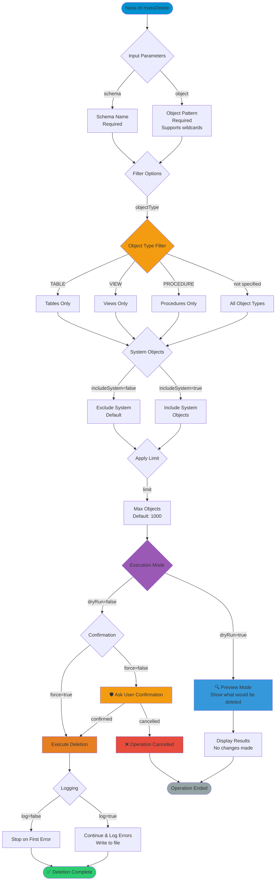

# massDelete

> Command: `massDelete`  
> Category: **Mass Operations**  
> Status: Production Ready

## Description

Bulk delete operations with filtering. This command allows you to delete multiple database objects at once based on pattern matching and filtering criteria. It's designed for cleanup tasks, schema migrations, and bulk maintenance operations.

### Use Cases

- **Development Cleanup**: Remove temporary tables and test objects
- **Schema Migration**: Delete deprecated objects in bulk
- **Pattern-based Cleanup**: Remove objects matching naming patterns
- **Type-specific Deletion**: Delete all objects of a specific type
- **Testing**: Use dry-run mode to preview deletions safely

### Safety Features

- **Dry Run Mode**: Preview what would be deleted without making changes
- **Confirmation Prompts**: Confirms dangerous operations unless forced
- **Limit Protection**: Default limit of 1000 objects prevents accidental mass deletion
- **System Object Protection**: Excludes system objects by default
- **Logging**: Optional log file for tracking bulk operations

## Syntax

```bash
hana-cli massDelete [schema] [object] [options]
```

## Aliases

- `md`
- `massdelete`
- `massDel`
- `massdel`

## Command Diagram



## Parameters

### Positional Arguments

| Parameter | Type   | Description                                                                    |
|-----------|--------|--------------------------------------------------------------------------------|
| `schema`  | string | Schema name containing the objects to delete                                   |
| `object`  | string | Object name or pattern (supports wildcards: `%` for any, `_` for single char) |

### Options

| Option            | Alias               | Type    | Default | Description                                                                    |
|-------------------|---------------------|---------|---------|--------------------------------------------------------------------------------|
| `--schema`        | `-s`                | string  | -       | Schema name containing the objects to delete                                   |
| `--object`        | `-o`                | string  | -       | Object name or pattern. Supports SQL wildcards (`%`, `_`)                      |
| `--objectType`    | `-t`, `--type`      | string  | -       | Filter by object type: `TABLE`, `VIEW`, `PROCEDURE`, `FUNCTION`, `SEQUENCE`    |
| `--limit`         | `-l`                | number  | `1000`  | Maximum number of objects to delete (safety limit)                             |
| `--includeSystem` | `-i`, `--system`    | boolean | `false` | Include system objects in deletion (use with extreme caution)                  |
| `--dryRun`        | `--dr`, `--preview` | boolean | `false` | Preview mode - show what would be deleted without making changes               |
| `--force`         | `-f`                | boolean | `false` | Skip confirmation prompts and execute immediately                              |
| `--log`           | -                   | boolean | `false` | Write progress log to file instead of stopping on first error                  |

### Connection Parameters

| Option    | Alias | Type    | Default | Description                                          |
|-----------|-------|---------|---------|------------------------------------------------------|
| `--admin` | `-a`  | boolean | `false` | Connect via admin (default-env-admin.json)           |
| `--conn`  | -     | string  | -       | Connection filename to override default-env.json     |

### Troubleshooting

| Option              | Alias     | Type    | Default | Description                                                                                              |
|---------------------|-----------|---------|---------|----------------------------------------------------------------------------------------------------------|
| `--disableVerbose`  | `--quiet` | boolean | `false` | Disable verbose output - removes all extra output that is only helpful to human readable interface       |
| `--debug`           | `-d`      | boolean | `false` | Debug hana-cli itself by adding output of LOTS of intermediate details                                   |

For a complete list of parameters and options, use:

```bash
hana-cli massDelete --help
```

## Examples

### Safe Preview (Recommended First Step)

```bash
hana-cli massDelete --schema MYSCHEMA --object % --objectType TABLE --dryRun
```

Preview all tables in MYSCHEMA that would be deleted. No actual changes are made.

### Delete Test Tables

```bash
hana-cli massDelete --schema DEV_SCHEMA --object "TEST_%" --objectType TABLE
```

Delete all tables starting with `TEST_` in DEV_SCHEMA. Will prompt for confirmation.

### Delete Without Confirmation

```bash
hana-cli massDelete --schema TEMP_SCHEMA --object % --force
```

Delete all objects in TEMP_SCHEMA without confirmation prompt. Use with caution!

### Delete with Limit

```bash
hana-cli massDelete --schema DATA_SCHEMA --object "OLD_%"  --limit 50
```

Delete up to 50 objects matching the pattern `OLD_%`. Safety limit prevents accidental mass deletion.

### Delete Specific Object Type

```bash
hana-cli massDelete --schema MYSCHEMA --object "%" --objectType VIEW --dryRun
```

Preview deletion of all views in MYSCHEMA.

### Delete with Logging

```bash
hana-cli massDelete --schema CLEANUP_SCHEMA --object % --log --force
```

Delete all objects and write progress log to file. Continues on errors instead of stopping.

Shorthand syntax using positional arguments (schema and object pattern).

### Complex Pattern Matching

```bash
hana-cli massDelete --schema ANALYTICS --object "%_STAGING_%"  --objectType TABLE
```

Delete all tables containing `_STAGING_` anywhere in their name.

## Wildcard Patterns

The `--object` parameter supports SQL wildcard patterns:

| Pattern | Matches                    | Example      | Result                               |
|---------|----------------------------|--------------|--------------------------------------|
| `%`     | Any sequence of characters | `TEST_%`     | `TEST_A`, `TEST_DATA`, `TEST_123`    |
| `_`     | Any single character       | `TEST_`      | `TEST_A`, `TEST_1` (not `TEST_AB`)   |
| `%ABC%` | Contains ABC               | `%_TEMP_%`   | `MY_TEMP_TABLE`, `OLD_TEMP_DATA`     |

## Best Practices

### 1. Always Start with Dry Run

```bash
# First: Preview
hana-cli massDelete --schema MYSCHEMA --object "%" --dryRun

# Then: Execute if results look correct
hana-cli massDelete --schema MYSCHEMA --object "%"
```

### 2. Use Specific Patterns

```bash
# ❌ Too broad
hana-cli massDelete --schema PROD --object %

# ✅ Specific and safe
hana-cli massDelete --schema PROD --object "TEMP_2024_%"
```

### 3. Set Conservative Limits

```bash
# Delete in batches
hana-cli massDelete --schema MYSCHEMA --object "OLD_%" --limit 100
```

### 4. Use Logging for Large Operations

```bash
# Continue on errors and keep log
hana-cli massDelete --schema MYSCHEMA --object % --log
```

### 5. Back Up Before Major Deletions

Always back up your schema before performing bulk deletions in production environments.

## Safety Warnings

⚠️ **CAUTION**: Mass delete operations are irreversible!

- Never use `%` wildcard alone in production without thorough testing
- Always verify object names with `--dryRun` first
- System objects are excluded by default for safety
- The default limit of 1000 objects prevents accidental mass operations
- Use `--log` option for large operations to track progress

## Output

The command displays:

- Number of objects matching the criteria
- List of objects that will be / were deleted
- Confirmation prompt (unless `--force` is used)
- Success/failure status for each deletion
- Final summary count

In `--dryRun` mode:

```text
Running in DRY RUN mode - no changes will be made

Objects that would be deleted:
  - MYSCHEMA.TEST_TABLE1
  - MYSCHEMA.TEST_TABLE2
  - MYSCHEMA.TEST_VIEW1

Dry run completed - no changes were made
Total: 3 objects would be deleted
```

In execution mode:

```text
Are you sure you want to delete 3 objects? This cannot be undone!
Confirm (y/N): y

Deleting Objects:
  ✓ MYSCHEMA.TEST_TABLE1
  ✓ MYSCHEMA.TEST_TABLE2
  ✓ MYSCHEMA.TEST_VIEW1

Successfully deleted 3 objects
```

## Related Commands

- [massExport](mass-export.md) - Export multiple objects before deletion
- [massConvert](mass-convert.md) - Convert objects to different formats
- [massUpdate](mass-update.md) - Bulk update operations
- [massRename](mass-rename.md) - Rename database objects
- [objects](../object-inspection/objects.md) - Search and list database objects

See the [Commands Reference](../all-commands.md) for other commands in this category.

## See Also

- [Category: Mass Operations](..)
- [All Commands A-Z](../all-commands.md)
