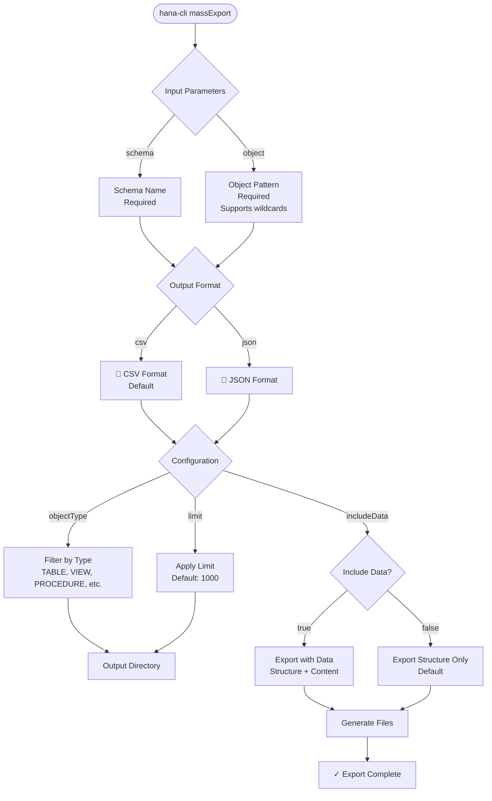

# massExport

> Command: `massExport`  
> Category: **Mass Operations**  
> Status: Production Ready

## Description

Export multiple database objects at once in various formats. This command allows you to bulk export tables, views, and other database objects to CSV, JSON, or other supported formats, with optional data export capabilities.

When exporting table structures, the command includes comprehensive schema metadata including column names, data types, nullability constraints, and **default values** for each column. This ensures complete table definitions are captured for documentation, migration, or backup purposes.

### Use Cases

- **Backup & Archive**: Export schema objects for version control or archival
- **Data Migration**: Export tables with data for transfer to other systems
- **Documentation**: Generate object metadata and structure documentation
- **Bulk Operations**: Export multiple related objects in a single command
- **Format Conversion**: Convert between data formats (CSV, JSON, etc.)

### Supported Formats

| Format | Description | Best For |
|--------|-------------|----------|
| `csv`  | Comma-separated values (default) | Spreadsheet import, general data exchange |
| `json` | JavaScript Object Notation | Web APIs, structured data |

## Syntax

```bash
hana-cli massExport [schema] [object] [options]
```

## Aliases

- `me`
- `mexport`
- `massExp`
- `massexp`

## Command Diagram



## Parameters

| Parameter | Alias | Type | Default | Required | Description |
|-----------|-------|------|---------|----------|-------------|
| `schema` | `s` | string | `**CURRENT_SCHEMA**` | No | Database schema to export from; if omitted, uses current schema context |
| `object` | `o` | string | `*` | No | Object name or pattern (use `*` or `%` for all objects); if omitted, exports all objects matching the pattern |
| `objectType` | `t`, `type` | string | - | No | Filter by object type (TABLE, VIEW, PROCEDURE, etc.) |
| `limit` | `l` | number | 1000 | No | Maximum number of objects to export |
| `format` | `f` | string | `csv` | No | Output format (csv, json) |
| `folder` | `d`, `directory` | string | - | No | Output directory for exported files |
| `includeData` | `data` | boolean | false | No | Include actual table data in export |

For a complete list of parameters and options, use:

```bash
hana-cli massExport --help
```

## Examples

### Export All Tables as CSV

```bash
hana-cli massExport --schema MYSCHEMA --object % --format csv --folder exports/
```

### Export Specific Table with Data

```bash
hana-cli massExport --schema MYSCHEMA --object CUSTOMERS --format json --folder exports/ --includeData
```

### Export Tables Matching Pattern

```bash
hana-cli massExport --schema MYSCHEMA --object "SALES%" --objectType TABLE --format csv
```

### Export Views Only

```bash
hana-cli massExport -s MYSCHEMA -o % -t VIEW -f json -d views/
```

## Output Format

### Structure Export

When exporting table structures (the default behavior), the command generates files containing the following information for each column:

- **COLUMN_NAME**: Name of the column
- **DATA_TYPE_NAME**: Data type (VARCHAR, INTEGER, DECIMAL, etc.)
- **IS_NULLABLE**: Whether the column allows NULL values (YES/NO)
- **DEFAULT_VALUE**: Default value assigned to the column (if any)
- **COMMENTS**: Column descriptions or documentation

**CSV Structure Output Example:**

```csv
COLUMN_NAME,DATA_TYPE_NAME,IS_NULLABLE,DEFAULT_VALUE
"ID","INTEGER","NO",""
"NAME","VARCHAR(255)","NO",""
"CREATED_AT","TIMESTAMP","YES","CURRENT_TIMESTAMP"
"STATUS","VARCHAR(50)","YES","'ACTIVE'"
```

**JSON Structure Output Example:**

```json
{
  "table": "CUSTOMERS",
  "schema": "MYSCHEMA",
  "columns": [
    {
      "COLUMN_NAME": "ID",
      "DATA_TYPE_NAME": "INTEGER",
      "IS_NULLABLE": "NO",
      "DEFAULT_VALUE": null
    },
    {
      "COLUMN_NAME": "CREATED_AT",
      "DATA_TYPE_NAME": "TIMESTAMP",
      "IS_NULLABLE": "YES",
      "DEFAULT_VALUE": "'CURRENT_TIMESTAMP'"
    }
  ],
  "createdAt": "2026-03-11T10:30:00.000Z"
}
```

### Data Export

When `--includeData` is specified, the command additionally exports actual table data in the selected format, preserving all column values and data types.

## Related Commands

- [massDelete](mass-delete.md) - Bulk delete database objects
- [massConvert](mass-convert.md) - Convert objects to different formats

## See Also

- [Category: Mass Operations](..)
- [All Commands A-Z](../all-commands.md)
