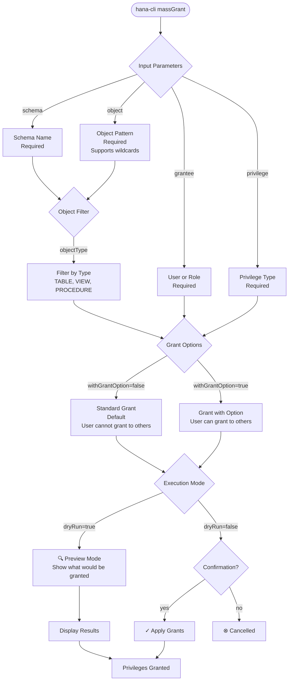

# massGrant

> Command: `massGrant`  
> Category: **Mass Operations**  
> Status: Production Ready

## Description

Grant database privileges to users or roles in bulk. This command allows you to assign the same privilege to a grantee across multiple database objects efficiently, supporting patterns, privilege options, and dry-run mode for validation.

### Use Cases

- **Permission Setup**: Grant SELECT/INSERT/UPDATE/DELETE to users on multiple tables at once
- **Schema Access**: Grant privileges on all objects in a schema to new team members
- **Role-based Access**: Assign privileges to roles for different user groups
- **Grant Delegation**: Use `--withGrantOption` to allow users to grant privileges to others
- **Access Revocation Planning**: Use dry-run mode to preview changes before applying

### Supported Privileges

| Privilege | Description | Use Case |
|-----------|-------------|----------|
| `SELECT` | Read data from objects | All users needing read access |
| `INSERT` | Add new rows to tables | Data entry and integration processes |
| `UPDATE` | Modify existing data | Data maintenance operations |
| `DELETE` | Remove rows from tables | Data cleanup and corrections |
| `EXECUTE` | Run procedures/functions | Automation and batch processes |

## Syntax

```bash
hana-cli massGrant [schema] [object] [options]
```

## Aliases

- `mg`
- `massgrant`
- `massGrn`
- `massgrn`

## Command Diagram



## Parameters

| Parameter | Alias | Type | Default | Required | Description |
|-----------|-------|------|---------|----------|-------------|
| `schema` | `s` | string | - | Yes | Database schema containing objects |
| `object` | `o` | string | - | Yes | Object name or pattern (use `%` for all) |
| `grantee` | `g` | string | - | Yes | User or role to grant privilege to |
| `privilege` | `pr` | string | - | Yes | Privilege to grant (SELECT, INSERT, UPDATE, DELETE, EXECUTE) |
| `objectType` | `t`, `type` | string | - | No | Filter by object type (TABLE, VIEW, PROCEDURE, etc.) |
| `withGrantOption` | `wgo` | boolean | false | No | Allow grantee to grant privilege to others |
| `dryRun` | `dr`, `preview` | boolean | false | No | Preview changes without applying |
| `log` | - | boolean | false | No | Log all grant operations |

For a complete list of parameters and options, use:

```bash
hana-cli massGrant --help
```

## Examples

### Grant SELECT to User on All Tables

```bash
hana-cli massGrant --schema MYSCHEMA --object % --grantee DBUSER --privilege SELECT
```

### Preview Grants Before Applying

```bash
hana-cli massGrant --schema MYSCHEMA --object % --grantee DBUSER --privilege SELECT --dryRun
```

### Grant with Delegation Option

```bash
hana-cli massGrant --schema MYSCHEMA --object "SALES%" --grantee SALES_ADMIN --privilege SELECT --withGrantOption
```

### Grant Multiple Privileges on Views Only

```bash
hana-cli massGrant -s MYSCHEMA -o % -t VIEW -g ANALYST -pr SELECT --log
```

## Related Commands

- [massUsers](mass-users.md) - Create bulk users for development
- [users](../connection-auth/users.md) - Manage individual users
- [roles](../connection-auth/roles.md) - Manage database roles

## See Also

- [Category: Mass Operations](..)
- [All Commands A-Z](../all-commands.md)
