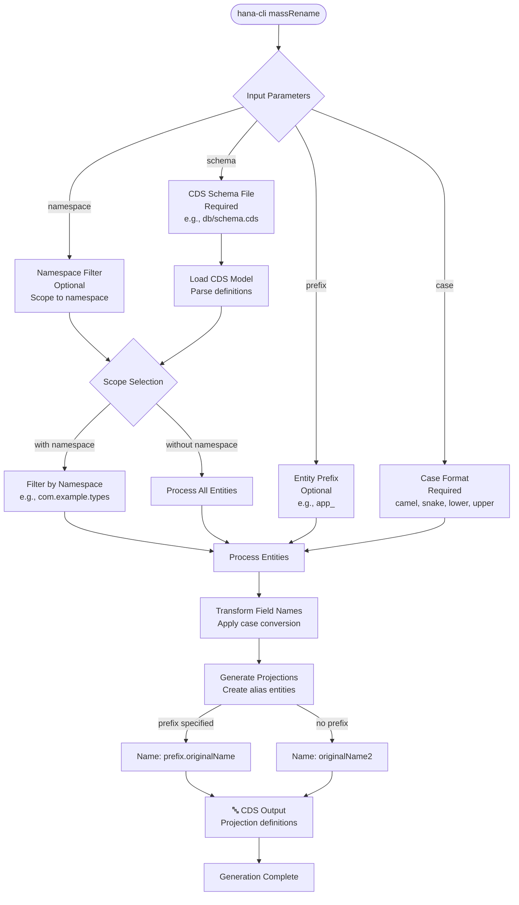

# massRename

> Command: `massRename`  
> Category: **Mass Operations**  
> Status: Production Ready

## Description

Rename fields in bulk based on a CDS schema file. This command processes CAP CDS models and creates projection entities with renamed elements, supporting naming conventions like camelCase, snake_case, and case transformations across entire CDS schemas.

### Use Cases

- **Naming Convention Alignment**: Convert field names to match project standards (camelCase, snake_case, etc.)
- **Entity Prefixing**: Add prefixes to all entities for namespace organization
- **Case Normalization**: Standardize case conventions across legacy or external schemas
- **Field Aliasing**: Create projection views with renamed fields for compatibility
- **Schema Evolution**: Generate new entity definitions with improved naming

### Supported Case Formats

| Format | Example | Use Case |
|--------|---------|----------|
| `camel` | `firstName`, `lastName` | JavaScript, Node.js, CAP conventions |
| `snake` | `first_name`, `last_name` | Database conventions, Python |
| `lower` | `firstname`, `lastname` | Lowercase normalization |
| `upper` | `FIRSTNAME`, `LASTNAME` | Legacy systems, all-caps conventions |

## Syntax

```bash
hana-cli massRename [options]
```

## Aliases

- `mr`
- `massrename`
- `massRN`
- `massrn`

## Command Diagram



## Parameters

| Parameter | Alias | Type | Default | Required | Description |
|-----------|-------|------|---------|----------|-------------|
| `schema` | `s` | string | - | Yes | Path to CDS schema file (e.g., `db/schema.cds`) |
| `namespace` | `n` | string | - | No | Filter entities by namespace (optional scoping) |
| `prefix` | `p` | string | - | No | Prefix to add to renamed entities |
| `case` | `c` | string | - | Yes | Case format for fields (camel, snake, lower, upper) |

For a complete list of parameters and options, use:

```bash
hana-cli massRename --help
```

## Examples

### Convert Fields to camelCase with Prefix

```bash
hana-cli massRename --schema db/schema.cds --prefix app_ --case camelCase
```

### Convert to snake_case Without Prefix

```bash
hana-cli massRename --schema db/domain.cds --case snake
```

### Filter by Namespace and Apply Case

```bash
hana-cli massRename --schema db/schema.cds --namespace com.example.types --case camel --prefix api_
```

### Lowercase Normalization

```bash
hana-cli massRename -s db/schema.cds -c lower
```

## Related Commands

- [massConvert](mass-convert.md) - Convert objects to different formats
- [massExport](mass-export.md) - Export database objects
- [massUpdate](mass-update.md) - Bulk update database records

## See Also

- [Category: Mass Operations](..)
- [All Commands A-Z](../all-commands.md)
