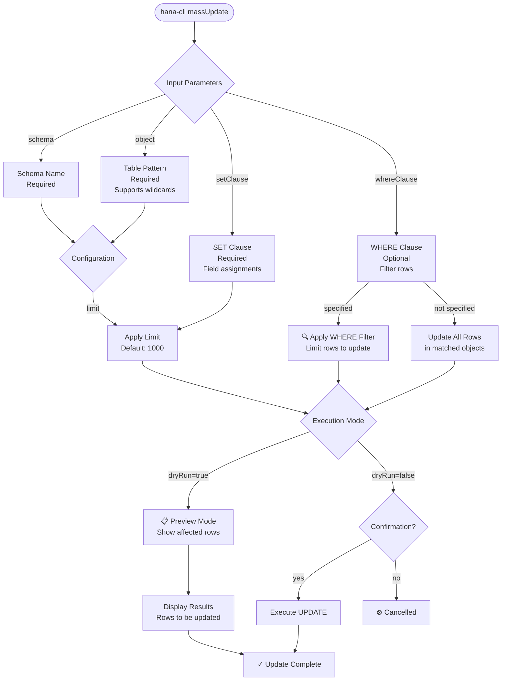

# massUpdate

> Command: `massUpdate`  
> Category: **Mass Operations**  
> Status: Production Ready

## Description

Perform bulk SQL UPDATE operations on multiple tables with conditional WHERE clauses. This command allows efficient mass updates across database objects with filtering, limiting, and dry-run capabilities for safe data modifications.

### Use Cases

- **Status Updates**: Bulk change status fields (e.g., mark inactive records)
- **Field Initialization**: Set default values for new or migrated data
- **Data Corrections**: Fix incorrect values across multiple rows
- **Archival Operations**: Mark historical data as archived or inactive
- **Bulk Maintenance**: Apply version updates, timestamps, or reference changes

### Safety Features

- **WHERE Clause Filtering**: Apply conditions to limit affected rows
- **Dry Run Mode**: Preview changes before applying (`--dryRun`)
- **Limit Protection**: Default 1000 object limit prevents accidental mass modifications
- **Logging**: Optional operation logging for audit trails

### Common Update Patterns

| Pattern | Example | Purpose |
|---------|---------|---------|
| Status Change | `STATUS = 'INACTIVE'` | Deactivate or archive records |
| Timestamp | `MODIFIED_AT = CURRENT_TIMESTAMP` | Track update times |
| Counter | `RETRY_COUNT = RETRY_COUNT + 1` | Increment failure counters |
| Conditional | `STATUS = 'COMPLETED' WHERE END_DATE IS NOT NULL` | Conditional status updates |

## Syntax

```bash
hana-cli massUpdate [schema] [object] [options]
```

## Aliases

- `mu`
- `massupdate`
- `massUpd`
- `massupd`

## Command Diagram



## Parameters

| Parameter | Alias | Type | Default | Required | Description |
|-----------|-------|------|---------|----------|-------------|
| `schema` | `s` | string | - | Yes | Database schema containing tables |
| `object` | `o` | string | - | Yes | Table name or pattern (use `%` for all) |
| `setClause` | `c`, `set` | string | - | Yes | SQL SET clause with field assignments |
| `whereClause` | `w`, `where` | string | - | No | SQL WHERE clause to filter rows |
| `limit` | `l` | number | 1000 | No | Maximum number of objects to update |
| `dryRun` | `dr`, `preview` | boolean | false | No | Preview changes without applying |
| `log` | - | boolean | false | No | Log all update operations |

For a complete list of parameters and options, use:

```bash
hana-cli massUpdate --help
```

## Examples

### Mark Inactive Records

```bash
hana-cli massUpdate --schema MYSCHEMA --object % --set "STATUS = 'INACTIVE'" --where "CREATED_AT < CURRENT_DATE"
```

### Update Timestamp on All Records

```bash
hana-cli massUpdate --schema MYSCHEMA --object ORDERS --set "MODIFIED_AT = CURRENT_TIMESTAMP"
```

### Preview Changes Before Applying

```bash
hana-cli massUpdate --schema MYSCHEMA --object CUSTOMERS --set "STATUS = 'VERIFIED'" --where "VERIFIED_DATE IS NOT NULL" --dryRun
```

### Increment Retry Counter on Failed Records

```bash
hana-cli massUpdate -s MYSCHEMA -o "ERROR_%" -c "RETRY_COUNT = RETRY_COUNT + 1" -w "STATUS = 'FAILED'" --log
```

## Related Commands

- [massDelete](mass-delete.md) - Bulk delete database objects
- [massExport](mass-export.md) - Export objects for analysis
- [massConvert](mass-convert.md) - Convert objects to different formats

## See Also

- [Category: Mass Operations](..)
- [All Commands A-Z](../all-commands.md)
