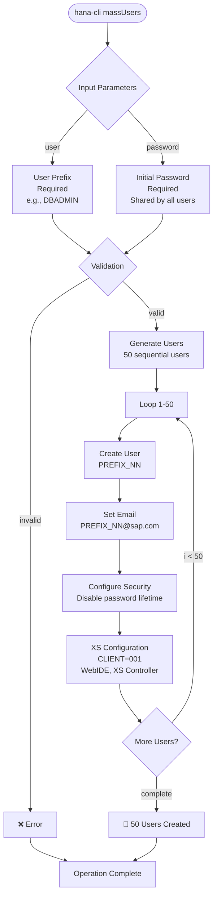

# massUsers

> Command: `massUsers`  
> Category: **Mass Operations**  
> Status: Production Ready

## Description

Create up to 50 database users in bulk for development and training environments. This command automatically generates user accounts with sequential naming, email addresses, and configurable passwords—ideal for workshop environments, development labs, and testing scenarios.

### Use Cases

- **Workshop Setup**: Quickly provision users for training sessions and hands-on labs
- **Development Teams**: Create multiple test accounts for feature development
- **Load Testing**: Generate bulk users for performance and scalability testing
- **Learning Environments**: Set up student accounts for educational programs
- **UAT Preparation**: Populate test environments with multiple user profiles

### User Generation Pattern

- **Naming Convention**: Users are created as `[PREFIX]_[NUMBER]` (e.g., `DBADMIN_01`, `DBADMIN_02`)
- **Count**: Generates exactly 50 users per execution
- **Email Addresses**: Automatically assigned as `[USERNAME]@sap.com`
- **Password**: Shared initial password for all created users
- **Configuration**: Each user configured with CLIENT='001', WebIDE, and XS Controller parameters

## Syntax

```bash
hana-cli massUsers [user] [password] [options]
```

## Aliases

- `massUser`
- `mUsers`
- `mUser`
- `mu`

## Command Diagram



## Parameters

| Parameter | Alias | Type | Default | Required | Description |
|-----------|-------|------|---------|----------|-------------|
| `user` | `u` | string | - | Yes | User prefix for naming (e.g., DBADMIN creates DBADMIN_01...DBADMIN_50) |
| `password` | `p` | string | - | Yes | Initial password for all created users (hidden input) |

For a complete list of parameters and options, use:

```bash
hana-cli massUsers --help
```

## Examples

### Create Workshop Users

```bash
hana-cli massUsers --user DBADMIN --password SecurePass123
```

Creates: `DBADMIN_01`, `DBADMIN_02`, ... `DBADMIN_50`

### Create Training Lab Users with Prompt

```bash
hana-cli massUsers
```

Prompts for user prefix and password interactively.

### Create Multiple User Groups

```bash
# First create admin users
hana-cli massUsers --user ADMIN --password AdminPass123

# Then create developer users  
hana-cli massUsers --user DEV --password DevPass123
```

### Using Short Aliases

```bash
hana-cli mu -u WORKSHOP -p TrainingPassword
```

## Generated User Details

Each user created includes:

- **Account**: `[PREFIX]_[00-49]` (zero-padded sequential)
- **Email**: `[PREFIX]_[00-49]@sap.com`
- **Password**: As provided during command execution
- **Client**: 001 (default SAP client)
- **Password Lifetime**: Disabled (no expiration required in dev environments)
- **XS Settings**: Configured for WebIDE and XS Controller access

## Related Commands

- [massGrant](mass-grant.md) - Grant privileges to bulk users
- [users](../connection-auth/users.md) - Manage individual users
- [roles](../connection-auth/roles.md) - Assign users to roles

## See Also

- [Category: Mass Operations](..)
- [All Commands A-Z](../all-commands.md)
