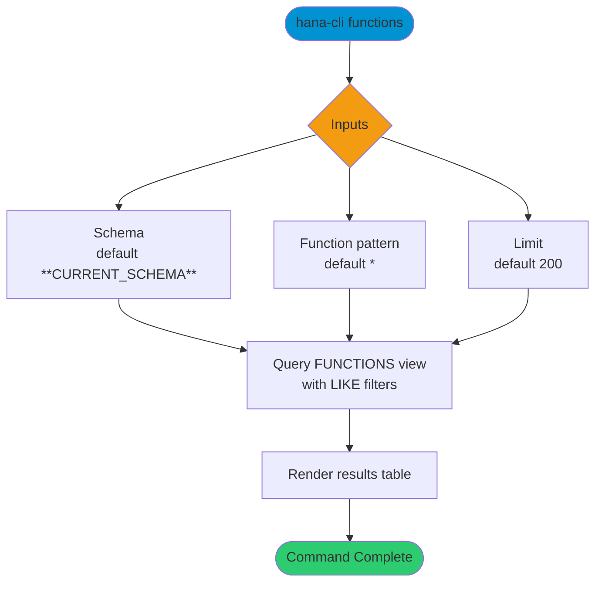

# functions

> Command: `functions`  
> Category: **Object Inspection**  
> Status: Production Ready

## Description

Get a list of functions for a schema and function name pattern.

## Syntax

```bash
hana-cli functions [schema] [function] [options]
```

## Aliases

- `f`
- `listFuncs`
- `ListFunc`
- `listfuncs`
- `Listfunc`
- `listFunctions`
- `listfunctions`

## Command Diagram



## Parameters

### Positional Arguments

| Parameter | Type | Description |
|---|---|---|
| `schema` | string | Schema name filter (optional positional input). |
| `function` | string | Function name filter (optional positional input). |

### Options

| Option | Alias | Type | Default | Description |
|---|---|---|---|---|
| `--function` | `-f` | string | `*` | Function name pattern to match. |
| `--schema` | `-s` | string | `**CURRENT_SCHEMA**` | Schema name or pattern to match. |
| `--limit` | `-l` | number | `200` | Maximum number of rows returned. |
| `--profile` | `-p` | string | - | Connection profile override. |

For additional shared options from the common command builder, use `hana-cli functions --help`.

## Examples

### Basic Usage

```bash
hana-cli functions --function myFunction --schema MYSCHEMA
```

List functions matching the provided schema and function pattern.

### Wildcard Search

```bash
hana-cli functions --function "SALES_*" --schema MYSCHEMA
```

List functions whose names start with `SALES_`.

### Limit Results

```bash
hana-cli functions --schema MYSCHEMA --limit 50
```

Return only the first 50 matching rows.

---

## functionsUI (UI Variant)

> Command: `functionsUI`  
> Status: Production Ready

**Description:** Execute functionsUI command - UI version for listing functions

**Syntax:**

```bash
hana-cli functionsUI [schema] [function] [options]
```

**Aliases:**

- `fui`
- `listFuncsUI`
- `ListFuncUI`
- `listfuncsui`
- `Listfuncui`
- `listFunctionsUI`
- `listfunctionsui`

**Parameters:**

For a complete list of parameters and options, use:

```bash
hana-cli functionsUI --help
```

**Example Usage:**

```bash
hana-cli functionsUI
```

Execute the command

## Related Commands

- [`inspectFunction`](inspect-function.md)
- [`procedures`](procedures.md)
- [`objects`](objects.md)

## See Also

- [Category: Object Inspection](..)
- [All Commands A-Z](../all-commands.md)
