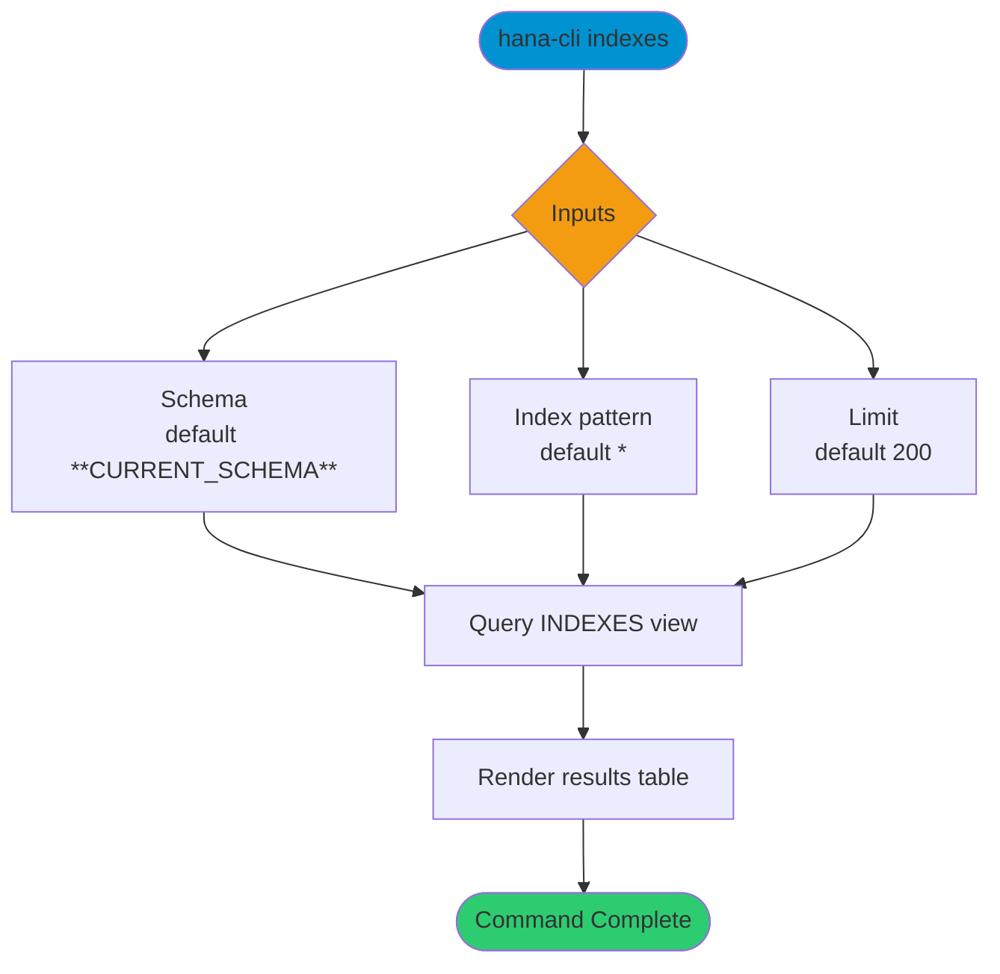

# indexes

> Command: `indexes`  
> Category: **Object Inspection**  
> Status: Production Ready

## Description

Get a list of indexes

## Syntax

```bash
hana-cli indexes [schema] [indexes] [options]
```

## Aliases

- `ind`
- `listIndexes`
- `ListInd`
- `listind`
- `Listind`
- `listfindexes`

## Command Diagram



## Parameters

### Positional Arguments

| Parameter | Type | Description |
|---|---|---|
| `schema` | string | Schema name filter (optional positional input). |
| `indexes` | string | Index name filter (optional positional input). |

### Options

| Option | Alias | Type | Default | Description |
|---|---|---|---|---|
| `--indexes` | `-i` | string | `*` | Index name pattern to match. |
| `--schema` | `-s` | string | `**CURRENT_SCHEMA**` | Schema name or pattern to match. |
| `--limit` | `-l` | number | `200` | Maximum number of rows returned. |
| `--profile` | `-p` | string | - | Connection profile override. |

For additional shared options from the common command builder, use `hana-cli indexes --help`.

## Examples

### Basic Usage

```bash
hana-cli indexes --indexes myIndex --schema MYSCHEMA
```

List indexes matching the schema and index filters.

### Limit Results

```bash
hana-cli indexes --schema MYSCHEMA --limit 50
```

Return only the first 50 matching rows.

---

## indexesUI (UI Variant)

> Command: `indexesUI`  
> Status: Production Ready

**Description:** Execute indexesUI command - UI version for listing indexes

**Syntax:**

```bash
hana-cli indexesUI [schema] [indexes] [options]
```

**Aliases:**

- `indUI`
- `listIndexesUI`
- `ListIndUI`
- `listindui`
- `Listindui`
- `listfindexesui`
- `indexesui`

**Parameters:**

For a complete list of parameters and options, use:

```bash
hana-cli indexesUI --help
```

**Example Usage:**

```bash
hana-cli indexesUI
```

Execute the command

## Related Commands

- `inspectIndex`
- [`tables`](tables.md)
- `tableHotspots`

## See Also

- [Category: Object Inspection](..)
- [All Commands A-Z](../all-commands.md)
