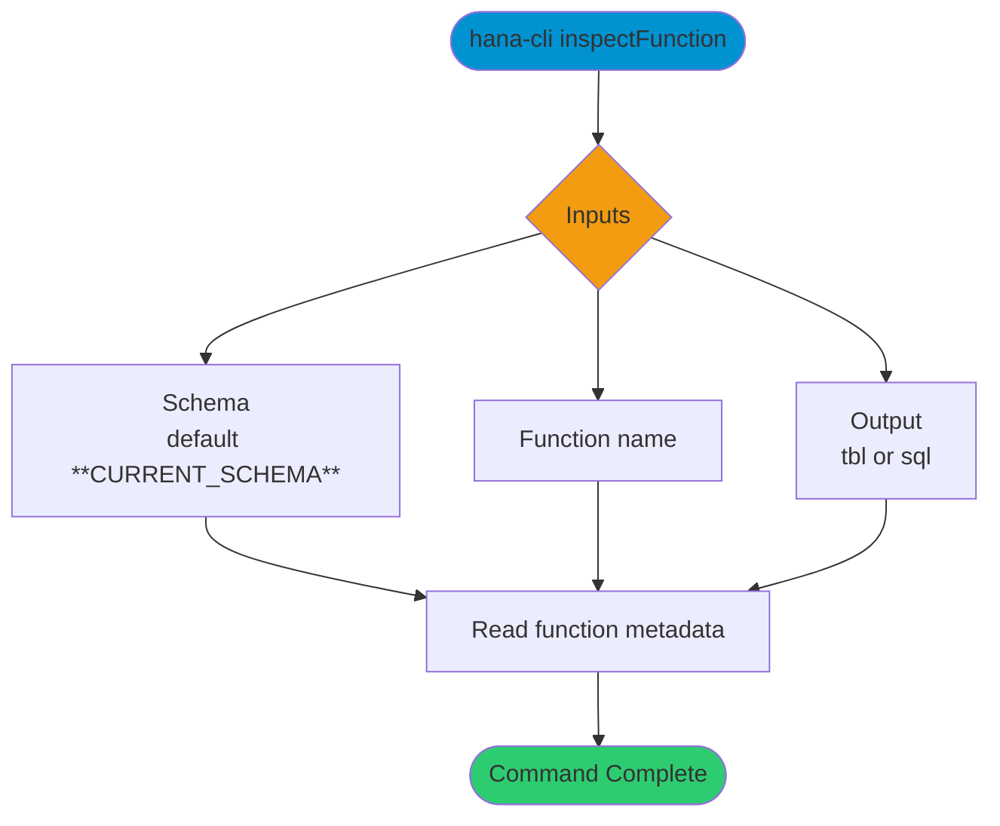

# inspectFunction

> Command: `inspectFunction`  
> Category: **Object Inspection**  
> Status: Production Ready

## Description

Return metadata about a Function

## Syntax

```bash
hana-cli inspectFunction [schema] [function] [options]
```

## Aliases

- `if`
- `function`
- `insFunc`
- `inspectfunction`

## Command Diagram



## Parameters

### Positional Arguments

| Parameter | Type | Description |
|---|---|---|
| `schema` | string | Target schema (optional positional input). |
| `function` | string | Function name (optional positional input). |

### Options

| Option | Alias | Type | Default | Description |
|---|---|---|---|---|
| `--function` | `-f` | string | - | Function name to inspect. |
| `--schema` | `-s` | string | `**CURRENT_SCHEMA**` | Schema that contains the function. |
| `--output` | `-o` | string | `tbl` | Output format. Choices: `tbl`, `sql`. |

## Examples

### Basic Usage

```bash
hana-cli inspectFunction --function myFunction --schema MYSCHEMA
```

Execute the command

### SQL Definition Output

```bash
hana-cli inspectFunction --function myFunction --schema MYSCHEMA --output sql
```

Display the function definition in SQL format.

## Related Commands

- [`functions`](functions.md)
- [`inspectProcedure`](inspect-procedure.md)

## See Also

- [Category: Object Inspection](..)
- [All Commands A-Z](../all-commands.md)
