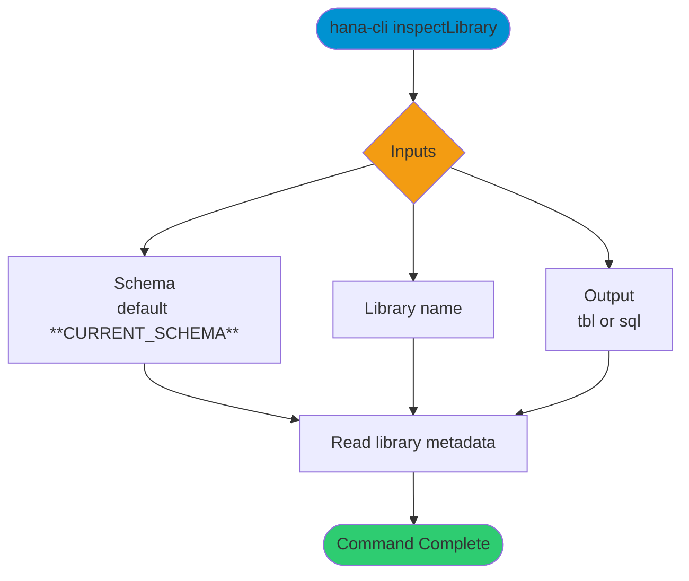

# inspectLibrary

> Command: `inspectLibrary`  
> Category: **Object Inspection**  
> Status: Production Ready

## Description

Return metadata about a Library

## Syntax

```bash
hana-cli inspectLibrary [schema] [library] [options]
```

## Aliases

- `il`
- `library`
- `insLib`
- `inspectlibrary`

## Command Diagram



## Parameters

### Positional Arguments

| Parameter | Type | Description |
|---|---|---|
| `schema` | string | Target schema (optional positional input). |
| `library` | string | Library name (optional positional input). |

### Options

| Option | Alias | Type | Default | Description |
|---|---|---|---|---|
| `--library` | `--lib` | string | - | Library name to inspect. |
| `--schema` | `-s` | string | `**CURRENT_SCHEMA**` | Schema that contains the library. |
| `--output` | `-o` | string | `tbl` | Output format. Choices: `tbl`, `sql`. |

## Examples

### Basic Usage

```bash
hana-cli inspectLibrary --library myLib --schema MYSCHEMA
```

Inspect metadata for a specific library.

## Related Commands

- [`libraries`](libraries.md)
- [`inspectLibMember`](inspect-lib-member.md)

## See Also

- [Category: Object Inspection](..)
- [All Commands A-Z](../all-commands.md)
